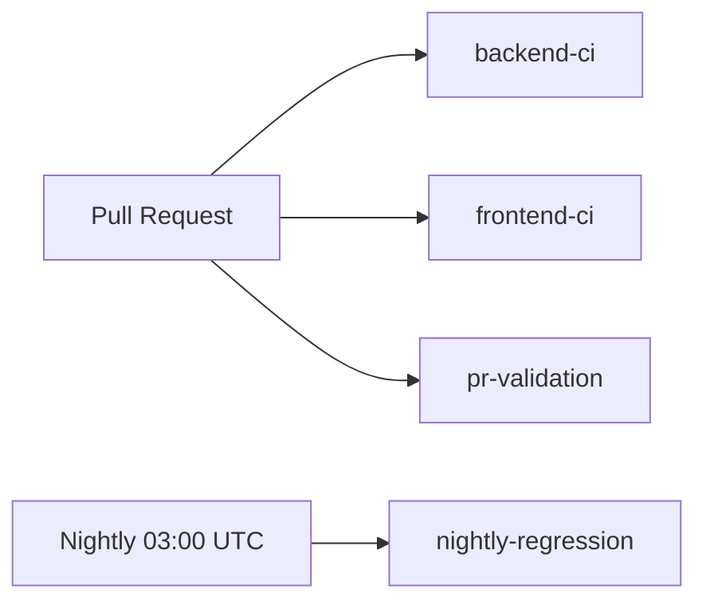

# FlowIQ Developer Handbook

| Field | Value |
|-------|-------|
| **Version** | 1.0 |
| **Updated** | 2026-06-28 |
| **Audience** | Contributors, maintainers, QA, DevOps |

This handbook is the **primary onboarding guide** for FlowIQ. Detailed references live in linked documents — content is not duplicated here.

**Related:** [Documentation index](index.md) · [Architecture index](architecture/README.md) · [SRS](product/SRS.md) · [Security audit](security/SECURITY_AUDIT.md)

---

## Table of contents

1. [Project overview](#1-project-overview)
2. [Local setup](#2-local-setup)
3. [Environment variables](#3-environment-variables)
4. [Docker usage](#4-docker-usage)
5. [CI/CD pipeline](#5-cicd-pipeline)
6. [Branch strategy](#6-branch-strategy)
7. [Code style](#7-code-style)
8. [Architecture overview](#8-architecture-overview)
9. [Backend guide](#9-backend-guide)
10. [Frontend guide](#10-frontend-guide)
11. [Automation guide](#11-automation-guide)
12. [Testing guide](#12-testing-guide)
13. [Release process](#13-release-process)
14. [Deployment guide](#14-deployment-guide)
15. [Troubleshooting](#15-troubleshooting)
16. [FAQ](#16-faq)
17. [Known limitations](#17-known-limitations)

---

## 1. Project overview

### What FlowIQ is

FlowIQ is a **financial operations platform for Ukrainian FOP (ФОП) entrepreneurs**. It helps users track cash flow, import bank CSV statements, receive rule-based insights and forecasts, manage tax deadlines, and browse a regulatory knowledge base.

### Repository layout

FlowIQ is split across **three Git repositories**:

| Repository | Stack | Role |
|------------|-------|------|
| **flowiq-backend** | Java 17, Spring Boot 3.5, PostgreSQL, Flyway | REST API, schedulers, business logic |
| **flowiq-frontend** | Next.js 16, React 19, TypeScript, Tailwind 4 | Web SPA |
| **flowiq-automation** | Java 17, TestNG, Rest Assured, Playwright | Cross-repo API/UI/E2E tests |

```
flowiq-frontend  ──HTTPS REST /api──►  flowiq-backend  ──JDBC──►  PostgreSQL
       ▲                                      ▲
       └──────── flowiq-automation ───────────┘
```

### Current maturity

| Area | Status |
|------|--------|
| MVP features | Shipped (transactions, dashboard, forecasts, tasks, notifications, reports, AI Accountant, chat, Business Guide) |
| Backend tests | 446 tests, ~81% line coverage (JaCoCo) |
| Frontend tests | Vitest (local); **not in CI** |
| Automation | PR validation, nightly full-stack regression |
| CD | **Manual** — CI only, no auto-deploy |
| External LLM / bank APIs | Not implemented (extension interfaces exist) |

Product context: [vision.md](product/vision.md) · Requirements: [SRS.md](product/SRS.md)

---

## 2. Local setup

Full walkthrough: [deployment/local-setup.md](deployment/local-setup.md)

### Prerequisites

| Tool | Version | Used by |
|------|---------|---------|
| Java (Temurin) | 17+ | Backend, automation |
| Maven | Wrapper (`./mvnw`) | Backend |
| Node.js | 20+ (18 minimum) | Frontend |
| Docker | Latest | PostgreSQL (Compose) |
| Git | 2.x | All |

### Quick start (full stack)

```bash
# Terminal 1 — database + API
cd flowiq-backend
docker compose up -d          # optional; Spring can auto-start Compose
./mvnw spring-boot:run

# Terminal 2 — UI
cd flowiq-frontend
npm ci
npm run dev
```

| Service | URL |
|---------|-----|
| Frontend | http://localhost:3000 |
| Backend API | http://localhost:8080/api |
| Swagger UI | http://localhost:8080/swagger-ui.html |
| Health | http://localhost:8080/api/health |

### Demo login (local dev)

When `flowiq.demo-seed.enabled=true` (default in dev):

- **Email:** `demo@flowiq.ai`
- **Password:** `demo123`

### Verify integration

1. Open http://localhost:3000/login and sign in.
2. Dashboard loads stat cards and charts.
3. Business Guide search returns articles from the API.

---

## 3. Environment variables

### Backend

| Variable | Profile | Required | Description |
|----------|---------|----------|-------------|
| `SPRING_PROFILES_ACTIVE` | prod / docker | Recommended | `prod` for production; `docker` for container |
| `JWT_SECRET` | prod, docker | **Yes in prod** | HMAC signing key (256+ bits). Weak defaults rejected in `prod` profile |
| `JWT_ACCESS_TOKEN_EXPIRATION` | prod | No | Default `900000` (15 min) in prod profile |
| `SPRING_DATASOURCE_URL` | prod | **Yes** | JDBC URL |
| `SPRING_DATASOURCE_USERNAME` | prod | **Yes** | DB user |
| `SPRING_DATASOURCE_PASSWORD` | prod, docker | **Yes** | DB password |
| `SPRING_DOCKER_COMPOSE_ENABLED` | any | No | Set `false` in CI/containers |
| `flowiq.demo-seed.enabled` | any | No | `false` in prod/docker profiles |

Properties reference: `src/main/resources/application.properties`, `application-docker.properties`, `application-prod.properties`

### Frontend

Create `flowiq-frontend/.env.local`:

```env
NEXT_PUBLIC_API_URL=http://localhost:8080/api
```

| Variable | Required | Description |
|----------|----------|-------------|
| `NEXT_PUBLIC_API_URL` | No | API base URL (build-time). Default: `http://localhost:8080/api` |

Client-side preferences (not env vars): `flowiq_language`, `flowiq_currency`, `token`, `refreshToken` in `localStorage`.

### Automation

| Variable / `-D` flag | Description |
|---------------------|-------------|
| `-Denv=local\|dev\|stage\|ci` | Environment config file |
| `TEST_USER_EMAIL` | Smoke/regression test user |
| `TEST_USER_PASSWORD` | Smoke/regression test password |
| `ENV` | Fallback for `-Denv` |

See `flowiq-automation/src/main/resources/environments/`.

Environment matrix: [deployment/environments.md](deployment/environments.md)

---

## 4. Docker usage

Detail: [deployment/docker.md](deployment/docker.md) · Topology: [architecture/deployment-architecture.md](architecture/deployment-architecture.md)

### PostgreSQL only (local dev)

```bash
cd flowiq-backend
docker compose up -d
```

Uses `postgres:15-alpine`, database `flowiq`, user/password `flowiq` / `flowiq123`.

### Backend container

```bash
cd flowiq-backend
docker build -t flowiq-backend .
docker run -p 8080:8080 \
  -e SPRING_PROFILES_ACTIVE=docker \
  -e JWT_SECRET="<your-secret>" \
  -e SPRING_DATASOURCE_URL=jdbc:postgresql://host.docker.internal:5432/flowiq \
  -e SPRING_DATASOURCE_PASSWORD=flowiq123 \
  flowiq-backend
```

The image runs as non-root user `flowiq`. Healthcheck: `GET /api/health`.

### Frontend container

```bash
cd flowiq-frontend
docker build --build-arg NEXT_PUBLIC_API_URL=http://localhost:8080/api -t flowiq-frontend .
docker run -p 3000:3000 flowiq-frontend
```

### Full-stack (automation nightly CI)

`flowiq-automation` builds and runs backend + frontend + PostgreSQL for regression. See [flowiq-automation/docs/automation/CI_INFRASTRUCTURE.md](https://github.com/YevheniiaDem/flowiq-automation/blob/main/docs/automation/CI_INFRASTRUCTURE.md).

---

## 5. CI/CD pipeline

Detail: [architecture/cicd-architecture.md](architecture/cicd-architecture.md)

### Overview

All three repos use **GitHub Actions for CI only**. There is **no automated deployment** on merge.



### Per repository

| Repo | Workflow | Trigger | Gate |
|------|----------|---------|------|
| **flowiq-backend** | `backend-ci.yml` | PR + push → `main` | `./mvnw clean verify` (446+ tests, JaCoCo) |
| **flowiq-frontend** | `frontend-ci.yml` | PR + push → `master` | `npm ci`, lint, build |
| **flowiq-automation** | `pr-validation.yml` | PR + push → `main`, `develop` | Compile + backend unit + contract tests |
| **flowiq-automation** | `nightly-regression.yml` | Cron + manual | Full Docker stack regression |
| **flowiq-automation** | `api-smoke.yml`, `ui-smoke.yml` | Manual | Stage/dev smoke |

### What CI does **not** do today

- Deploy to production or staging
- Run frontend Vitest
- OWASP / dependency vulnerability scan (recommended — see [SECURITY_AUDIT.md](security/SECURITY_AUDIT.md))

---

## 6. Branch strategy

| Repository | Default branch | Integration branch | Notes |
|------------|----------------|-------------------|-------|
| **flowiq-backend** | `main` | `main` | Single trunk |
| **flowiq-frontend** | `master` | `master` | CI triggers on `master` |
| **flowiq-automation** | `main` | `main`, `develop` | PR validation on both |

### Workflow for contributors

1. Fork / clone the target repository.
2. Create a feature branch from the default branch: `feature/short-description` or `fix/issue-description`.
3. Open a PR against the default branch.
4. Ensure CI checks pass (see [CONTRIBUTING.md](../CONTRIBUTING.md)).
5. Squash or merge per maintainer preference (maintainers may rebase).

**Cross-repo changes:** If API and frontend change together, open linked PRs in both repos. Automation PR validation checks out backend at matching branch name when possible.

---

## 7. Code style

There is **no enforced formatter** (no Checkstyle/Spotless in backend). Follow existing patterns in each repo.

### Backend (Java)

| Convention | Standard |
|------------|----------|
| Package layout | Layered: `controller` → `service` → `repository` / feature modules |
| Naming | `*Controller`, `*Service`, `*Repository`, `*Request`/`*Response` DTOs |
| Validation | Jakarta `@Valid` on controller parameters |
| API docs | `@Tag`, `@Operation`, `@Schema` on public endpoints |
| Tests | JUnit 5, Mockito, AssertJ; `*Test.java` naming |
| Transactions | `@Transactional` on service write methods |

### Frontend (TypeScript)

| Convention | Standard |
|------------|----------|
| Lint | ESLint 9 + `eslint-config-next` — run `npm run lint` |
| Structure | Feature modules under `src/features/<name>/` |
| API calls | Shared `src/services/api.ts` (Axios + interceptors) |
| Styling | Tailwind 4 + shadcn/ui tokens |
| Tests | Vitest + Testing Library — `npm test` |

### Automation (Java)

| Convention | Standard |
|------------|----------|
| API tests | Rest Assured via `BaseApiTest` |
| UI tests | Playwright Page Objects via `BaseUiTest` |
| Reporting | Allure annotations (`@Epic`, `@Feature`, `@Severity`) |

### Commits

Use clear, imperative subject lines. Reference issue IDs when applicable. See [CONTRIBUTING.md](../CONTRIBUTING.md).

---

## 8. Architecture overview

**Do not duplicate** — use the architecture documentation hub.

| Topic | Document |
|-------|----------|
| **Start here** | [architecture/README.md](architecture/README.md) |
| High-level diagram | [architecture/system-overview.md](architecture/system-overview.md) |
| C4 model (context, container, component) | [architecture/c4/](architecture/c4/c4-context.md) |
| Module dependencies | [architecture/module-dependencies.md](architecture/module-dependencies.md) |
| Auth / import / forecast / AI / report flows | [architecture/flows/](architecture/flows/authentication-flow.md) |
| Database ER | [architecture/database-er-diagram.md](architecture/database-er-diagram.md) |
| ADRs | [architecture/adr/README.md](architecture/adr/README.md) |

**Key design choices:**

- Stateless JWT API (access + refresh with server-side session hashes)
- Rule-based “AI” with pluggable provider interfaces (no LLM in production)
- Row-level multi-tenancy via `user_id`
- Flyway-only schema changes (`ddl-auto=validate`)

---

## 9. Backend guide

Detail: [architecture/backend-architecture.md](architecture/backend-architecture.md)

### Entry point

- **Main class:** `com.flowiq.FlowiqBackendApplication`
- **API prefix:** `/api`
- **Source:** `src/main/java/com/flowiq/`

### Package map

| Package | Responsibility |
|---------|----------------|
| `controller`, `service`, `entity`, `repository` | Core domain |
| `profile` | Profile, FOP settings, sessions, avatars |
| `forecasts`, `tasks`, `notifications`, `knowledge` | Feature modules |
| `aiaccountant`, `categorization`, `importcsv`, `reports` | Intelligence & output |
| `security`, `config`, `exception`, `audit` | Cross-cutting |

### REST surface

15 controllers, ~90 endpoints. Inventory: [api/openapi-overview.md](api/openapi-overview.md)

Live docs (dev only): http://localhost:8080/swagger-ui.html

### Database

- **Engine:** PostgreSQL 15+
- **Migrations:** Flyway V1–V8 in `src/main/resources/db/migration/`
- **Never** use Hibernate DDL auto-update in shared environments

Adding a migration:

```bash
# Create V9__description.sql, then:
./mvnw spring-boot:run   # Flyway applies on startup
./mvnw test              # integration tests validate schema
```

Reference: [database/migrations.md](database/migrations.md)

### Schedulers

| Job | Cron | Class |
|-----|------|-------|
| Task generation | 07:30 daily | `DailyTaskScheduler` |
| Notification rules | 08:00 daily | `NotificationScheduler` |

### Common tasks

```bash
./mvnw spring-boot:run              # Run locally
./mvnw test                         # Unit + integration tests
./mvnw test jacoco:report             # Coverage HTML in target/site/jacoco/
./mvnw -DskipTests package           # Package JAR (Docker build uses this)
```

Module docs: [modules/](modules/) (auth, transactions, dashboard, etc.)

---

## 10. Frontend guide

Detail: [architecture/frontend-architecture.md](architecture/frontend-architecture.md)

Repository: **flowiq-frontend** (separate clone)

### Structure

```
flowiq-frontend/
├── app/                 # Next.js App Router pages (thin)
├── src/features/        # Domain modules (auth, dashboard, transactions, …)
├── src/services/        # api.ts, auth.service.ts, tokenRefresh.ts
└── src/shared/          # components, i18n (uk/en), context, utils
```

### Routes (16 authenticated + auth)

| Route | Feature |
|-------|---------|
| `/` | Dashboard |
| `/transactions`, `/imports`, `/analytics`, `/forecasts` | Core finance |
| `/ai-accountant`, `/chat` | Assistant UIs |
| `/tasks`, `/notifications`, `/reports` | Workflow |
| `/business-guide`, `/settings` | Knowledge & profile |
| `/login`, `/register` | Auth |

Routing detail: [frontend/routing.md](frontend/routing.md)

### API integration

- Base client: `src/services/api.ts`
- Injects `Authorization`, `X-App-Language`, `X-App-Currency`
- 401 → automatic refresh via `tokenRefresh.ts` → retry once

### Auth guard

Client-side only in `MainLayout` — checks `localStorage` token. No Next.js middleware.

### Commands

```bash
npm run dev      # Development server :3000
npm run build    # Production build (TypeScript check)
npm run lint     # ESLint
npm test         # Vitest (local)
```

### Hybrid data sources

Most modules call the backend API. Some UI still uses **local mock data** (tax profile card, parts of Business Guide explorer). See [architecture/data-sources.md](architecture/data-sources.md).

---

## 11. Automation guide

Detail: [architecture/automation-architecture.md](architecture/automation-architecture.md)

Repository: **flowiq-automation** (separate clone)

### Purpose

Cross-repo test harness — not a deployable application.

### Quick start

```bash
cd flowiq-automation

# Install Playwright browser
mvn exec:java -e -Dexec.mainClass=com.microsoft.playwright.CLI -Dexec.args="install chromium"

# Contract tests (backend + PostgreSQL must be running)
mvn test -Pcontract -Denv=local

# API smoke (localhost)
mvn test -Papi-smoke -Denv=local
```

Full README: [flowiq-automation repository](https://github.com/YevheniiaDem/flowiq-automation)

### Key Maven profiles

| Profile | Purpose |
|---------|---------|
| `contract` | OpenAPI JSON Schema validation |
| `api-smoke` / `api-regression` | Rest Assured API suites |
| `ui-smoke` / `ui-regression` | Playwright UI suites |
| `e2e` | End-to-end journeys |

Traceability: `flowiq-automation/docs/qa/TRACEABILITY_MATRIX.md`

---

## 12. Testing guide

Detail: [architecture/test-architecture.md](architecture/test-architecture.md)

### Test pyramid (as-built)

```
        E2E (automation)
       Integration (backend Testcontainers)
      Unit (backend 446 tests, frontend Vitest local)
     Contract (automation)
```

### Backend

```bash
cd flowiq-backend
./mvnw test                              # All tests
./mvnw test -Dtest=AuthControllerTest    # Single class
./mvnw test jacoco:report                # Coverage report
```

| Layer | Location | Tools |
|-------|----------|-------|
| Unit | `src/test/java/com/flowiq/unit/` | JUnit 5, Mockito |
| Controller | `src/test/java/com/flowiq/controller/` | MockMvc, `ControllerTestSupport` |
| Integration | `src/test/java/com/flowiq/integration/` | Testcontainers PostgreSQL |

Coverage report: [qa/BACKEND_TEST_COVERAGE_REPORT.md](qa/BACKEND_TEST_COVERAGE_REPORT.md)

Test config: `src/test/resources/application-test.properties`

### Frontend

```bash
cd flowiq-frontend
npm test        # Vitest — not run in CI yet
```

### Automation

See [§11 Automation guide](#11-automation-guide). Nightly regression runs full stack in Docker.

### Before opening a PR

| Repo | Minimum check |
|------|---------------|
| Backend | `./mvnw clean verify` |
| Frontend | `npm ci && npm run lint && npm run build` |
| Automation | `mvn test -Pcontract -Denv=local` (if API changed) |

Checklists: [qa/smoke-checklist.md](qa/smoke-checklist.md) · [qa/regression-checklist.md](qa/regression-checklist.md)

---

## 13. Release process

FlowIQ does **not** have automated releases today. This is the **manual release checklist**.

### Versioning

- Backend: `0.0.1-SNAPSHOT` in `pom.xml` (Maven)
- Frontend: `0.1.0` in `package.json`
- No unified semver tag across repos yet

### Pre-release checklist

1. All PR CI checks green on `main` / `master`.
2. `./mvnw clean verify` (backend).
3. `npm run lint && npm run build` (frontend).
4. Nightly automation regression green (or manual smoke on target env).
5. Flyway migrations reviewed (backward-compatible).
6. [SECURITY_AUDIT.md](security/SECURITY_AUDIT.md) production checklist applied.
7. [qa/smoke-checklist.md](qa/smoke-checklist.md) executed on staging.

### Release steps (manual)

1. Tag backend / frontend repos (optional): `git tag v0.x.y`.
2. Build backend JAR or Docker image with `SPRING_PROFILES_ACTIVE=prod`.
3. Run Flyway migrations against production DB (on app startup or explicit).
4. Deploy backend to target host.
5. Build frontend with production `NEXT_PUBLIC_API_URL`.
6. Deploy frontend (Vercel or container).
7. Verify health endpoints and critical user flows.

### Rollback

- Redeploy previous JAR/container image.
- Avoid destructive Flyway migrations; use expand-contract pattern.
- See [deployment/production-deployment.md](deployment/production-deployment.md)

---

## 14. Deployment guide

| Topic | Document |
|-------|----------|
| Production checklist | [deployment/production-deployment.md](deployment/production-deployment.md) |
| Docker | [deployment/docker.md](deployment/docker.md) |
| Topology | [architecture/deployment-architecture.md](architecture/deployment-architecture.md) |
| Environments | [deployment/environments.md](deployment/environments.md) |
| Security | [security/SECURITY_AUDIT.md](security/SECURITY_AUDIT.md) |

### Production minimum (backend)

```bash
export SPRING_PROFILES_ACTIVE=prod
export JWT_SECRET="<256-bit-random-secret>"
export SPRING_DATASOURCE_URL="jdbc:postgresql://..."
export SPRING_DATASOURCE_USERNAME="..."
export SPRING_DATASOURCE_PASSWORD="..."
java -jar app.jar
```

`ProductionSecretsValidator` **refuses to start** the `prod` profile with weak JWT secrets.

### Production targets (current)

| Component | Typical target |
|-----------|----------------|
| Frontend | Vercel (`flowiq.vercel.app`) or Docker |
| Backend | JAR or Docker on JVM host |
| Database | Managed PostgreSQL |

**CD is not automated** — see [architecture/cicd-architecture.md](architecture/cicd-architecture.md).

---

## 15. Troubleshooting

### Backend

| Symptom | Likely cause | Fix |
|---------|--------------|-----|
| Port 8080 in use | Another process | Stop conflicting service or change `server.port` |
| Flyway validation error | Schema drift | Ensure all V1–V8 migrations applied; never edit applied migrations |
| `Connection refused` to PostgreSQL | DB not running | `docker compose up -d` in backend repo |
| CORS error from frontend | Wrong origin | Frontend must be `:3000`, `:3001`, or allowed production URL |
| 401 on all API calls | Expired/missing JWT | Re-login; check `tokenRefresh.ts` |
| Prod startup fails on JWT | Weak `JWT_SECRET` | Set strong secret; see `application-prod.properties` |
| Demo user missing | Demo seed disabled | Set `flowiq.demo-seed.enabled=true` (dev only) |

### Frontend

| Symptom | Likely cause | Fix |
|---------|--------------|-----|
| API calls to wrong host | Missing env | Set `NEXT_PUBLIC_API_URL` in `.env.local`; rebuild for production |
| Redirect loop to login | No token in localStorage | Login again; check backend is reachable |
| Build TypeScript errors | Type mismatch with API | Fix types in `src/features/*/types/` |

### Automation

| Symptom | Likely cause | Fix |
|---------|--------------|-----|
| Contract tests fail | Backend not running | Start backend; wait for `/api/health` |
| UI tests timeout | Frontend not running | `npm run dev` on :3000 |
| Playwright browser missing | Browsers not installed | `mvn exec:java ... install chromium` |

Logs: [operations/logging.md](operations/logging.md) · Health: [operations/health-checks.md](operations/health-checks.md)

---

## 16. FAQ

**Q: Which repo do I clone first?**  
A: Start with `flowiq-backend` (this repo) for docs and API. Clone `flowiq-frontend` for UI work. Clone `flowiq-automation` only for QA/contract work.

**Q: Is the AI powered by OpenAI/Claude?**  
A: **No.** Production logic is rule-based. Provider interfaces exist for future LLM integration. See [architecture/ai-architecture.md](architecture/ai-architecture.md).

**Q: Can I connect my bank directly?**  
A: **Not yet.** Only CSV import is implemented. See [roadmap/BANK_INTEGRATIONS_ROADMAP.md](roadmap/BANK_INTEGRATIONS_ROADMAP.md).

**Q: Why are frontend and backend default branches different (`master` vs `main`)?**  
A: Historical setup. Match each repo's default branch when opening PRs.

**Q: Where is the single docker-compose for everything?**  
A: Backend `compose.yaml` is PostgreSQL only. Full stack compose lives in `flowiq-automation` for CI.

**Q: How do I add a new REST endpoint?**  
A: Controller → DTO → Service → (Repository). Add Flyway migration if schema changes. Add controller test. Update OpenAPI annotations. Run `./mvnw verify`.

**Q: Are roles (ADMIN/VIEWER) enforced?**  
A: **Not yet.** Roles exist in JWT but there is no `@PreAuthorize`. All authenticated users have equal API access.

**Q: Where is license information?**  
A: Backend README currently states proprietary license. Confirm with maintainers before open-source release.

---

## 17. Known limitations

Consolidated from [SRS.md](product/SRS.md) and codebase audit. **Not bugs** — documented scope boundaries.

### Platform

| Limitation | Notes |
|------------|-------|
| No automated CD | Deploy is manual |
| No rate limiting | Auth endpoints unthrottled |
| RBAC not enforced | ADMIN/VIEWER roles inert |
| No email/Telegram/push notifications | IN_APP only |
| No OAuth / social login | Email/password only |
| No bank API integrations | CSV import only |
| No external LLM | Rule-based AI labeled as AI in UI |

### Backend

| Limitation | Notes |
|------------|-------|
| Report generation synchronous | Despite `GENERATING` status enum |
| Report files in PostgreSQL BYTEA | Not object storage |
| Demo seed enabled by default in dev | Disable in prod/docker profiles |
| Registration password min 6 chars | Change-password requires min 10 + complexity |
| Swagger public in default dev profile | Disabled in prod/docker |

### Frontend

| Limitation | Notes |
|------------|-------|
| JWT in localStorage | XSS risk; no HttpOnly cookies |
| Client-side auth guard only | No Next.js middleware |
| Vitest not in CI | Local only |
| Tax profile / partial Business Guide | Mock data in some views |
| Global search in nav | Input present; no backend action |

### Automation / QA

| Limitation | Notes |
|------------|-------|
| Frontend tests not in frontend CI | Lint + build only |
| No dependency CVE scan in CI | Recommended in security audit |
| Stage API URL | Automation references `api.flowiq.ai` — confirm availability |

### Documentation gaps to watch

Some older docs (e.g. [product/roadmap.md](product/roadmap.md) medium-term section) predate current test/CI coverage. Prefer this handbook and [architecture/](architecture/README.md) for as-built state.

---

## Document maintenance

When you change code, update the **linked** deep-dive doc — not this handbook — unless onboarding steps change.

| Change type | Update |
|-------------|--------|
| New env var | §3 + `application-*.properties` |
| New CI workflow | §5 + [cicd-architecture.md](architecture/cicd-architecture.md) |
| New migration | §9 + [migrations.md](database/migrations.md) |
| New route | §10 + [frontend/routing.md](frontend/routing.md) |
| Security fix | [SECURITY_AUDIT.md](security/SECURITY_AUDIT.md) |

---

*FlowIQ Developer Handbook — maintained in flowiq-backend/docs*
