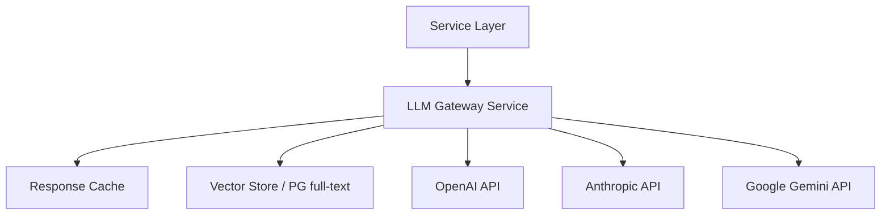

# Future LLM Integration

## Ready Extension Points

| Use Case | Interface | Suggested Model Role |
|----------|-----------|---------------------|
| Forecast narratives | `ForecastProvider` | Analyze trends, explain risks |
| Knowledge Q&A | `KnowledgeProvider` | RAG over `knowledge_articles` |
| AI Accountant chat | `AIInsightProvider` | Tool-use with transaction data |
| Transaction categories | `CategorizationProvider` | Classify unknown merchants |
| Analytics commentary | `AnalyticsInsightProvider` | Period-over-period explanation |

## Recommended Architecture

## Implementation Checklist

- [ ] `LlmKnowledgeProvider implements KnowledgeProvider`
- [ ] API keys via environment variables (never commit)
- [ ] Rate limiting & token budgets per user
- [ ] Audit log for AI responses (tax advice disclaimer)
- [ ] Fallback to `DatabaseKnowledgeProvider` on API failure
- [ ] Ukrainian language system prompts
- [ ] PII redaction before sending to external APIs

## Security Considerations

- Do not send raw passwords or JWT to LLM
- Sanitize transaction descriptions
- Display "AI-generated" disclaimer in UI (partially present in checker)

## Cost Control

- Cache frequent FAQ answers
- Use smaller models for categorization
- Reserve GPT-4 class for chat only

## Related

- [ADR-001](../architecture/adr/001-pluggable-ai-providers.md)
- [Providers](providers.md)
