# Architect Review Cheat Sheet

**Goal:** Present FlowIQ architecture in **10–15 minutes**.  
**Rule:** Facts only — verified against `flowiq-backend` and `flowiq-frontend` code (2026-06-23).  
**Deep dives:** [ADR Defense Guide](ADR_DEFENSE_GUIDE.md) · [AI Audit](AI_DOCUMENTATION_AUDIT_REPORT.md) · [Data Sources](data-sources.md)

---

## Suggested Talk Track (15 min)

| Min | Section |
|-----|---------|
| 0–2 | Executive Summary + System Overview |
| 2–4 | Backend Architecture |
| 4–5 | Frontend Architecture |
| 5–6 | Database Architecture |
| 6–8 | AI Architecture |
| 8–9 | Security Architecture |
| 9–10 | CI/CD + Deployment |
| 10–12 | Limitations + Technical Debt |
| 12–15 | Q&A (use [ADR_DEFENSE_GUIDE](ADR_DEFENSE_GUIDE.md)) |

---

## Executive Summary

### Description

FlowIQ is an **MVP financial platform for Ukrainian FOP** (sole proprietors): transactions, dashboard, analytics, forecasts, AI Accountant (rule-based), reports, tasks, notifications, Business Guide, CSV import. **Monolith backend** (Spring Boot) + **SPA frontend** (Next.js) + **PostgreSQL 15**. No external bank APIs or LLM calls in production.

### Diagram

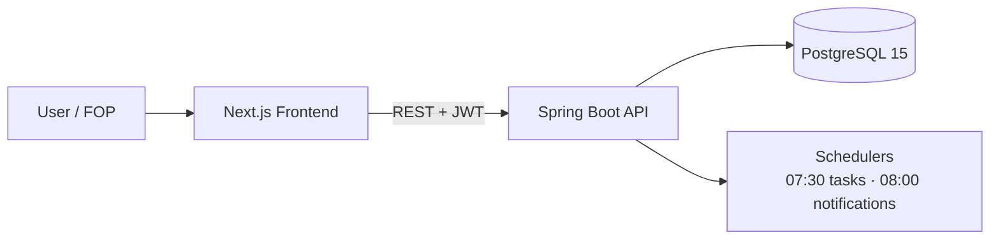

### Key classes

| Layer | Classes |
|-------|---------|
| Entry | `FlowiqBackendApplication` |
| HTTP | 13 `@RestController` classes |
| Core services | `DashboardService`, `AIAccountantService`, `ForecastService`, `AnalyticsService` |
| Client | `apiClient` (axios singleton) |

### Key files

| Repo | Files |
|------|-------|
| Backend | `pom.xml`, `src/main/java/com/flowiq/FlowiqBackendApplication.java` |
| Frontend | `package.json`, `app/page.tsx`, `src/services/api.ts` |
| Ops | `compose.yaml`, `Dockerfile` (both repos) |

**One-liner for architect:** *"Single deployable API with rule-based financial intelligence, JWT-secured REST, and PostgreSQL — frontend is a thin client with feature modules mirroring backend domains."*

---

## System Overview

### Description

Two repositories: **`flowiq-backend`** (API + intelligence + schedulers) and **`flowiq-frontend`** (UI). Communication is **HTTPS REST** (`/api/*`). Auth via **Bearer JWT**. Locale/currency via headers `X-App-Language`, `X-App-Currency`. Multi-user isolation by `user_id` FK — no `companies` table.

**Not in production:** bank HTTP clients, LLM SDKs, email/Telegram delivery, audit log.

### Diagram

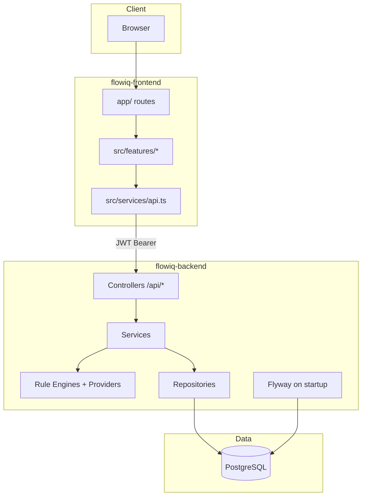

### Key classes

| Component | Class / module |
|-----------|----------------|
| Backend bootstrap | `com.flowiq.FlowiqBackendApplication` |
| API surface | `*Controller` under `com.flowiq` and sub-packages |
| Persistence | `TransactionRepository`, `UserRepository`, domain repos |
| Frontend routing | `app/*/page.tsx` |
| API client | `apiClient` in `src/services/api.ts` |

### Key files

| Purpose | Path |
|---------|------|
| C4 context | `docs/architecture/c4/c4-context.md` |
| C4 containers | `docs/architecture/c4/c4-container.md` |
| Module map | `docs/architecture/data-sources.md` |
| Backend routes | `src/main/java/com/flowiq/**/**Controller.java` |
| Frontend routes | `flowiq-frontend/app/**/page.tsx` |

---

## Backend Architecture

### Description

**Spring Boot 3.5.14**, **Java 17**, single JAR monolith. Pattern: **Controller → Service → Repository → Entity** (ADR-007). Domain vertical slices: `forecasts/`, `tasks/`, `notifications/`, `knowledge/`. Rule engines are `@Component` beans injected into services — not called from controllers.

**13 REST controllers:** `Auth`, `Health`, `Dashboard`, `Transaction`, `Analytics`, `Forecast`, `AIAccountant`, `Chat`, `Import`, `Reports`, `Task`, `Notification`, `BusinessGuide`.

### Diagram

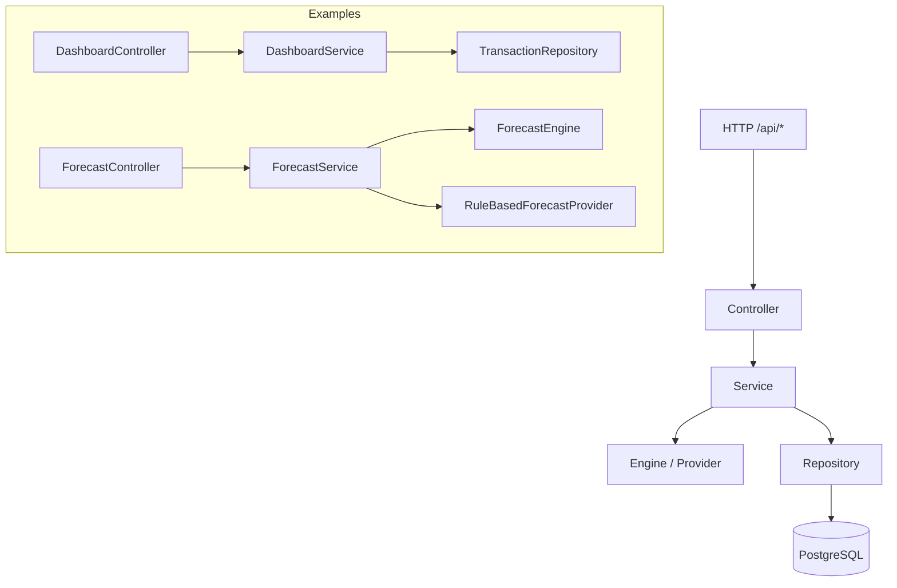

### Key classes

| Role | Classes |
|------|---------|
| Controllers | `DashboardController`, `AIAccountantController`, `ForecastController`, `AuthController`, … |
| Services | `DashboardService`, `AIAccountantService`, `ForecastService`, `AnalyticsService`, `ImportService`, `ReportsService`, `ChatService`, `KnowledgeService`, `TransactionSeedService` |
| Engines | `ForecastEngine`, `AIRecommendationEngine`, `NotificationRuleEngine`, `TaskRuleEngine`, `CategorizationEngine` |
| Providers | `RuleBasedForecastProvider`, `DatabaseKnowledgeProvider` |
| Security | `JwtAuthenticationFilter`, `SecurityConfig` |
| Schedulers | `DailyTaskScheduler` (07:30), `NotificationScheduler` (08:00) |

### Key files

| Path | Purpose |
|------|---------|
| `src/main/java/com/flowiq/controller/` | Core HTTP layer |
| `src/main/java/com/flowiq/forecasts/` | Forecast vertical slice |
| `src/main/java/com/flowiq/service/` | Shared services |
| `src/main/java/com/flowiq/config/SecurityConfig.java` | Security filter chain |
| `docs/architecture/adr/007-layered-architecture.md` | ADR |

---

## Frontend Architecture

### Description

**Next.js 16** App Router, **React 19**, **TypeScript**, **Tailwind 4**, **axios**. Structure: **`src/features/{module}/`** (components, hooks, services) + **`app/`** routes + shared **`src/services/api.ts`**. **No Redux, Zustand, or TanStack Query.** State: `localStorage` (auth) + `PreferencesContext` (language/currency/theme) + per-feature `useState` hooks.

Most pages are **client components** fetching REST on mount. Exceptions use **static mock data**: tax profile card, parts of Business Guide (groups/taxes/KVED).

### Diagram

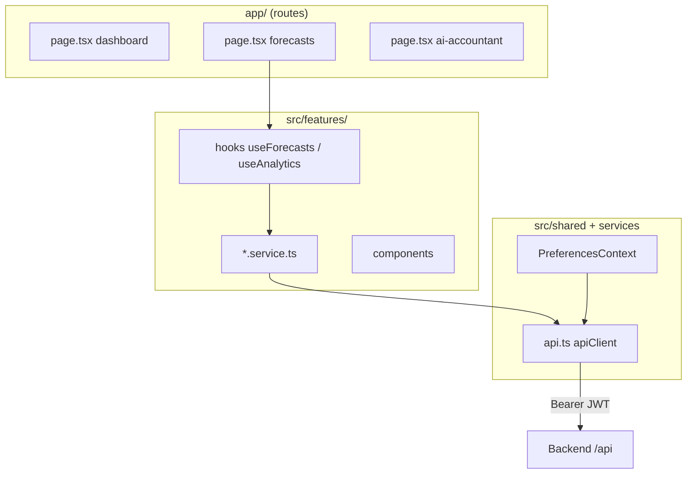

### Key classes / modules

| Module | Hook / service |
|--------|----------------|
| Dashboard | `dashboard.service.ts` |
| AI Accountant | `aiAccountantService.ts`, `useAIAccountant.ts` |
| Forecasts | `forecast.service.ts`, `useForecasts.ts` |
| Analytics | `analyticsService.ts`, `useAnalytics.ts` |
| Auth | `auth.service.ts` |
| Chat | `chat.service.ts` |
| Global API | `apiClient` |

### Key files

| Path | Purpose |
|------|---------|
| `flowiq-frontend/src/services/api.ts` | JWT + i18n headers, 401 handling |
| `flowiq-frontend/src/features/` | Feature modules |
| `flowiq-frontend/app/` | Next.js routes (18 pages) |
| `flowiq-frontend/next.config.ts` | `output: "standalone"` |
| `flowiq-frontend/package.json` | Stack versions |
| `docs/architecture/adr/008-frontend-architecture.md` | ADR |

---

## Database Architecture

### Description

**PostgreSQL 15** (`postgres:15-alpine` in `compose.yaml`). Access via **Spring Data JPA**. Schema owned by **Flyway** (`V1`–`V5`); Hibernate **`ddl-auto=validate`** only.

**Tables (as-built):** `users`, `transactions`, `chat_conversations`, `chat_messages`, `import_jobs`, `report_jobs`, `notifications`, `tasks`, `knowledge_articles`. Tenant scope: **`user_id` FK** on user-owned tables.

### Diagram

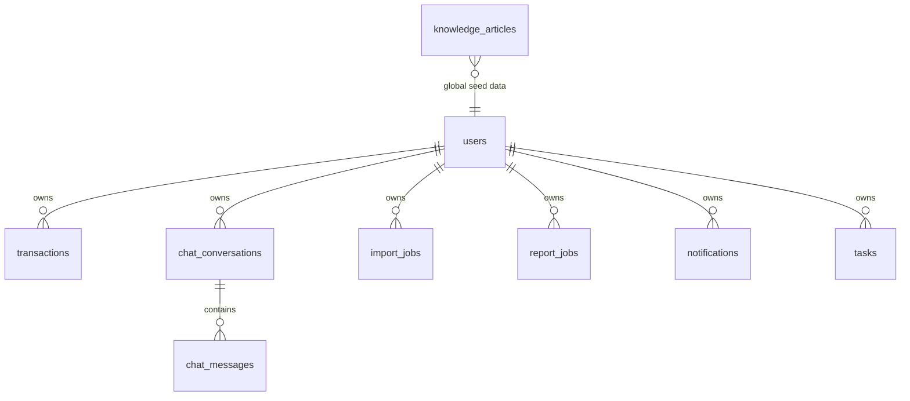

### Key classes

| Role | Classes |
|------|---------|
| Entities | `User`, `Transaction`, `ChatConversation`, `ChatMessage`, `ImportJob`, `ReportJob`, `Notification`, `Task`, `KnowledgeArticle` |
| Repositories | `TransactionRepository`, `UserRepository`, `TaskRepository`, `NotificationRepository`, `KnowledgeArticleRepository`, … |
| Migrations | Flyway SQL only (no Java migrations) |

### Key files

| Path | Purpose |
|------|---------|
| `src/main/resources/db/migration/V1__initial_schema.sql` | Core schema |
| `V2__add_auto_categorized_column.sql` | Import categorization flag |
| `V3__create_notifications_table.sql` | Notifications |
| `V4__create_tasks_table.sql` | Tasks |
| `V5__create_knowledge_articles_table.sql` | Business Guide |
| `src/main/resources/application.properties` | JDBC URL, Flyway, `ddl-auto=validate` |
| `compose.yaml` | Local PostgreSQL |
| `docs/architecture/adr/004-postgresql-selection.md` | ADR |
| `docs/architecture/adr/005-flyway-selection.md` | ADR |

---

## AI Architecture

### Description

Production intelligence is **100% rule-based** — no LLM SDK in `pom.xml`. Five **provider interfaces** for future LLM; only **`RuleBasedForecastProvider`** and **`DatabaseKnowledgeProvider`** are implemented. `AIRecommendationEngine` drives AI Accountant recommendations; `ForecastEngine` drives Forecast Center math; `DashboardService` has inline insight rules.

**Future hooks (wired, not active):** `AIInsightProvider`, `AnalyticsInsightProvider` (injected, never called), `CategorizationProvider`, `TransactionInsightService` (no callers).

### Diagram

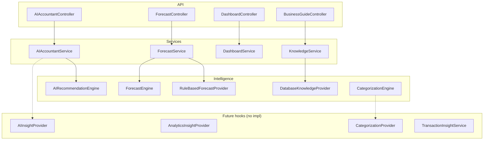

### Key classes

| Component | Class |
|-----------|-------|
| AI Accountant rules | `AIRecommendationEngine`, `FinancialSnapshot` |
| Forecast math | `ForecastEngine`, `RuleBasedForecastProvider` |
| Dashboard insights | `DashboardService.getInsights()` (inline) |
| Knowledge assist | `DatabaseKnowledgeProvider`, `KnowledgeService` |
| Import categorization | `CategorizationEngine`, `DefaultCategoryRules` |
| Provider interfaces | `AIInsightProvider`, `ForecastProvider`, `KnowledgeProvider`, `AnalyticsInsightProvider`, `CategorizationProvider` |

### Key files

| Path | Purpose |
|------|---------|
| `src/main/java/com/flowiq/aiaccountant/AIRecommendationEngine.java` | Recommendations |
| `src/main/java/com/flowiq/forecasts/engine/ForecastEngine.java` | Projections |
| `src/main/java/com/flowiq/service/DashboardService.java` | Dashboard AI insights |
| `src/main/java/com/flowiq/service/AIAccountantService.java` | AI Accountant orchestration |
| `docs/architecture/ai-architecture.md` | Provider map |
| `docs/architecture/AI_DOCUMENTATION_AUDIT_REPORT.md` | As-built audit |

---

## CI/CD Architecture

### Description

**GitHub Actions** on `main` push/PR — **verify only, no deploy**.

| Pipeline | Repo | Steps |
|----------|------|-------|
| Backend CI | `flowiq-backend` | Java 17 → `./mvnw clean verify` → Surefire reports → JaCoCo artifact |
| Frontend CI | `flowiq-frontend` | Node 20 → `npm ci` → `npm run lint` → `npm run build` |

CI disables Docker Compose (`SPRING_DOCKER_COMPOSE_ENABLED=false` on backend). **No** Testcontainers, **no** E2E, **no** deployment workflow, **no** frontend tests.

### Diagram

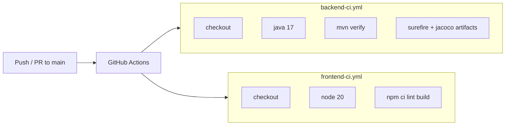

### Key classes

N/A — YAML workflows only.

### Key files

| Path | Purpose |
|------|---------|
| `flowiq-backend/.github/workflows/backend-ci.yml` | Maven verify + coverage |
| `flowiq-frontend/.github/workflows/frontend-ci.yml` | Lint + build |
| `docs/deployment/ci-cd-as-built.md` | CI documentation |
| `pom.xml` | JaCoCo + Surefire plugins |

---

## Security Architecture

### Description

**Stateless JWT** (HS256) via `JwtService` + `JwtAuthenticationFilter`. **BCrypt** passwords. **No server sessions.** Public routes: `/api/health`, `/api/auth/register`, `/api/auth/login`, Swagger. All other `/api/*` require authentication.

**Access token:** 24h. **Refresh token:** generated on login (7d) but **`POST /api/auth/refresh` not implemented**. Frontend stores tokens in **`localStorage`**. CORS allowlist: `localhost:3000`, `flowiq-frontend:3000`, `https://flowiq.vercel.app`.

Roles (`ADMIN`/`USER`/`VIEWER`) exist on `User` entity — **partial enforcement** (no full RBAC).

### Diagram

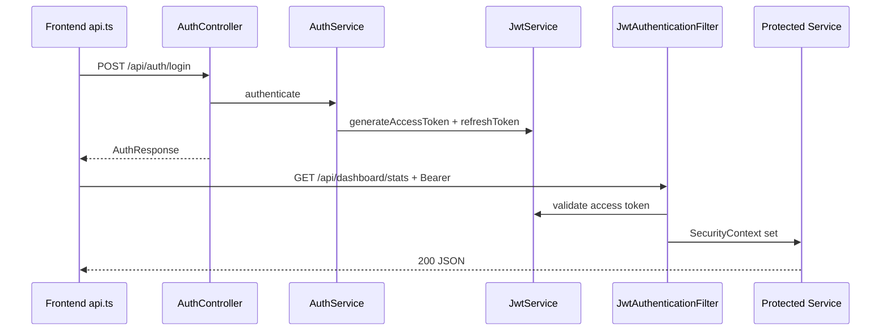

### Key classes

| Role | Class |
|------|-------|
| JWT | `JwtService`, `JwtAuthenticationFilter` |
| Auth flow | `AuthService`, `AuthController` |
| User load | `CustomUserDetailsService`, `UserPrincipal` |
| Security config | `SecurityConfig` |
| CORS | `CorsConfig` |
| Preferences | `AppPreferencesFilter`, `AppPreferences` |
| Password | `BCryptPasswordEncoder` (bean in `SecurityConfig`) |

### Key files

| Path | Purpose |
|------|---------|
| `src/main/java/com/flowiq/config/SecurityConfig.java` | Filter chain, public paths |
| `src/main/java/com/flowiq/config/CorsConfig.java` | Allowed origins |
| `src/main/java/com/flowiq/security/JwtService.java` | Token generate/validate |
| `src/main/resources/application.properties` | `jwt.secret`, expirations |
| `flowiq-frontend/src/services/api.ts` | Token attach + 401 clear |
| `docs/architecture/adr/006-jwt-authentication-strategy.md` | ADR |

---

## Deployment Architecture

### Description

**Local dev:** `compose.yaml` runs **PostgreSQL only**; backend via `./mvnw spring-boot:run` (optional Spring Docker Compose support); frontend via `npm run dev` on port 3000.

**Containers:** Multi-stage **Dockerfiles** in both repos. Backend JAR on port **8080** with `/api/health` healthcheck. Frontend **Next.js standalone** on port **3000**. **No full-stack docker-compose** (app + DB together) in repo.

**Production (as-configured):** CORS points to **`https://flowiq.vercel.app`** for frontend; backend host TBD. API URL via `NEXT_PUBLIC_API_URL`.

### Diagram

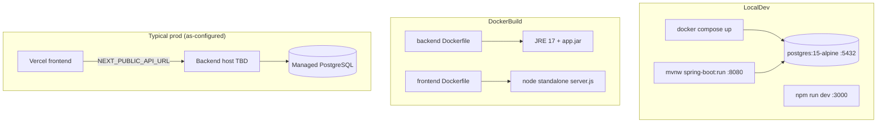

### Key classes

N/A — deployment is infrastructure/Docker.

### Key files

| Path | Purpose |
|------|---------|
| `flowiq-backend/compose.yaml` | PostgreSQL service only |
| `flowiq-backend/Dockerfile` | Backend image |
| `flowiq-backend/src/main/resources/application-docker.properties` | Docker JDBC URL |
| `flowiq-frontend/Dockerfile` | Frontend standalone image |
| `flowiq-frontend/next.config.ts` | `output: "standalone"` |
| `docs/deployment/docker.md` | Docker docs |

---

## Основные ограничения системы

### Description

Hard limits of the **current as-built** system relevant for architect review.

| Limitation | Fact in code |
|------------|--------------|
| No LLM / bank APIs | No OpenAI/bank SDK; integrations UI mock-only |
| Demo transaction seed | `TransactionSeedService.seedIfEmpty()` on first module access — all environments |
| No `transactions.source` | Cannot distinguish seeded vs real data |
| JWT refresh missing | Refresh token issued; no `/api/auth/refresh` |
| Token in localStorage | XSS exposure; logout is client-only |
| Single-tenant rows | `user_id` only — no organization model |
| FOP/tax constants hardcoded | Duplicated in `AnalyticsService`, `ForecastService`, rule engines |
| No audit log | No entity/table/API |
| No settings API | Frontend settings not persisted on backend |
| RBAC incomplete | Roles exist; not enforced on all endpoints |
| Schedulers single-instance | Cron assumes one backend node |
| Forward-only migrations | Flyway Community — no auto-rollback |

### Diagram

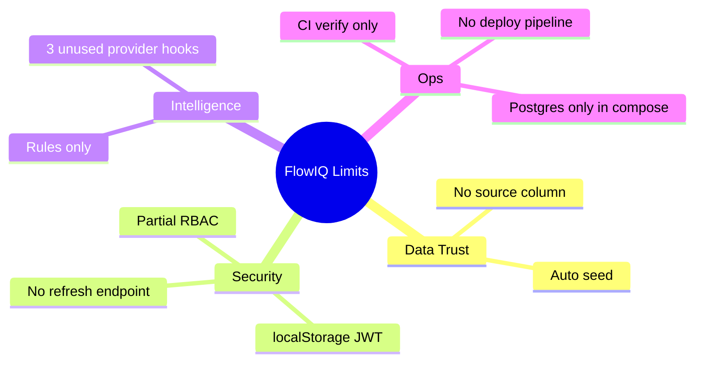

### Key classes

`TransactionSeedService`, `JwtService`, `AnalyticsService` (hardcoded `INCOME_LIMITS`).

### Key files

`TransactionSeedService.java`, `application.properties`, `docs/architecture/data-sources.md`

---

## Технический долг

### Description

Documented gaps between **intended architecture** and **current code**.

| Debt | Evidence |
|------|----------|
| `AnalyticsInsightProvider` unused | Injected in `AnalyticsService`, field never read |
| `TransactionInsightService` dead code | `@Service` with zero callers |
| Duplicate forecast logic | `AIAccountantService.buildForecast()` vs `ForecastEngine` |
| Dual health scores | `DashboardService` vs `AIAccountantService` different formulas |
| Duplicate FOP constants | 4+ classes — ADR-009 candidate |
| Frontend mock hybrid | `tax-profile.service.ts`, `business-guide.service.ts` static data |
| Backend Dockerfile skips tests | `-DskipTests package` in Dockerfile build stage |
| No integration/E2E tests | 10 backend unit test classes; 0 frontend tests |
| CI without Testcontainers | `mvn verify` without live PostgreSQL in CI |
| Dev JWT secret in properties | Must externalize for production |

### Diagram

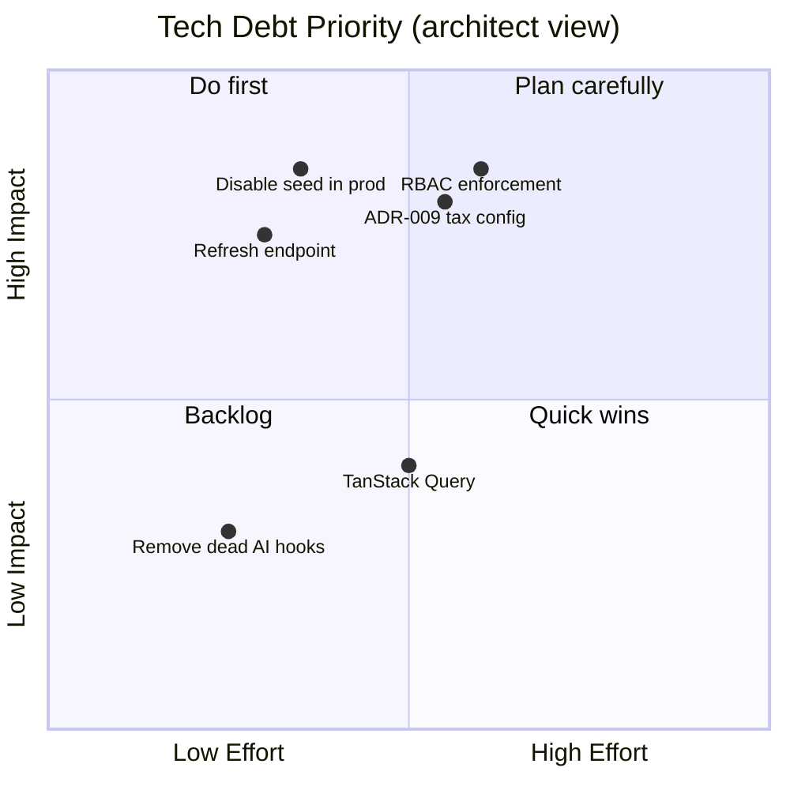

### Key classes

`AnalyticsService`, `TransactionInsightService`, `AIAccountantService`, `DashboardService`

### Key files

`docs/architecture/AI_DOCUMENTATION_AUDIT_REPORT.md`, `docs/architecture/adr/ADR_COVERAGE_REPORT.md`

---

## Будущие улучшения

### Description

Roadmap items aligned with ADRs and coverage report — **not implemented**.

| Priority | Improvement | ADR / doc reference |
|----------|-------------|---------------------|
| High | `POST /api/auth/refresh` + axios interceptor | ADR-006 Phase 2 |
| High | Disable/gate `TransactionSeedService` in prod + UI labeling | ADR-002 |
| High | ADR-009: centralize FOP/tax constants | ADR Coverage Report |
| High | ADR-017: RBAC enforcement | Security gap |
| High | Audit log entity + API | Gap #13 |
| Medium | First `AIInsightProvider` / `KnowledgeProvider` LLM impl | ADR-001 |
| Medium | Testcontainers in CI | CI maturity |
| Medium | Settings persistence API | Frontend settings |
| Medium | `transactions.source` column (`SEED`/`IMPORT`/`MANUAL`) | ADR-002 mitigation |
| Low | TanStack Query on frontend | ADR-008 |
| Low | Full docker-compose (API + DB + FE) | Deployment |
| Low | Bank API ingestion Phase 1 | Roadmap |

### Diagram

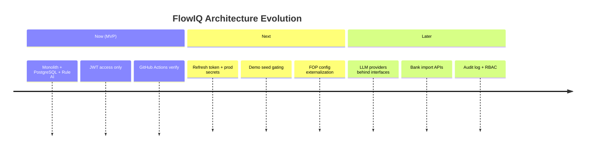

### Key classes (future touch points)

`AuthService` (refresh), `TransactionSeedService` (gating), new `TaxConfigurationService`, `AIInsightProvider` implementations.

### Key files

| Path | Purpose |
|------|---------|
| `docs/architecture/ADR_DEFENSE_GUIDE.md` | Defense Q&A |
| `docs/architecture/adr/ADR_COVERAGE_REPORT.md` | ADR-009+ candidates |
| `docs/ai/future-llm-integration.md` | LLM checklist |

---

## Quick Reference Card

```
Stack:     Java 17 · Spring Boot 3.5 · PostgreSQL 15 · Flyway V1-5
           Next.js 16 · React 19 · axios · Tailwind 4

API:       /api/*  ·  13 controllers  ·  OpenAPI /swagger-ui

Auth:      JWT Bearer  ·  24h access  ·  refresh issued but no endpoint

AI:        Rules only  ·  ForecastEngine + AIRecommendationEngine
           Provider interfaces ready  ·  no LLM beans

Data:      user_id tenancy  ·  auto-seed on empty transactions

CI:        mvn verify | npm lint+build  ·  no deploy

Deploy:    Dockerfiles exist  ·  compose = Postgres only
           Frontend CORS target: flowiq.vercel.app
```

---

## Related Documents

| Document | Use when |
|----------|----------|
| [ADR Defense Guide](ADR_DEFENSE_GUIDE.md) | Architect asks "why this decision?" |
| [ADR Index](adr/README.md) | ADR list + dependencies |
| [Architecture Review Readiness](ARCHITECTURE_REVIEW_READINESS.md) | Overall doc health score |
| [Data Sources](data-sources.md) | "Where does this module get data?" |
| [AI Documentation Audit](AI_DOCUMENTATION_AUDIT_REPORT.md) | "Is AI real?" |

**Prepared:** 2026-06-23
