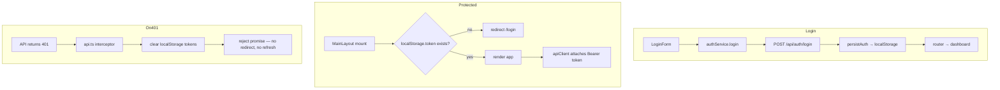
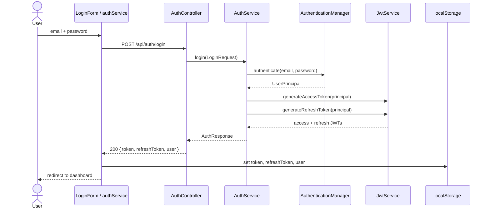
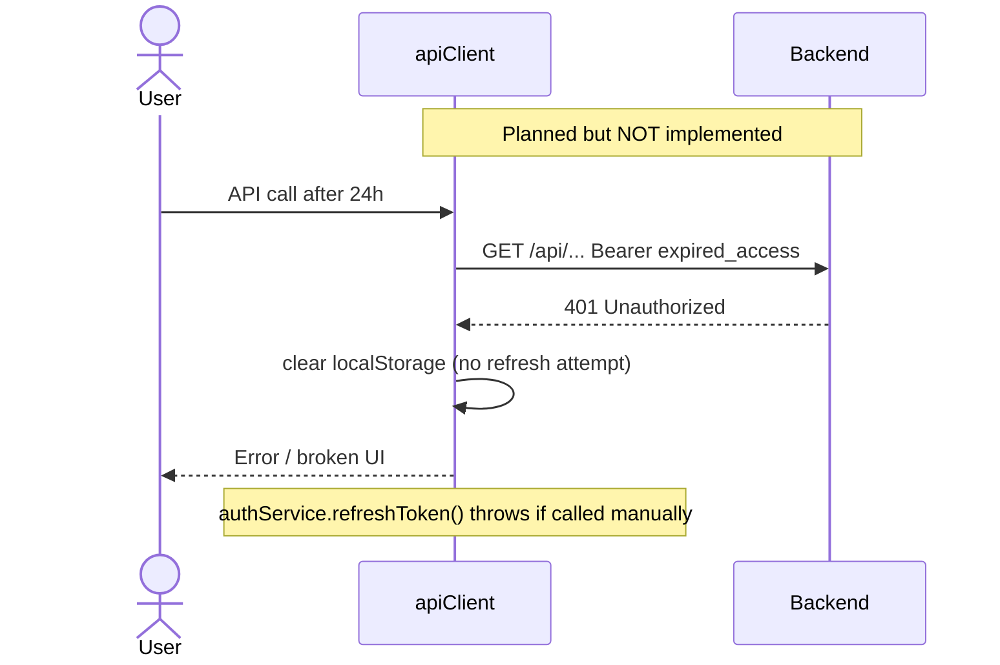
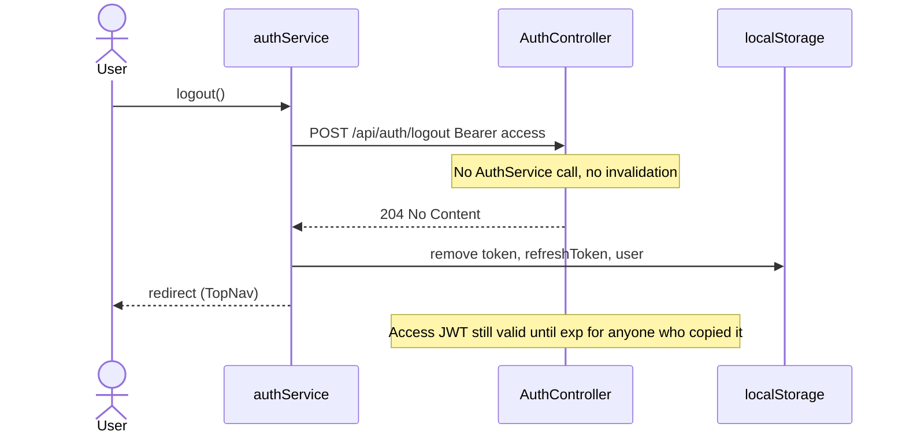
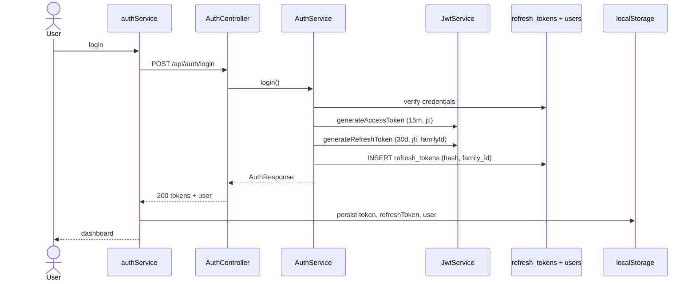
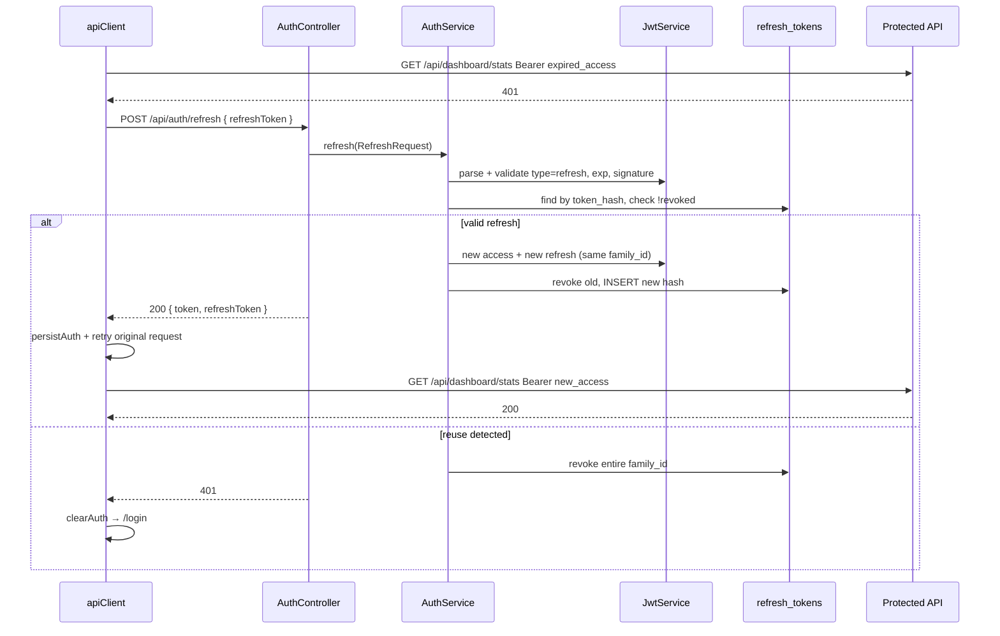

# JWT Lifecycle Remediation Plan

**Audit date:** 2026-06-23  
**Scope:** Backend JWT stack + `flowiq-frontend` auth flow  
**Source of truth:** Code only (no changes in this document)  
**Related:** [ADR-006](adr/006-jwt-authentication-strategy.md) · [JWT Flow](../security/jwt-flow.md) · [TD-C06](TECHNICAL_DEBT_REGISTER.md) · [TD-H02](TECHNICAL_DEBT_REGISTER.md)

---

## Executive Summary

FlowIQ реализует **stateless JWT** (Spring Security + JJWT). Access и refresh токены **генерируются** при login/register, но **refresh lifecycle не завершён**: нет `POST /api/auth/refresh`, logout **client-only**, refresh token **лежит в localStorage без использования**.

**Вердикт:** для Production необходимы refresh endpoint, silent refresh на frontend, server-side logout/rotation и сокращение TTL access token. Текущая схема приемлема для **MVP demo**, но блокирует production security sign-off (TD-C06).

---

## 1. As-Built Audit

### 1.1 Component map

| Component | File | Role |
|-----------|------|------|
| `JwtService` | `src/main/java/com/flowiq/security/JwtService.java` | Generate/parse/validate JWT (HS256) |
| `JwtAuthenticationFilter` | `src/main/java/com/flowiq/security/JwtAuthenticationFilter.java` | Bearer validation per request |
| `SecurityConfig` | `src/main/java/com/flowiq/config/SecurityConfig.java` | Stateless filter chain, public routes |
| `AuthService` | `src/main/java/com/flowiq/service/AuthService.java` | register/login/me, token issuance |
| `AuthController` | `src/main/java/com/flowiq/controller/AuthController.java` | REST `/api/auth/*` |
| `apiClient` | `flowiq-frontend/src/services/api.ts` | Axios + request/response interceptors |
| `authService` | `flowiq-frontend/src/services/auth.service.ts` | Login/logout/persist tokens |
| `MainLayout` | `flowiq-frontend/src/shared/components/layout/MainLayout.tsx` | Client-side route guard |

### 1.2 Token parameters (current)

| Parameter | Value | Config |
|-----------|-------|--------|
| Algorithm | HS256 (symmetric) | `jwt.secret` |
| Access TTL | **24 hours** (86 400 000 ms) | `jwt.access-token-expiration` |
| Refresh TTL | **7 days** (604 800 000 ms) | `jwt.refresh-token-expiration` |
| Session policy | `STATELESS` | `SecurityConfig` |
| Access claim `type` | `"access"` | `JwtService.generateAccessToken` |
| Refresh claim `type` | `"refresh"` | `JwtService.generateRefreshToken` |
| Other claims | `sub` (email), `userId`, `role` | `JwtService.generateToken` |

**Dev secret** committed in `application.properties` (TD-C03) — отдельный риск, не часть lifecycle, но критичен для prod.

### 1.3 Где генерируется refresh token

```text
POST /api/auth/login  OR  POST /api/auth/register
  → AuthController
    → AuthService.login() / register()
      → AuthService.buildAuthResponse()
        → jwtService.generateAccessToken(principal)   // type=access
        → jwtService.generateRefreshToken(principal)  // type=refresh
      → AuthResponse { token, refreshToken, user }
```

**Единственная точка генерации refresh** — `AuthService.buildAuthResponse()` (private). Повторная выдача refresh при refresh/logout **не реализована**.

### 1.4 Где хранится refresh token

| Location | Key / mechanism | Read on API calls? |
|----------|-----------------|-------------------|
| **Browser `localStorage`** | `refreshToken` | **No** — не отправляется на backend |
| Backend DB | — | **No table** |
| Backend Redis/cache | — | **Absent** |
| httpOnly cookie | — | **Not used** |

**Frontend persist** (`auth.service.ts`):

```typescript
localStorage.setItem("token", authResponse.token);           // access
localStorage.setItem("refreshToken", authResponse.refreshToken);
localStorage.setItem("user", JSON.stringify(authResponse.user));
```

**Access token** attach (`api.ts` request interceptor):

```typescript
const token = localStorage.getItem("token");
config.headers.Authorization = `Bearer ${token}`;
```

Refresh token **никогда не читается** для HTTP-запросов (кроме `removeItem` при 401/logout).

### 1.5 Почему отсутствует `POST /api/auth/refresh`

| Factor | Detail |
|--------|--------|
| **AuthController** | Endpoints: `/register`, `/login`, `/me`, `/logout` only — **no `/refresh` mapping** |
| **AuthService** | No `refresh()` method |
| **JwtService** | Has `generateRefreshToken`, **no** `validateRefreshToken` / `isRefreshToken` public API |
| **SecurityConfig** | `/api/auth/refresh` not in `permitAll` (would need to be added) |
| **ADR-006** | Refresh marked **Phase 2 (planned)**, not implemented |
| **Frontend** | `authService.refreshToken()` **explicitly throws** `"Refresh token endpoint is not available yet"` |

Refresh token был заложен в ADR и DTO **на будущее**, но цепочка validate → re-issue не доведена.

### 1.6 `JwtAuthenticationFilter` behavior

- Читает `Authorization: Bearer <jwt>`
- Принимает **только** `type=access` (`jwtService.isAccessToken(jwt)`)
- Refresh token, отправленный как Bearer, **игнорируется** → запрос идёт как unauthenticated
- При parse/validation error — `SecurityContextHolder.clearContext()`, исключение **проглатывается** (silent fail → 401 downstream)

### 1.7 Logout (current)

```text
POST /api/auth/logout (requires valid access JWT)
  → AuthController.logout()
    → return 204 No Content
    → AuthService NOT called
    → No server-side invalidation
```

Frontend (`auth.service.logout`):

1. `POST /api/auth/logout` (best effort)
2. `clearAuth()` — удаляет `token`, `refreshToken`, `user` из localStorage

**Access token остаётся валидным до `exp`** (до 24h). Украденный token можно использовать даже после «logout».

### 1.8 Frontend auth flow



**Guards:**

| Check | Validates expiry? | Validates signature? |
|-------|-------------------|---------------------|
| `MainLayout` `isAuthenticated()` | **No** — only `!!localStorage.getItem("token")` | **No** |
| `LoginPage` redirect if authenticated | **No** — token presence only | **No** |
| Backend `JwtAuthenticationFilter` | **Yes** | **Yes** |

### 1.9 localStorage inventory (auth-related)

| Key | Written by | Purpose | Security note |
|-----|------------|---------|---------------|
| `token` | `auth.service` login/register | Access JWT | XSS → full API access 24h |
| `refreshToken` | `auth.service` login/register | Stored, **unused** | XSS → 7d window if refresh endpoint added without rotation |
| `user` | `auth.service`, `getCurrentUser` | Profile cache | PII in localStorage |
| `flowiq_language` | `PreferencesContext` | API headers | Non-auth |
| `flowiq_currency` | `PreferencesContext` | API headers | Non-auth |
| `flowiq_theme` | theme module | UI | Non-auth |

**Нет:** `sessionStorage`, cookies, `Secure`/`httpOnly` storage для токенов.

---

## 2. Risk Assessment

| ID | Risk | Severity | Current state |
|----|------|----------|---------------|
| R1 | **No refresh flow** — forced re-login after 24h; refresh token dead weight | High | Confirmed |
| R2 | **Logout не инвалидирует JWT** — stolen token valid until expiry | Critical | 24h exposure window |
| R3 | **Refresh в localStorage** — XSS exfiltration | High | Standard SPA trade-off |
| R4 | **24h access TTL** — long compromise window | High | No prod shortening |
| R5 | **Client-only session check** — UI shows «logged in» with expired token | Medium | Until first 401 |
| R6 | **401 handler** clears tokens but **no redirect** to `/login` | Medium | Broken UX, stale shell |
| R7 | **Dev JWT secret in repo** | Critical | TD-C03 |
| R8 | **No `jti` / denylist** — impossible to revoke single session | High | By design (stateless) |
| R9 | **Refresh reuse** (future) — without rotation, stolen refresh = long-lived access | High | Mitigate in Phase 2 |
| R10 | **Swagger public** — token testing surface in dev | Medium | TD-H13 |

---

## 3. What Happens After Access Token Expiry

### Timeline (typical user session)

| Time | Event |
|------|-------|
| **T+0** | Login → access (24h) + refresh (7d) in localStorage |
| **T+0…24h** | All API calls succeed; `MainLayout` shows app |
| **T+24h** | Access JWT `exp` passed |
| **First API call after expiry** | `JwtAuthenticationFilter` → invalid/expired → no SecurityContext → **401 Unauthorized** |
| **401 interceptor** | Removes `token`, `refreshToken`, `user` from localStorage |
| **UI state** | `MainLayout` **still mounted** — no automatic redirect; user sees errors on data fetches |
| **Navigation / F5** | `isAuthenticated()` false → redirect `/login` |
| **Refresh token** | **Unused** — cannot extend session even within 7 days |
| **T+7d** | Refresh also expired (irrelevant today — never consumed) |

### Edge cases

| Scenario | Behavior |
|----------|----------|
| User idle 25h, clicks button | 401 → cleared storage → error toast, no silent recovery |
| Tab open overnight | Same — first request fails |
| Logout clicked | Client clears storage; **access JWT still valid** for attacker |
| Send refresh JWT as Bearer | Filter rejects (`!isAccessToken`) → 401 on protected routes |
| `GET /api/auth/me` with expired token | 401 → `getCurrentUser` clears auth |

---

## 4. Current Sequence Diagrams (As-Built)

### 4.1 Login



### 4.2 Refresh (not implemented — actual behavior)



### 4.3 Logout



---

## 5. Production-Ready Target Architecture

### 5.1 Design principles

1. **Short access, long refresh** — access 15 min, refresh 7–30 days  
2. **Refresh only via dedicated endpoint** — never as Bearer on business APIs  
3. **Rotation** — each refresh issues new refresh token; old one invalidated  
4. **Server-side session control** — refresh token family in DB (MVP) or Redis (scale)  
5. **Defense in depth** — CSP against XSS; optional BFF + httpOnly cookies (Phase 3)

### 5.2 Token roles

| Token | Transport | TTL (prod target) | Storage (MVP) | Storage (hardened) |
|-------|-----------|-------------------|---------------|-------------------|
| **Access** | `Authorization: Bearer` | **15 min** | `localStorage` (`token`) | memory or short-lived |
| **Refresh** | Request body or `httpOnly` cookie | **30 days** | `localStorage` → rotate | `httpOnly; Secure; SameSite=Strict` cookie |

### 5.3 Proposed API contract

#### `POST /api/auth/refresh` (public)

**Request:**

```json
{
  "refreshToken": "<jwt_refresh>"
}
```

**Response `200`:**

```json
{
  "token": "<new_access>",
  "refreshToken": "<new_refresh>"
}
```

**Errors:** `401` invalid/expired/revoked/reused refresh

**SecurityConfig:** add `/api/auth/refresh` to `permitAll`.

#### `POST /api/auth/logout` (authenticated OR refresh body)

**Option A (MVP):** Bearer access + body `{ "refreshToken": "..." }` → revoke refresh family  
**Option B:** Refresh-only logout for expired access

**Response:** `204` — invalidate refresh record(s); optional access `jti` denylist (short TTL)

### 5.4 Backend components (proposed)

| Component | Responsibility |
|-----------|----------------|
| `JwtService` | Add `isRefreshToken()`, `validateRefreshToken()`, `extractJti()` |
| `RefreshTokenService` | Persist hash, rotation, reuse detection |
| `AuthService.refresh()` | Validate refresh → issue pair → revoke old |
| `AuthService.logout()` | Revoke refresh family; audit log entry |
| `V7__create_refresh_tokens.sql` | `refresh_tokens` table |
| `TokenDenylistService` (Phase 3) | Redis SET for revoked access `jti` (TTL = access TTL) |

#### `refresh_tokens` table (recommended MVP)

```sql
CREATE TABLE refresh_tokens (
    id              BIGSERIAL PRIMARY KEY,
    user_id         BIGINT NOT NULL REFERENCES users(id),
    token_hash      VARCHAR(64) NOT NULL,      -- SHA-256 of refresh JWT
    family_id       UUID NOT NULL,             -- rotation family
    expires_at      TIMESTAMP NOT NULL,
    revoked_at      TIMESTAMP,
    replaced_by_id  BIGINT REFERENCES refresh_tokens(id),
    created_at      TIMESTAMP NOT NULL DEFAULT NOW(),
    user_agent      VARCHAR(512),
    ip_address      VARCHAR(45)
);
CREATE INDEX idx_refresh_tokens_user_id ON refresh_tokens(user_id);
CREATE INDEX idx_refresh_tokens_hash ON refresh_tokens(token_hash);
```

**On login:** create row with new `family_id`, store hash of refresh JWT.  
**On refresh:** validate JWT + hash + not revoked + not expired → new row same `family_id`, mark old `replaced_by_id`, revoke old.  
**On reuse of old refresh:** revoke **entire family** (breach detection).  
**On logout:** revoke all tokens for user or family.

### 5.5 Blacklist vs alternatives

| Strategy | Use for | Pros | Cons |
|----------|---------|------|------|
| **Refresh token DB + rotation** | Refresh lifecycle | Revocable sessions; reuse detection | DB write per refresh |
| **Redis denylist (`jti`)** | Access token logout | Fast revoke before expiry | Needs Redis; TTL management |
| **User `token_version` claim** | Invalidate all sessions | One column bump | Nuclear — logs out everywhere |
| **Short access TTL only** | Reduce access risk | Simple | Bad UX without refresh |
| **Opaque refresh tokens** | Hide JWT from client | No JWT refresh parsing | More complexity |

**Recommended for FlowIQ MVP Production:**

- **Primary:** `refresh_tokens` table + rotation + family reuse detection  
- **Secondary:** Redis optional denylist for access `jti` on logout (Phase 3) — TTL 15 min makes full access blacklist optional  
- **Not recommended alone:** client-only logout without server state

### 5.6 Frontend target flow

```typescript
// Pseudocode — api.ts response interceptor (proposed)
on 401 (not auth/login|register|refresh):
  if (!isRetry && localStorage.refreshToken):
    try:
      newTokens = POST /auth/refresh { refreshToken }
      persistAuth(newTokens)
      retry original request with new access
    catch:
      clearAuth(); router.replace('/login')
  else:
    clearAuth(); router.replace('/login')
```

**Additional:**

- `isAuthenticated()` → decode JWT `exp` client-side (non-authoritative) for early redirect  
- Single-flight refresh lock (prevent parallel refresh storms)  
- `MainLayout` listen for `auth:logout` event from interceptor

### 5.7 Production configuration (proposed)

```properties
# application-prod.properties
jwt.access-token-expiration=900000          # 15 min
jwt.refresh-token-expiration=2592000000     # 30 days
jwt.secret=${JWT_SECRET}                    # from env / secrets manager

flowiq.auth.refresh-rotation-enabled=true
flowiq.auth.refresh-reuse-detection=true
```

Startup validator: fail if `jwt.secret` equals dev default in `prod` profile.

---

## 6. Target Sequence Diagrams

### 6.1 Login (target)



### 6.2 Refresh (target)



### 6.3 Logout (target)

```mermaid
sequenceDiagram
    actor User
    participant FE as authService
    participant API as AuthController
    participant SVC as AuthService
    participant DB as refresh_tokens
    participant Redis as denylist (optional)

    User->>FE: logout()
    FE->>API: POST /api/auth/logout Bearer access + { refreshToken }
    API->>SVC: logout(accessJti, refreshToken)
    SVC->>DB: revoke refresh family / user tokens
    opt Phase 3
        SVC->>Redis: SET jti revoked TTL=15m
    end
    API-->>FE: 204
    FE->>FE: clearAuth()
    FE-->>User: /login

    Note over API: Stolen access valid max 15m; refresh unusable immediately
```

---

## 7. Remediation Options

### Option A — Minimal (refresh endpoint only)

- Add `POST /api/auth/refresh`, validate `type=refresh` in JwtService  
- No DB, no rotation — stateless refresh JWT  
- Frontend axios retry  

| Pros | Cons |
|------|------|
| Fast (1 week) | Logout still ineffective; refresh theft = 7d access |
| Unblocks UX | Not production-grade |

### Option B — Recommended MVP Production

- Option A + `refresh_tokens` table + rotation + reuse detection  
- Shorten access to 15 min in prod  
- Logout revokes refresh family  
- Audit log on login/logout/refresh-fail (ADR-013)  

| Pros | Cons |
|------|------|
| Revocable sessions | Schema migration + tests |
| ADR-006 Phase 2–3 aligned | Slightly more backend code |

### Option C — BFF + httpOnly cookies

- Next.js API route holds tokens; browser gets session cookie  

| Pros | Cons |
|------|------|
| XSS cannot read refresh | Major arch change; CORS/cookie design |
| | Deferred post-MVP |

---

## 8. Recommended Solution (MVP → Production)

**Adopt Option B** in two implementation waves:

### Wave 1 — Week 2 (Month 1 roadmap, TD-C06)

| # | Task | Repo |
|---|------|------|
| 1 | `RefreshTokenRequest` DTO, `POST /api/auth/refresh` | backend |
| 2 | `JwtService.isRefreshToken()`, validate refresh path | backend |
| 3 | `permitAll` for `/api/auth/refresh` | backend |
| 4 | Implement `authService.refreshToken()` → call API | frontend |
| 5 | Axios 401 interceptor with single-flight retry | frontend |
| 6 | 401 → `router.replace('/login')` | frontend |
| 7 | Integration test: login → wait/expired mock → refresh → access | backend |

**TTL unchanged in Wave 1** (24h access) — lower risk; shorten in Wave 2.

### Wave 2 — Week 3–4

| # | Task |
|---|------|
| 1 | Flyway `V7__create_refresh_tokens.sql` |
| 2 | `RefreshTokenService` — hash, store, rotate, reuse |
| 3 | Wire login to persist refresh hash |
| 4 | `AuthService.logout()` — revoke family |
| 5 | `application-prod.properties` — access 15m, env secret |
| 6 | ADR-006 amendment (accepted changes) |
| 7 | Update `docs/api/authentication-api.md`, `jwt-flow.md` |

### Wave 3 — Post-MVP (optional)

- Redis `jti` denylist for immediate access revoke on logout  
- httpOnly cookie migration (ADR-020 candidate)  
- `@PreAuthorize` RBAC (TD-H03)

---

## 9. Migration Plan (no breakage)

### Phase 0 — Docs (now)

- This plan; link from TD-C06, ADR-006.

### Phase 1 — Backward-compatible refresh

- New endpoint only; existing login response **unchanged**  
- Old clients: ignore refresh, re-login at 24h (same as today)  
- New clients: use refresh silently  

### Phase 2 — Server-side refresh store

- Deploy migration `V7`  
- On login: **also** write DB row (old clients still get JWT refresh in body)  
- Refresh endpoint: require DB row match (gradual enforcement)  
- **No forced logout** of existing sessions — old refresh JWTs work until natural expiry unless rotation enforced with feature flag:

```properties
flowiq.auth.refresh-persistence-required=false  # Week 1
flowiq.auth.refresh-persistence-required=true   # cutover after deploy
```

### Phase 3 — Prod TTL cutover

- Deploy prod profile with 15m access **after** refresh proven in staging  
- Communicate: users on old tabs get one 401 → auto-refresh → continue  

### Rollback

| Change | Rollback |
|--------|----------|
| Refresh endpoint | Feature flag `flowiq.auth.refresh-enabled=false` |
| DB refresh table | Keep table; fall back to stateless JWT refresh |
| Short access TTL | Revert `jwt.access-token-expiration` in prod |

---

## 10. Test Checklist (post-implementation)

- [ ] Login returns access + refresh; refresh in DB (Wave 2)  
- [ ] Protected route works with access token  
- [ ] Expired access + valid refresh → silent retry → 200  
- [ ] Expired refresh → 401 → redirect login  
- [ ] Logout → refresh revoked → refresh call fails  
- [ ] Reuse old refresh after rotation → family revoked  
- [ ] Refresh JWT as Bearer on `/api/dashboard/*` → 401  
- [ ] Concurrent 401s → single refresh request (single-flight)  
- [ ] `POST /auth/refresh` without body → 400  
- [ ] Swagger/doc updated  

---

## 11. Code Anchors (current)

| Artifact | Path |
|----------|------|
| JWT generation | `src/main/java/com/flowiq/security/JwtService.java` |
| Filter (access only) | `src/main/java/com/flowiq/security/JwtAuthenticationFilter.java` |
| Security chain | `src/main/java/com/flowiq/config/SecurityConfig.java` |
| Token issuance | `src/main/java/com/flowiq/service/AuthService.java:81-90` |
| Logout stub | `src/main/java/com/flowiq/controller/AuthController.java:83-86` |
| Config | `src/main/resources/application.properties:38-44` |
| Frontend persist | `flowiq-frontend/src/services/auth.service.ts:32-46` |
| Frontend 401 | `flowiq-frontend/src/services/api.ts:29-43` |
| Route guard | `flowiq-frontend/src/shared/components/layout/MainLayout.tsx:20-25` |
| ADR | `docs/architecture/adr/006-jwt-authentication-strategy.md` |
| Debt | TD-C06, TD-H02, TD-H10 in `TECHNICAL_DEBT_REGISTER.md` |

---

## 12. Decision Summary

| Question | Answer (today) | Target (production) |
|----------|----------------|---------------------|
| Refresh generated? | Yes, login/register | Yes + stored hash in DB |
| Refresh stored? | `localStorage` only | `localStorage` + server record |
| Refresh endpoint? | **No** | `POST /api/auth/refresh` |
| Logout invalidates? | **No** | Revoke refresh family (+ optional jti denylist) |
| Rotation? | **No** | Yes, per refresh |
| After access expiry? | 401 → clear → manual re-login | 401 → refresh → retry |
| Blacklist? | **None** | Refresh DB + optional Redis jti |

---

**Status:** Proposed — awaiting implementation  
**Owner:** Backend + Frontend  
**Target:** Wave 1 in Month 1 Week 2 per [TECHNICAL_DEBT_REGISTER](TECHNICAL_DEBT_REGISTER.md)
