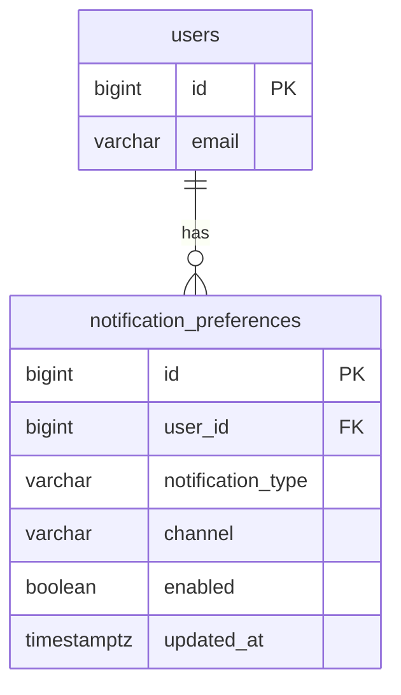
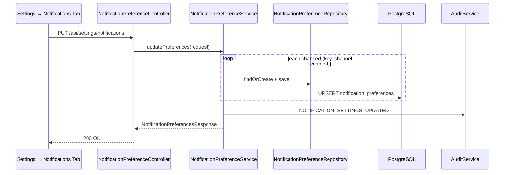
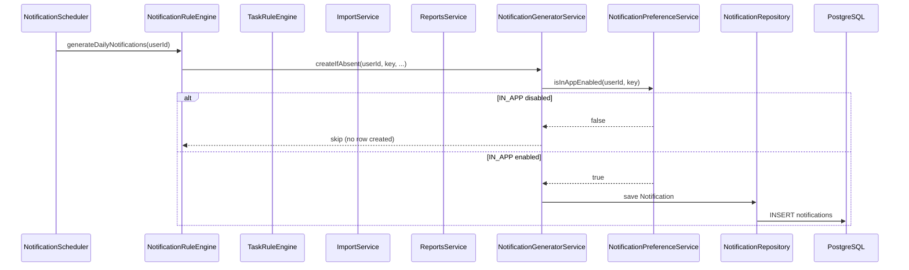

# Notification Preferences Architecture

> **Full notification lifecycle:** [flows/notification-flow.md](flows/notification-flow.md)

FlowIQ notification preferences let each user control **which** notification types are delivered and **through which channels**. Preferences are stored per user in PostgreSQL and enforced at notification creation time — disabled types are never persisted.

## Scope

| Area | Endpoints | Persistence |
|------|-----------|-------------|
| Read preferences | `GET /api/settings/notifications` | `notification_preferences` (with defaults) |
| Update preferences | `PUT /api/settings/notifications` | `notification_preferences` |
| Reset to defaults | `POST /api/settings/notifications/reset` | Deletes user rows → defaults apply |

**Audit:** `NOTIFICATION_SETTINGS_UPDATED` on update and reset.

## Categories & Types

| Category | Preference keys |
|----------|-----------------|
| **FINANCIAL** | Taxes, large expense/income, negative cash flow, low balance, overdue payment, tax warning |
| **TASKS** | Reminders: today, 3 days, week, overdue |
| **AI** | Accountant recommendations, financial tips, tax optimization, warnings, forecast anomaly |
| **IMPORTS** | Completed, failed, partial, CSV processing |
| **REPORTS** | Ready, generation error, PDF available, Excel available |

Enum: `NotificationPreferenceKey` (24 values).

## Delivery Channels

| Channel | Default | Status |
|---------|---------|--------|
| `IN_APP` | **enabled** | Production — gates `notifications` table writes |
| `EMAIL` | disabled | Architecture ready |
| `PUSH` | disabled | Future |
| `TELEGRAM` | disabled | Future |

Each `(user_id, notification_type, channel)` tuple is stored independently.

## Database

### `notification_preferences` (Flyway V8)



| Column | Type | Notes |
|--------|------|-------|
| `user_id` | BIGINT FK → `users` | Tenant scope |
| `notification_type` | VARCHAR | `NotificationPreferenceKey` enum name |
| `channel` | VARCHAR | `IN_APP`, `EMAIL`, `PUSH`, `TELEGRAM` |
| `enabled` | BOOLEAN | User choice |
| `updated_at` | TIMESTAMPTZ | Auto-updated |

**Unique:** `(user_id, notification_type, channel)`.

**Defaults:** When no row exists, `NotificationPreferenceService` returns `IN_APP=true`, all other channels `false`.

## Sequence: Update Preferences (Settings UI)



## Sequence: Notification Creation (Preference Gate)

All notification writes go through `NotificationGeneratorService.createIfAbsent()`, which checks `NotificationPreferenceService.isInAppEnabled()` **before** inserting into `notifications`.



### Integrations

| Component | Preference keys used |
|-----------|---------------------|
| `NotificationScheduler` → `NotificationRuleEngine` | Financial, AI, tax warnings |
| `TaskRuleEngine` | `TASK_REMINDER_*` |
| `ImportService` | `IMPORT_*` |
| `ReportsService` | `REPORT_*` |
| Forecast / Analytics | Via `NotificationRuleEngine` (e.g. `AI_FORECAST_ANOMALY`) |

**Rule:** If `IN_APP` is off for a type, the notification is **not created** — no orphan rows, no unread noise.

## Frontend

| Piece | Location |
|-------|----------|
| Settings tab | `SettingsView` → `notifications` tab |
| Feature module | `src/features/notification-preferences/` |
| API client | `GET/PUT /api/settings/notifications`, `POST .../reset` |

**UX:** Accordion by category, per-category master switch, global master switch, Enable All / Disable All, Reset to Defaults, search filter, explicit Save (no autosave). PUSH and TELEGRAM toggles shown as disabled (“Soon”).

## API Shapes

### GET response (abbreviated)

```json
{
  "categories": [
    {
      "id": "FINANCIAL",
      "preferences": [
        {
          "key": "FINANCIAL_TAXES",
          "channels": { "IN_APP": true, "EMAIL": false, "PUSH": false, "TELEGRAM": false }
        }
      ]
    }
  ],
  "channels": ["IN_APP", "EMAIL", "PUSH", "TELEGRAM"]
}
```

### PUT body

```json
{
  "preferences": [
    { "key": "FINANCIAL_TAXES", "channel": "IN_APP", "enabled": false }
  ]
}
```

## Future: Multi-Channel Delivery

When EMAIL/PUSH/TELEGRAM are implemented, a `NotificationDeliveryService` should read the same `notification_preferences` rows and dispatch outbound messages. `NotificationGeneratorService` remains the single gate for in-app creation; outbound dispatchers consult `isEnabled(userId, key, channel)` per channel.

## Related Documents

| Document | Link |
|----------|------|
| Request flow map | [REQUEST_FLOW_MAP.md](REQUEST_FLOW_MAP.md) |
| Component catalog | [SYSTEM_COMPONENT_CATALOG.md](SYSTEM_COMPONENT_CATALOG.md) |
| Profile (settings sibling) | [PROFILE_ARCHITECTURE.md](PROFILE_ARCHITECTURE.md) |
