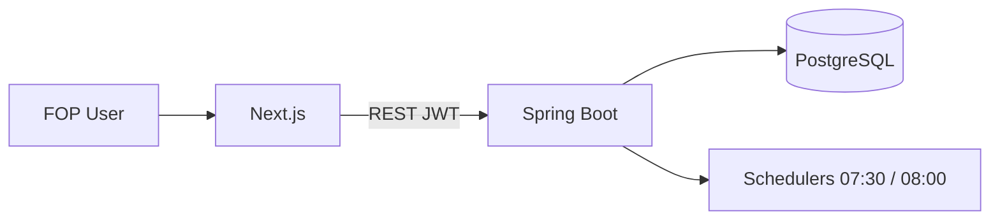

# One-Page Architect Brief — FlowIQ

**Read time:** ~5 minutes · **Updated:** 2026-06-23  
**Use before:** Senior architect review, steering committee, or investor technical Q&A  
**Deep dives:** [Cheat Sheet](ARCHITECT_REVIEW_CHEAT_SHEET.md) · [Interview Guide (56 Q)](ARCHITECT_INTERVIEW_GUIDE.md) · [ADR Defense](ADR_DEFENSE_GUIDE.md) · [Trap Questions](ARCHITECT_TRAP_QUESTIONS.md)

---

## 1. What is FlowIQ?

**FlowIQ** — MVP **financial platform for Ukrainian FOP** (фізичні особи-підприємці): облік, дашборд, аналітика, прогнози, «AI-бухгалтер», звіти, задачі, сповіщення, Business Guide, імпорт CSV з банків.

| Fact | Value |
|------|-------|
| **Repos** | `flowiq-backend` (API) + `flowiq-frontend` (UI) + `flowiq-automation` (QA/CI) |
| **Stack** | Spring Boot 3.5 / Java 17 · PostgreSQL 15 · Next.js 16 / React 19 |
| **Intelligence** | **100% rule-based** — no LLM SDK, no bank APIs in production |
| **Users** | Row-level isolation (`user_id`); нет `companies` / multi-tenant org |

**One-liner:** *Монолитный JWT-secured REST API + тонкий SPA-клиент; «AI» — детерминированные правила и FOP-логика в Java, не ML.*

**Readiness:** Doc health **86/100** · Review readiness **71/100** — [ARCHITECTURE_REVIEW_READINESS.md](ARCHITECTURE_REVIEW_READINESS.md). **MVP review — да; production go-live — нет без remediation.**

---

## 2. Architecture (as-built)

| Layer | Backend | Frontend |
|-------|---------|----------|
| **Entry** | 13 controllers `/api/*` | 18 routes `app/**` |
| **Logic** | Services + rule engines (`ForecastEngine`, `AIRecommendationEngine`, `TaskRuleEngine`, …) | 14 features `src/features/*` |
| **Data** | 8 JPA repos · Flyway **V1–V5** · 9 tables | `apiClient` + feature services |
| **Auth** | Stateless JWT · BCrypt · `JwtAuthenticationFilter` | Token in `localStorage` · `MainLayout` guard |
| **Cross-cutting** | `TransactionSeedService` (auto-demo data) · `AppPreferencesFilter` (locale/currency headers) | `PreferencesContext` |

**Request path (типичный):** `Controller → Service → [Engine/Provider] → Repository → Entity → table` — см. [REQUEST_FLOW_MAP.md](REQUEST_FLOW_MAP.md).

**QA (отдельный репо):** `flowiq-automation` — contract/regression/UI smoke; PR Validation поднимает backend + Postgres.

---

## 3. Key architectural decisions (ADR-001–008)

| ADR | Decision | Trade-off |
|-----|----------|-----------|
| **001** | Pluggable AI providers + rule defaults | Интерфейсы без LLM-bean сегодня |
| **002** | Auto-seed транзакций при пустом счёте | Demo WOW vs риск «фейковых» метрик |
| **003** | Распределённый intelligence (нет monolith orchestrator) | Нет единой trace-точки |
| **004** | PostgreSQL 15 | BYTEA для отчётов в OLTP |
| **005** | Flyway SQL, `ddl-auto=validate` | Forward-only migrations |
| **006** | JWT access + refresh (refresh **endpoint TBD**) | Revocation ограничен |
| **007** | Controller → Service → Repository | Дубли `getCurrentUserEntity()` |
| **008** | Next.js App Router + feature folders | Нет React Query / server auth middleware |

**Не оформлено ADR (кандидаты 009+):** tax constants, audit log, refresh lifecycle, frontend mock hybrid, scheduler HA.

---

## 4. Main risks (what architect will challenge)

| # | Risk | Severity |
|---|------|----------|
| 1 | **Auto-seed** — синтетические транзакции неотличимы от реальных (`TransactionSeedService`, нет `source`) | Critical |
| 2 | **Нет audit log** — нет следа для tax/AI/financial actions | Critical |
| 3 | **Secrets в `application.properties`** — jwt/DB/show-sql | Critical |
| 4 | **JWT в localStorage** + refresh без `/auth/refresh` | Critical / High |
| 5 | **FOP/tax константы** дублируются в 4+ сервисах (+ frontend mocks) | Critical |
| 6 | **«AI» naming** при rule-only логике | High (trust) |
| 7 | **Dual forecast** — `ForecastEngine` vs inline в `AIAccountantService` | High |
| 8 | **Schedulers** без leader election при scale-out | High |
| 9 | **Reports BYTEA** в Postgres + sync generate | High (scale) |
| 10 | **RBAC в JWT**, но нет `@PreAuthorize` | High |

Полный разбор ответов: [ARCHITECT_TRAP_QUESTIONS.md](ARCHITECT_TRAP_QUESTIONS.md) (48 traps).

---

## 5. Main limitations (honest MVP boundaries)

- **Нет:** bank API, LLM, email/Telegram notifications, audit log, CD, staging URL, Actuator, server-side settings.
- **Partial:** Business Guide (статьи = API; FOP/KVED/checker = client mock); integrations UI = placeholder.
- **CI:** backend + frontend unit/lint/build; **нет** Flyway/Testcontainers в backend-only CI (есть в `flowiq-automation` PR Validation).
- **Tests:** ~95 backend unit tests; **0** frontend tests в CI; E2E только через automation repo.
- **Security:** logout client-only; demo user `demo@flowiq.ai` на старте; Swagger public в dev config.
- **Scale assumption:** один инстанс backend (schedulers).

---

## 6. Top technical debt (6 Critical)

| ID | Item | Fix direction |
|----|------|----------------|
| TD-C01 | Auto-seed во всех env | `demo-seed-enabled=false` в prod + UI banner |
| TD-C02 | No audit log | `V6` + `AuditLogService` + ADR-013 |
| TD-C03 | Dev secrets in repo | `application-prod` + env + fail-fast |
| TD-C04 | No `transactions.source` | Migration + API badge |
| TD-C05 | Hardcoded tax/FOP | `TaxConfigurationService` + ADR-009 |
| TD-C06 | Incomplete JWT lifecycle | `POST /auth/refresh` + interceptor |

**Total register:** 48 items (6 / 14 / 16 / 12) — [TECHNICAL_DEBT_REGISTER.md](TECHNICAL_DEBT_REGISTER.md).

---

## 7. Evolution plan (3 months)

| Month | Goal | Key deliverables |
|-------|------|------------------|
| **M1** | Production-defensible security & data trust | Prod secrets; seed off; refresh endpoint; `transactions.source`; audit log V6; `TaxConfigurationService` |
| **M2** | Testable releases + staging | Testcontainers in CI; frontend unit tests; settings API; staging env; Actuator + correlation ID |
| **M3** | Repeatable delivery | Playwright E2E in CI; CD to staging; unify forecast/health scores; wire/remove dead AI hooks; ADR-009/013/017 |

**Target after M3:** Review readiness **90+**; trustworthy production path documented.

---

## 8. Five-minute talk track

| Min | Say this |
|-----|----------|
| **0–1** | FlowIQ = FOP financial MVP; monolith + SPA + PG; rule-based intelligence. |
| **1–2** | 13 API modules mirror frontend features; JWT; Flyway V1–V5; см. C4 + [catalog](SYSTEM_COMPONENT_CATALOG.md). |
| **2–3** | ADR-001–008: layered, JWT, Flyway, pluggable AI (rules today). |
| **3–4** | **Caveats:** seed data, no audit, secrets, JWT gaps — documented with remediation (M1). |
| **4–5** | CI exists (3 repos); CD/staging/E2E on roadmap; open [Interview Guide](ARCHITECT_INTERVIEW_GUIDE.md) for Q&A. |

**If pressed on «AI»:** *Production = deterministic rules in `AIRecommendationEngine`, `ForecastEngine`, inline dashboard insights. LLM = ADR-001 extension point, no beans yet.*

**If pressed on production:** *We seek architecture approval for MVP + roadmap, not go-live sign-off today.*

---

## Quick reference card

| Question | Short answer |
|----------|--------------|
| Microservices? | **No** — single Spring Boot JAR |
| Multi-tenant? | **user_id** rows only |
| Real AI? | **No LLM** — rule-based |
| Data on first login? | **Auto-seed** if empty (risk) |
| Auth? | JWT Bearer 24h; refresh issued, no endpoint |
| DB migrations? | Flyway V1–V5 |
| Deploy? | Docker manual; FE → Vercel; **no CD** |

---

## Document map (keep open during review)

| Need | Document |
|------|----------|
| 15-min presentation | [ARCHITECT_REVIEW_CHEAT_SHEET.md](ARCHITECT_REVIEW_CHEAT_SHEET.md) |
| Q&A prep | [ARCHITECT_INTERVIEW_GUIDE.md](ARCHITECT_INTERVIEW_GUIDE.md) |
| ADR defense | [ADR_DEFENSE_GUIDE.md](ADR_DEFENSE_GUIDE.md) |
| Hostile questions | [ARCHITECT_TRAP_QUESTIONS.md](ARCHITECT_TRAP_QUESTIONS.md) |
| All components | [SYSTEM_COMPONENT_CATALOG.md](SYSTEM_COMPONENT_CATALOG.md) |
| Request chains | [REQUEST_FLOW_MAP.md](REQUEST_FLOW_MAP.md) |
| Scores & audit | [ARCHITECTURE_REVIEW_READINESS.md](ARCHITECTURE_REVIEW_READINESS.md) |
| Debt & roadmap | [TECHNICAL_DEBT_REGISTER.md](TECHNICAL_DEBT_REGISTER.md) |
| ADR index | [adr/README.md](adr/README.md) |

*Print this page double-sided or export to PDF — fits ≤2 pages at 11pt.*
