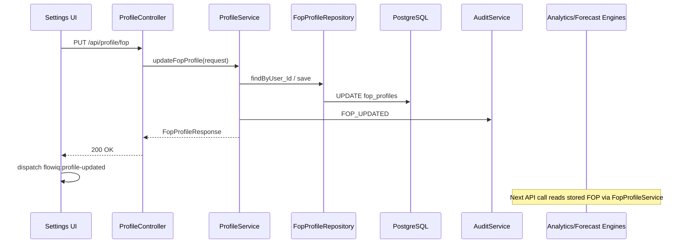
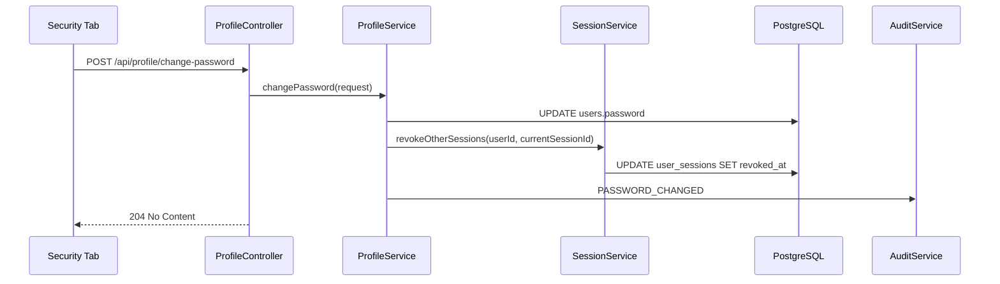

# Profile Architecture

FlowIQ profile management covers personal user data, FOP business settings, password changes, and session management. Data is persisted in PostgreSQL and exposed via REST under `/api/profile`.

## Scope

| Area | Endpoints | Persistence |
|------|-----------|-------------|
| Personal info | `GET/PUT /api/profile`, `POST /api/profile/avatar` | `users` table |
| FOP profile | `GET/PUT /api/profile/fop` | `fop_profiles` table |
| Password | `POST /api/profile/change-password` | `users.password` |
| Sessions | `GET /api/profile/sessions`, logout endpoints | `user_sessions` table |

## Sequence: Update FOP Profile



## Sequence: Change Password



## Domain Model

### `users` (extended)

- `first_name`, `last_name`, `phone`
- `name` — denormalized full name for backward compatibility
- `avatar_url` — path served from `/api/profile/avatars/{filename}`

### `fop_profiles`

| Column | Type | Notes |
|--------|------|-------|
| fop_group | SMALLINT | 1–3 or 0 (general) |
| tax_system | VARCHAR | `SINGLE_TAX`, `GENERAL` |
| vat_payer | BOOLEAN | |
| tax_rate | NUMERIC | Optional override |
| registration_date | DATE | |
| region | VARCHAR | |
| main_kved | VARCHAR | |
| main_kved_name | VARCHAR | |
| kved_codes | JSONB | Array of KVED codes |

### `user_sessions`

Tracks refresh-token hashes (SHA-256), device metadata, login/activity timestamps, and revocation.

## FOP as Source of Truth

`FopProfileService.resolveEffectiveFopGroup(userId, annualIncome)` returns the **stored** FOP group when a profile exists; otherwise derives from YTD revenue (legacy behavior).

Wired into:

- `AnalyticsService`
- `ForecastService`
- `NotificationRuleEngine`
- `TaskRuleEngine`

## Audit Events

| Event | Trigger |
|-------|---------|
| `PROFILE_UPDATED` | Personal info or avatar change |
| `FOP_UPDATED` | FOP profile save |
| `PASSWORD_CHANGED` | Successful password change |
| `SESSION_TERMINATED` | Logout current / logout all |

## Frontend

```
src/features/profile/
  components/   PersonalInfoForm, FopInfoForm, SecurityTab, SettingsTabs
  hooks/        useProfile, useFopProfile, useSessions
  services/     profile.service.ts
  types/        Profile, FopProfile, UserSession
  validators/   Zod schemas (react-hook-form)
```

Settings page tabs: **General** | **Profile** | **Security** | **Notifications** | **Appearance**.

### FOP profile lazy creation

`GET /api/profile/fop` calls `FopProfileService.getOrCreateForUser()` when no row exists. Creation runs in `REQUIRES_NEW` so it is not blocked by read-only caller transactions. `DemoUserSeedService` ensures the demo user has an FOP row on startup.

Profile updates dispatch `flowiq:profile-updated` so Dashboard (and other views) refresh without re-login.

## Security Notes

- Email change requires verification — not implemented; API returns `400` if email differs.
- Password policy: min 10 chars, upper, lower, digit, special symbol.
- Password change revokes all **other** refresh-token sessions.
- Avatar upload: max 5 MB, JPEG/PNG/WebP/GIF, stored under `uploads/avatars/` (gitignored).
- Avatar upload writes `PROFILE_UPDATED` audit event; audit persistence uses isolated transaction (see audit docs).

## API Summary

```
GET    /api/profile
PUT    /api/profile
POST   /api/profile/avatar          multipart/form-data, field: file
GET    /api/profile/avatars/{file}  public read
GET    /api/profile/fop
PUT    /api/profile/fop
POST   /api/profile/change-password
GET    /api/profile/sessions
POST   /api/profile/sessions/logout-current
POST   /api/profile/sessions/logout-all
```

Migration: `V7__user_profile_fop_sessions.sql`
