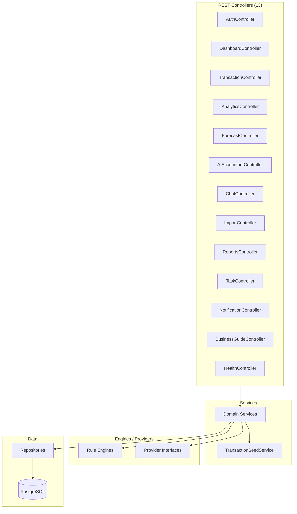
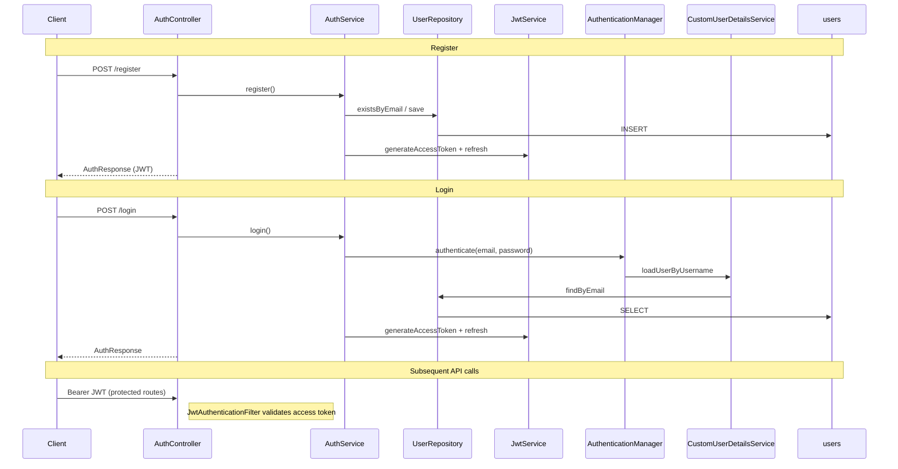
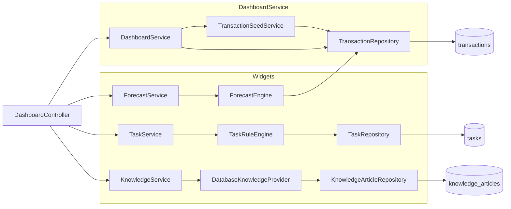
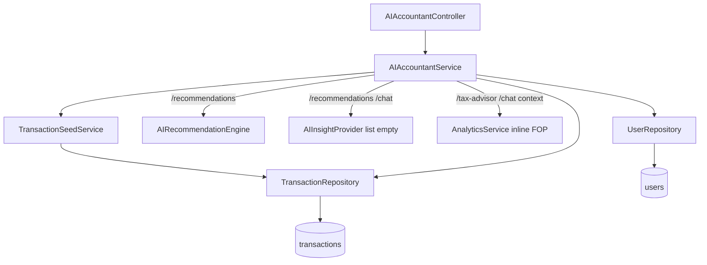
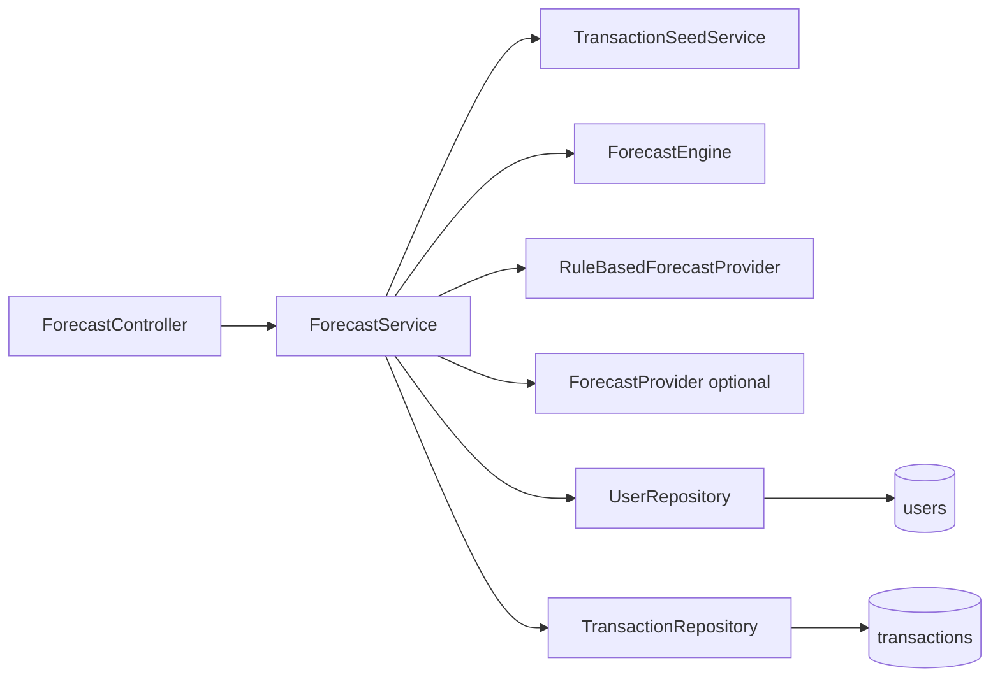
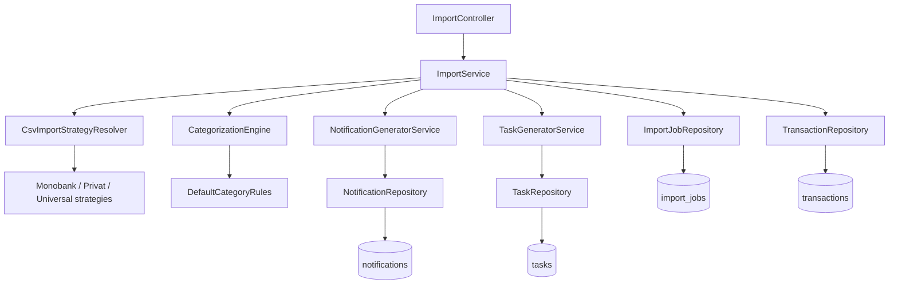
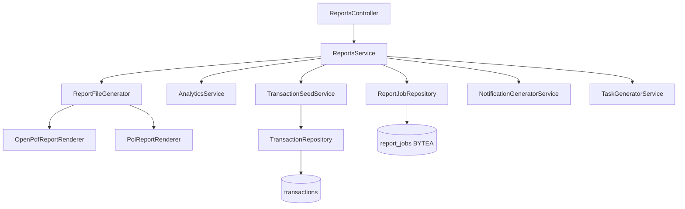
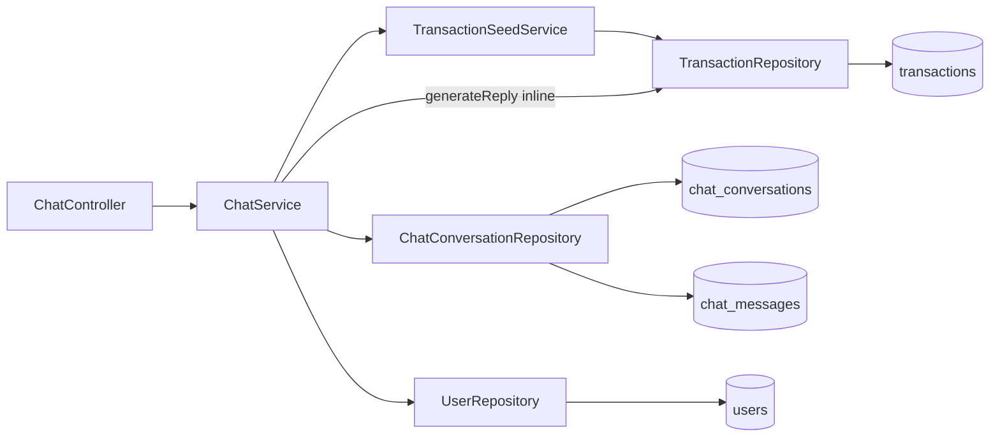

# Request Flow Map — FlowIQ Backend

**Generated:** 2026-06-23  
**Source:** `flowiq-backend/src/main/java` (as-built)  
**Scope:** Controller → Service → Engine/Provider → Repository → Entity → Database table

### Legend

| Symbol | Meaning |
|--------|---------|
| **—** | No component at this layer (inline logic in Service, or no persistence) |
| *(inline)* | Business rules implemented directly in the Service class |
| *(security)* | Spring Security component, not a domain service |
| *(side effect)* | Secondary write path (notifications/tasks) |

### Cross-cutting

| Component | Used by | Flow |
|-----------|---------|------|
| `TransactionSeedService` | Dashboard, Analytics, Forecast, AI Accountant, Chat, Reports, Task | `TransactionRepository` → `Transaction` → `transactions` |
| `JwtAuthenticationFilter` | All protected `/api/*` | `JwtService` + `CustomUserDetailsService` → `UserRepository` → `users` |
| `UserRepository` | Nearly all services | Resolve current user from JWT → `User` → `users` |

---

## System Overview

---

## Master Dependency Table

| Controller | Service(s) | Engine / Provider | Repository | Entity | Table |
|------------|------------|-----------------|------------|--------|-------|
| **AuthController** | `AuthService` | `JwtService` *(security)*, `PasswordEncoder` *(security)* | `UserRepository` | `User` | `users` |
| **HealthController** | — | — | — | — | — |
| **DashboardController** | `DashboardService`, `ForecastService`, `TaskService`, `KnowledgeService` | See per-endpoint below | `TransactionRepository`, `UserRepository`, `TaskRepository`, `KnowledgeArticleRepository` | `Transaction`, `User`, `Task`, `KnowledgeArticle` | `transactions`, `users`, `tasks`, `knowledge_articles` |
| **TransactionController** | `TransactionService` | — | `TransactionRepository`, `UserRepository` | `Transaction`, `User` | `transactions`, `users` |
| **AnalyticsController** | `AnalyticsService` | `AnalyticsInsightProvider` *(wired, unused)* | `TransactionRepository`, `UserRepository` | `Transaction`, `User` | `transactions`, `users` |
| **ForecastController** | `ForecastService` | `ForecastEngine`, `RuleBasedForecastProvider`, `ForecastProvider` *(optional)* | `TransactionRepository`, `UserRepository` | `Transaction`, `User` | `transactions`, `users` |
| **AIAccountantController** | `AIAccountantService` | `AIRecommendationEngine`, `AIInsightProvider` *(empty)*, delegates `AnalyticsService` | `TransactionRepository`, `UserRepository` | `Transaction`, `User` | `transactions`, `users` |
| **ChatController** | `ChatService` | — *(inline `generateReply()`)* | `ChatConversationRepository`, `TransactionRepository`, `UserRepository` | `ChatConversation`, `ChatMessage`, `Transaction`, `User` | `chat_conversations`, `chat_messages`, `transactions`, `users` |
| **ImportController** | `ImportService` | `CsvImportStrategyResolver` → bank CSV strategies, `CategorizationEngine` → `DefaultCategoryRules`, `CategorizationProvider` *(empty)* | `ImportJobRepository`, `TransactionRepository`, `UserRepository` | `ImportJob`, `Transaction`, `User` | `import_jobs`, `transactions`, `users` |
| **ReportsController** | `ReportsService` | `ReportFileGenerator` → `OpenPdfReportRenderer`, `PoiReportRenderer`; `AnalyticsService` *(inline FOP)* | `ReportJobRepository`, `TransactionRepository`, `UserRepository` | `ReportJob`, `Transaction`, `User` | `report_jobs`, `transactions`, `users` |
| **TaskController** | `TaskService` | `TaskRuleEngine` → `TaskGeneratorService` | `TaskRepository`, `TransactionRepository`, `UserRepository` | `Task`, `Transaction`, `User` | `tasks`, `transactions`, `users` |
| **NotificationController** | `NotificationService` | — | `NotificationRepository`, `UserRepository` | `Notification`, `User` | `notifications`, `users` |
| **BusinessGuideController** | `KnowledgeService` | `DatabaseKnowledgeProvider`, `KnowledgeProvider` *(optional)* | `KnowledgeArticleRepository` | `KnowledgeArticle` | `knowledge_articles` |

---

## Per-Controller Detail

### AuthController — `/api/auth`

| Endpoint | Service | Engine/Provider | Repository | Entity | Table |
|----------|---------|-----------------|------------|--------|-------|
| `POST /register` | `AuthService` | `JwtService`, `PasswordEncoder` | `UserRepository` | `User` | `users` |
| `POST /login` | `AuthService` | `AuthenticationManager` → `CustomUserDetailsService`, `JwtService` | `UserRepository` | `User` | `users` |
| `GET /me` | `AuthService` | — *(SecurityContext)* | `UserRepository` | `User` | `users` |
| `POST /logout` | — | — | — | — | — |

### HealthController — `/api/health`

| Endpoint | Service | Engine/Provider | Repository | Entity | Table |
|----------|---------|-----------------|------------|--------|-------|
| `GET /`, `GET /ping` | — | — | — | — | — |

### DashboardController — `/api/dashboard`

| Endpoint | Primary service | Engine/Provider | Repository | Entity | Table |
|----------|-----------------|-----------------|------------|--------|-------|
| `GET /stats` | `DashboardService` | — *(inline aggregates)* | `TransactionRepository`, `UserRepository` | `Transaction`, `User` | `transactions`, `users` |
| `GET /insights` | `DashboardService` | — *(inline rules)* | `TransactionRepository` | `Transaction` | `transactions` |
| `GET /health` | `DashboardService` | — *(inline score)* | `TransactionRepository` | `Transaction` | `transactions` |
| `GET /summary` | `DashboardService` | — *(inline text)* | `TransactionRepository` | `Transaction` | `transactions` |
| `GET /charts/*` | `DashboardService` | — | `TransactionRepository` | `Transaction` | `transactions` |
| `GET /forecast-snapshot` | `ForecastService` | `ForecastEngine`, `RuleBasedForecastProvider` | `TransactionRepository` | `Transaction` | `transactions` |
| `GET /tasks-snapshot` | `TaskService` | `TaskRuleEngine` | `TaskRepository` | `Task` | `tasks` |
| `GET /business-guide-snapshot` | `KnowledgeService` | `DatabaseKnowledgeProvider` | `KnowledgeArticleRepository` | `KnowledgeArticle` | `knowledge_articles` |

*All dashboard paths that read transactions call `TransactionSeedService.seedIfEmpty()` first.*

### TransactionController — `/api/transactions`

| Operation | Service | Engine/Provider | Repository | Entity | Table |
|-----------|---------|-----------------|------------|--------|-------|
| CRUD + summary | `TransactionService` | — | `TransactionRepository`, `UserRepository` | `Transaction`, `User` | `transactions`, `users` |

### AnalyticsController — `/api/analytics`

| Endpoint | Service | Engine/Provider | Repository | Entity | Table |
|----------|---------|-----------------|------------|--------|-------|
| All GET endpoints | `AnalyticsService` | — *(inline FOP/tax math)*; `AnalyticsInsightProvider` not called | `TransactionRepository`, `UserRepository` | `Transaction`, `User` | `transactions`, `users` |

### ForecastController — `/api/forecasts`

| Endpoint | Service | Engine/Provider | Repository | Entity | Table |
|----------|---------|-----------------|------------|--------|-------|
| `/revenue`, `/expenses`, `/profit`, `/taxes`, `/fop-limit` | `ForecastService` | `ForecastEngine` | `TransactionRepository` | `Transaction` | `transactions` |
| `/summary` | `ForecastService` | `ForecastEngine`, `RuleBasedForecastProvider`, `ForecastProvider` list | `TransactionRepository` | `Transaction` | `transactions` |

### AIAccountantController — `/api/ai-accountant`

| Endpoint | Service | Engine/Provider | Repository | Entity | Table |
|----------|---------|-----------------|------------|--------|-------|
| `GET /health` | `AIAccountantService` | — *(inline score)* | `TransactionRepository` | `Transaction` | `transactions` |
| `GET /recommendations` | `AIAccountantService` | `AIRecommendationEngine`, `AIInsightProvider` *(empty)* | `TransactionRepository` | `Transaction` | `transactions` |
| `GET /tax-advisor` | `AIAccountantService` → `AnalyticsService` | — *(inline FOP)* | `TransactionRepository` | `Transaction` | `transactions` |
| `GET /forecasts` | `AIAccountantService` | — *(inline `buildForecast()`, not `ForecastEngine`)* | `TransactionRepository` | `Transaction` | `transactions` |
| `POST /chat` | `AIAccountantService` | `AIInsightProvider` *(empty)* → inline templates | `TransactionRepository` | `Transaction` | `transactions` |

### ChatController — `/api/chat`

| Endpoint | Service | Engine/Provider | Repository | Entity | Table |
|----------|---------|-----------------|------------|--------|-------|
| `GET /conversations` | `ChatService` | — | `ChatConversationRepository`, `UserRepository` | `ChatConversation`, `User` | `chat_conversations`, `users` |
| `POST /message` | `ChatService` | — *(inline `generateReply()`)* | `ChatConversationRepository`, `TransactionRepository`, `UserRepository` | `ChatConversation`, `ChatMessage`, `Transaction`, `User` | `chat_conversations`, `chat_messages`, `transactions`, `users` |

### ImportController — `/api/imports`

| Endpoint | Service | Engine/Provider | Repository | Entity | Table |
|----------|---------|-----------------|------------|--------|-------|
| `POST /upload` | `ImportService` | `CsvImportStrategyResolver`, `CategorizationEngine` | `ImportJobRepository`, `TransactionRepository` | `ImportJob`, `Transaction` | `import_jobs`, `transactions` |
| `GET`, `GET /{id}` | `ImportService` | — | `ImportJobRepository`, `UserRepository` | `ImportJob`, `User` | `import_jobs`, `users` |

*Upload side effects:* `NotificationGeneratorService` → `NotificationRepository` → `notifications`; `TaskGeneratorService` → `TaskRepository` → `tasks`.

### ReportsController — `/api/reports`

| Endpoint | Service | Engine/Provider | Repository | Entity | Table |
|----------|---------|-----------------|------------|--------|-------|
| `GET` (list) | `ReportsService` | — | `ReportJobRepository`, `UserRepository` | `ReportJob`, `User` | `report_jobs`, `users` |
| `GET /preview` | `ReportsService` → `AnalyticsService` | — *(FOP for preview)* | `TransactionRepository` | `Transaction` | `transactions` |
| `POST /generate` | `ReportsService` | `ReportFileGenerator` (PDF/Excel/CSV) | `ReportJobRepository`, `TransactionRepository` | `ReportJob`, `Transaction` | `report_jobs`, `transactions` |
| `GET /{id}/download` | `ReportsService` | — | `ReportJobRepository` | `ReportJob` | `report_jobs` |

### TaskController — `/api/tasks`

| Endpoint | Service | Engine/Provider | Repository | Entity | Table |
|----------|---------|-----------------|------------|--------|-------|
| List, CRUD, suggestions | `TaskService` | `TaskRuleEngine` → `TaskGeneratorService` | `TaskRepository`, `TransactionRepository`, `UserRepository` | `Task`, `Transaction`, `User` | `tasks`, `transactions`, `users` |

### NotificationController — `/api/notifications`

| Endpoint | Service | Engine/Provider | Repository | Entity | Table |
|----------|---------|-----------------|------------|--------|-------|
| List, unread, summary | `NotificationService` | — | `NotificationRepository`, `UserRepository` | `Notification`, `User` | `notifications`, `users` |

### BusinessGuideController — `/api/business-guide`

| Endpoint | Service | Engine/Provider | Repository | Entity | Table |
|----------|---------|-----------------|------------|--------|-------|
| Articles, search, categories | `KnowledgeService` | `DatabaseKnowledgeProvider` | `KnowledgeArticleRepository` | `KnowledgeArticle` | `knowledge_articles` |

---

# Highlighted Flows

## 1. Auth Flow

**Public endpoints:** `POST /api/auth/register`, `POST /api/auth/login`  
**Protected:** `GET /api/auth/me`, `POST /api/auth/logout`

| Step | Layer | Component | Persistence |
|------|-------|-----------|-------------|
| 1 | Controller | `AuthController` | — |
| 2 | Service | `AuthService` | — |
| 3 | Security | `JwtService`, `PasswordEncoder`, `AuthenticationManager` | — |
| 4 | Security | `CustomUserDetailsService` (login only) | — |
| 5 | Repository | `UserRepository` | — |
| 6 | Entity | `User` | — |
| 7 | Table | — | **`users`** |

---

## 2. Dashboard Flow

**Base path:** `GET /api/dashboard/*`  
**Services:** `DashboardService` (core), `ForecastService`, `TaskService`, `KnowledgeService` (widgets)

| Path | Controller → Service → Engine → Repository → Entity → Table |
|------|---------------------------------------------------------------|
| Stats / insights / charts | `DashboardController` → `DashboardService` → `TransactionSeedService` → `TransactionRepository` → `Transaction` → **`transactions`** |
| Forecast widget | `DashboardController` → `ForecastService` → `ForecastEngine` → `TransactionRepository` → `Transaction` → **`transactions`** |
| Tasks widget | `DashboardController` → `TaskService` → `TaskRuleEngine` → `TaskRepository` → `Task` → **`tasks`** |
| Business Guide widget | `DashboardController` → `KnowledgeService` → `DatabaseKnowledgeProvider` → `KnowledgeArticleRepository` → `KnowledgeArticle` → **`knowledge_articles`** |

---

## 3. AI Accountant Flow

**Base path:** `/api/ai-accountant/*`  
**Note:** Forecasts here use **inline math** in `AIAccountantService` — not `ForecastEngine`.

| Endpoint | Chain |
|----------|-------|
| `GET /health` | `AIAccountantController` → `AIAccountantService` *(inline)* → `TransactionRepository` → `Transaction` → **`transactions`** |
| `GET /recommendations` | → `AIRecommendationEngine` → `TransactionRepository` → **`transactions`** |
| `GET /tax-advisor` | → `AnalyticsService.getFopInsights()` *(inline)* → `TransactionRepository` → **`transactions`** |
| `GET /forecasts` | → `AIAccountantService.buildForecast()` *(inline)* → `TransactionRepository` → **`transactions`** |
| `POST /chat` | → `AIInsightProvider` (skip if empty) → inline reply → `TransactionRepository` → **`transactions`** |

---

## 4. Forecast Flow

**Base path:** `/api/forecasts/*`  
**Canonical forecast path** — uses `ForecastEngine` + `RuleBasedForecastProvider`.

| Endpoint | Chain |
|----------|-------|
| `GET /revenue` … `/fop-limit` | `ForecastController` → `ForecastService` → `ForecastEngine` → `TransactionRepository` → `Transaction` → **`transactions`** |
| `GET /summary` | → `ForecastEngine` + `RuleBasedForecastProvider` (+ optional `ForecastProvider`) → `TransactionRepository` → **`transactions`** |

---

## 5. Import Flow

**Base path:** `/api/imports/*`

| Operation | Chain |
|-----------|-------|
| `POST /upload` | `ImportController` → `ImportService` → `CsvImportStrategyResolver` → `CategorizationEngine` → `ImportJobRepository` → **`import_jobs`** + `TransactionRepository` → **`transactions`** |
| Side effects | → `NotificationGeneratorService` → **`notifications`**; `TaskGeneratorService` → **`tasks`** |
| `GET` list/detail | → `ImportJobRepository` → `ImportJob` → **`import_jobs`** |

---

## 6. Reports Flow

**Base path:** `/api/reports/*`

| Operation | Chain |
|-----------|-------|
| `GET` list | `ReportsController` → `ReportsService` → `ReportJobRepository` → `ReportJob` → **`report_jobs`** |
| `GET /preview` | → `AnalyticsService` + `TransactionRepository` → **`transactions`** |
| `POST /generate` | → `ReportFileGenerator` → `ReportJobRepository` → **`report_jobs`** (file bytes in DB) |
| `GET /{id}/download` | → `ReportJobRepository` → **`report_jobs`** |

---

## 7. Chat Flow

**Base path:** `/api/chat/*`  
Standalone chat (separate from `AIAccountantController` chat).

| Endpoint | Chain |
|----------|-------|
| `GET /conversations` | `ChatController` → `ChatService` → `ChatConversationRepository` → `ChatConversation` → **`chat_conversations`** |
| `POST /message` | → `ChatConversationRepository` → **`chat_conversations`** + **`chat_messages`**; context from `TransactionRepository` → **`transactions`** |

---

## Entity → Table Quick Reference

| Entity | Table | Tenant |
|--------|-------|--------|
| `User` | `users` | Global |
| `Transaction` | `transactions` | `user_id` |
| `ChatConversation` | `chat_conversations` | `user_id` |
| `ChatMessage` | `chat_messages` | via `conversation_id` |
| `ImportJob` | `import_jobs` | `user_id` |
| `ReportJob` | `report_jobs` | `user_id` |
| `Notification` | `notifications` | `user_id` |
| `Task` | `tasks` | `user_id` |
| `KnowledgeArticle` | `knowledge_articles` | Global (shared) |

---

## Related Documents

| Document | Link |
|----------|------|
| System Component Catalog | [SYSTEM_COMPONENT_CATALOG.md](SYSTEM_COMPONENT_CATALOG.md) |
| Data Sources | [data-sources.md](data-sources.md) |
| AI Documentation Audit | [AI_DOCUMENTATION_AUDIT_REPORT.md](AI_DOCUMENTATION_AUDIT_REPORT.md) |
| Backend Architecture | [backend-architecture.md](backend-architecture.md) |

**Maintain:** Update when adding controllers, services, or Flyway V6+ tables.
