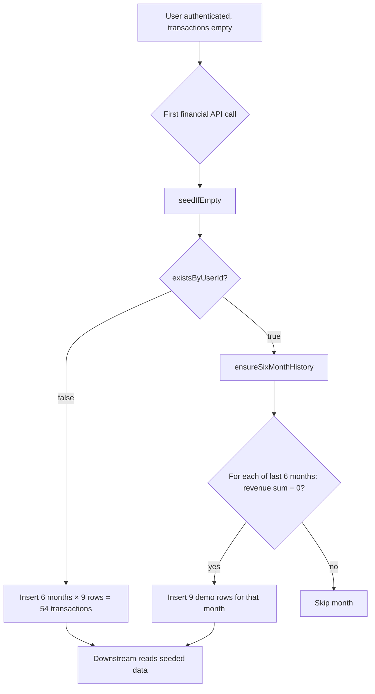
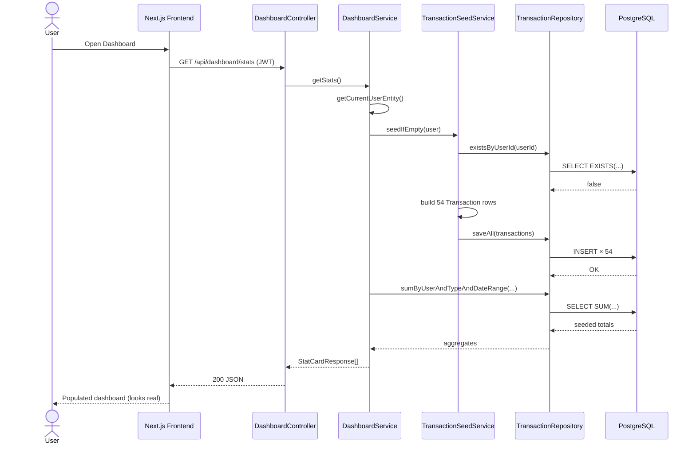

# Transaction Seed Remediation Plan

**Audit date:** 2026-06-23  
**Scope:** `TransactionSeedService`, все call sites, схема БД, downstream-эффекты  
**Source of truth:** `flowiq-backend` source code (без изменений кода в этом документе)  
**Related:** [ADR-002](adr/002-transaction-seed-strategy.md) · [TD-C01 / TD-C04](TECHNICAL_DEBT_REGISTER.md) · [Data Sources](data-sources.md)

---

## Executive Summary

`TransactionSeedService` автоматически вставляет **6 месяцев синтетических транзакций** в PostgreSQL при первом обращении пользователя к финансовым модулям. Сегодня **нет** feature flag, **нет** `spring.profiles.active=prod` gating, **нет** колонки `source` — seed **будет выполняться в Production** при деплое текущего артефакта.

**Вердикт:** для Production seed необходимо **отключить по умолчанию** и ввести явную маркировку `transactions.source` + UI empty state. Для demo/staging — оставить seed за feature flag.

---

## 1. Audit Findings

### 1.1 Где вызывается `TransactionSeedService`

Единственный публичный entry point: **`seedIfEmpty(User user)`**.  
Внутренний метод **`ensureSixMonthHistory(User user)`** вызывается только из `seedIfEmpty` (не из других классов).

| # | Caller service | Method(s) | HTTP / trigger | API path(s) |
|---|----------------|-----------|----------------|-------------|
| 1 | `DashboardService` | `getStats`, `getInsights`, `getBusinessHealth`, `getRevenueTrend`, `getExpenseBreakdown`, `getAISummary` | REST GET | `/api/dashboard/stats`, `/insights`, `/health`, `/summary`, `/charts/revenue-trend`, `/charts/expense-breakdown` |
| 2 | `ForecastService` | `loadForecastData()` (private) | REST GET | `/api/forecasts/*` (6 endpoints) + `/api/dashboard/forecast-snapshot` |
| 3 | `AnalyticsService` | `getOverview`, `getRevenueTrend`, `getExpenseBreakdown`, `getProfitTrend`, `getIncomeVsExpenses`, `getFopInsights` | REST GET | `/api/analytics/*` (6 endpoints) |
| 4 | `ReportsService` | `getPreview`, `generate` | REST GET/POST | `/api/reports/preview`, `/api/reports/generate` |
| 5 | `AIAccountantService` | `buildSnapshot()` (private) | REST GET/POST | `/api/ai-accountant/health`, `/recommendations`, `/tax-advisor`, `/forecasts`, `/chat` |
| 6 | `ChatService` | `sendMessage` | REST POST | `/api/chat/messages` |
| 7 | `TaskService` | `getSuggestions`; `ensureGeneratedTasks` → used by `getTasks`, `getTodayTasks`, `getUpcomingTasks`, `getGroupedTasks`, `getSnapshot` | REST GET | `/api/tasks/suggestions`, `/api/tasks`, `/today`, `/upcoming`, `/grouped`, `/api/dashboard/tasks-snapshot` |

**Итого:** 7 сервисов, **~30 уникальных API endpoints** могут инициировать seed (часть — косвенно через `buildSnapshot` / `loadForecastData`).

**Не вызывают seed:**

| Service | Поведение |
|---------|-----------|
| `TransactionService` | CRUD `/api/transactions` — только реальные операции пользователя |
| `ImportService` | CSV upload — пишет транзакции напрямую в `transactions` |
| `AuthService` | Регистрация/login — seed не запускается |
| `NotificationService` / `NotificationScheduler` | Читает `transactions`, но **не** вызывает seed |
| `KnowledgeService` | Не зависит от транзакций |
| `DemoUserSeedService` | Создаёт только пользователя `demo@flowiq.ai`, **не** транзакции |

### 1.2 Сценарии автоматического создания демо-транзакций



**Сценарий A — полный seed (новый пользователь):**

1. Пользователь регистрируется → `transactions` пуста.
2. Открывает Dashboard / Analytics / Forecast / Reports / AI Accountant / Chat / Tasks.
3. `existsByUserId` = false → вставляется **54 транзакции** за последние 6 календарных месяцев.

**Сценарий B — частичный backfill (`ensureSixMonthHistory`):**

1. У пользователя уже есть ≥1 транзакция (ручная или import).
2. При любом последующем `seedIfEmpty` вызывается `ensureSixMonthHistory`.
3. Для каждого из 6 месяцев: если **сумма REVENUE за месяц = 0** → добавляется полный набор demo-строк за этот месяц.
4. **Риск смешивания:** пользователь импортировал только расходы → месяц получит синтетический доход.

**Сценарий C — каскад через Tasks:**

1. `TaskService.ensureGeneratedTasks` → `seedIfEmpty` + `TaskRuleEngine.generateForUser`.
2. После seed rule engine создаёт задачи на основе **в т.ч. seeded** агрегатов (FOP limit, tax deadlines).

**Сценарий D — demo user:**

1. `DemoUserSeedService` при старте приложения создаёт `demo@flowiq.ai`.
2. Транзакции для demo user появляются только при **первом** визите в финансовый модуль (сценарий A).

**Сценарий E — import до первого визита:**

1. Пользователь загружает CSV через `ImportService` → реальные строки в `transactions`.
2. `existsByUserId` = true → срабатывает только `ensureSixMonthHistory` (сценарий B), не полный 54-row seed.

### 1.3 Может ли seed запускаться в Production?

**Да — без ограничений.**

| Check | Current state |
|-------|---------------|
| `spring.profiles.active=prod` guard | **Отсутствует** — нет `application-prod.properties` |
| Feature flag `flowiq.features.demo-seed-enabled` | **Отсутствует** (есть только `bank-integrations-enabled`) |
| Per-user opt-out | **Отсутствует** |
| `@Profile` на `TransactionSeedService` | **Отсутствует** |
| ADR-002 production disable criteria | **Документированы, не реализованы** |

Любой Production deploy с текущим JAR **будет** auto-seed при первом API-визите пустого пользователя.

### 1.4 Какие данные создаются автоматически

**Класс:** `com.flowiq.service.TransactionSeedService`

**Параметры генерации (hardcoded):**

| Parameter | Value |
|-----------|-------|
| History window | 6 months (`YearMonth.now()` − 5 … now) |
| Monthly revenue targets (UAH) | 150 000 → 165 000 → 178 000 → 190 000 → 204 300 → 245 400 |
| Total 6-month revenue | **1 132 700 UAH** |
| Expense ratio | 62% of monthly revenue |
| Rows per month | **9** (4 REVENUE + 5 EXPENSE) |
| Total rows (full seed) | **54** |

**Revenue categories (фиксированные доли):**

| Category | Share of month revenue | Day of month |
|----------|------------------------|--------------|
| Online Sales | 59% | 1 |
| Subscriptions | 24% | 5 |
| Consulting | 12% | 10 |
| Partnerships | 5% | 15 |

**Expense categories:**

| Category | Share of month expense | Day of month |
|----------|------------------------|--------------|
| Salaries | 41% | 1 |
| Marketing | 29% | 3 |
| Infrastructure | 12% | 7 |
| Operations | 10% | 12 |
| Other | 8% | 20 |

**Поля каждой `Transaction` entity:**

| Field | Seed value |
|-------|------------|
| `user_id` | Current user |
| `type` | `REVENUE` or `EXPENSE` |
| `amount` | Calculated from targets |
| `category` | As above |
| `description` | `"{category} transaction"` |
| `transaction_date` | Day within target month |
| `auto_categorized` | **`false`** (default) |
| `source` | **Column does not exist** |

**Отличие от ручного CRUD:** `TransactionService` использует другой набор категорий (`Services`, `Salary`, …) — seeded rows **визуально отличимы по category names**, но API не помечает их как demo.

### 1.5 Можно ли отличить seed от реальных транзакций?

| Method | Works today? |
|--------|--------------|
| DB column `source` | **No** — not in V1–V5 |
| `auto_categorized` flag | **No** — seed sets `false`, same as manual |
| Category naming heuristic | **Partial** — seed uses `Online Sales`, `Salaries`; manual CRUD uses `Services`, `Salary` |
| Description pattern `"{category} transaction"` | **Partial** — fragile, not enforced in queries |
| `created_at` burst | **Partial** — 54 rows inserted in one transaction |
| API field | **No** — `TransactionResponse` has no `source` |
| UI banner | **No** |

**Вывод:** программно надёжно отличить нельзя. Эвристики недостаточны для compliance и фильтрации в отчётах.

### 1.6 Какие таблицы затрагиваются

| Table | Direct write? | Indirect effect |
|-------|---------------|-----------------|
| **`transactions`** | **Yes** — единственная таблица, куда пишет seed | — |
| `users` | No | Demo user created separately by `DemoUserSeedService` |
| `tasks` | No (seed itself) | **Yes** — `TaskRuleEngine.generateForUser` after seed in Task paths |
| `notifications` | No | Scheduler reads transactions; **no seed** unless user visited financial module earlier |
| `import_jobs` | No | Unaffected |
| `report_jobs` | No | Reports **read** seeded data after preview/generate triggers seed |
| `chat_conversations` / `chat_messages` | No | Chat replies use financial snapshot built on seeded data |
| `knowledge_articles` | No | Unaffected |

### 1.7 Риски для downstream-модулей

| Module | Impact | Mechanism |
|--------|--------|-----------|
| **Dashboard** | **Critical** | Stats, charts, health score, AI insights/summary — все агрегаты включают seeded revenue/expense |
| **Analytics** | **Critical** | FOP group, tax burden, annual income, limit usage % — расчёты на fake 150k–245k UAH/month |
| **Forecast Center** | **Critical** | `ForecastEngine` строит тренды на seeded history → ложные 3-month projections |
| **AI Accountant** | **Critical** | Health score, recommendations, tax advisor, chat replies — `FinancialSnapshot` из seeded DB |
| **Reports** | **High** | PDF/XLSX preview и generate включают seeded rows в период |
| **Chat** | **High** | Template replies ссылаются на profit/FOP metrics после seed |
| **Tasks** | **Medium** | `TaskRuleEngine` генерирует FOP/tax tasks на основе seeded YTD income |
| **Notifications** | **Low–Medium** | Только если транзакции уже есть (seed или import); scheduler сам seed не вызывает |
| **Transactions list** | **High** | `/api/transactions` **не** вызывает seed, но показывает уже вставленные demo rows без маркировки |

**Regulatory / trust risk:** пользователь видит «здоровый» бизнес с доходом ~1.1M UAH за полгода и tax/FOP советы, основанные на вымышленных данных, **не зная**, что это demo.

**Concurrency risk:** два параллельных запроса при пустом `transactions` — оба могут пройти `existsByUserId` до commit → потенциальные **дубликаты** (нет unique constraint / advisory lock).

---

## 2. Current Call Chain

### 2.1 Canonical path (example: Dashboard stats)

```
HTTP GET /api/dashboard/stats
  → DashboardController.getStats()
    → DashboardService.getStats()
      → getCurrentUserEntity()
      → TransactionSeedService.seedIfEmpty(user)
          → TransactionRepository.existsByUserId(userId)
          → [if empty] build 54 Transaction entities
          → TransactionRepository.saveAll(transactions)
      → TransactionRepository.sumByUserAndTypeAndDateRange(...)
      → build StatCardResponse list
```

### 2.2 Highest-fan-out path (AI Accountant health)

```
HTTP GET /api/ai-accountant/health
  → AIAccountantService.getHealth()
    → buildSnapshot()
      → TransactionSeedService.seedIfEmpty(user)     ← seed #1
      → transactionRepository sums (YTD, monthly)
      → AnalyticsService.getFopInsights()
          → TransactionSeedService.seedIfEmpty(user) ← seed #2 (no-op if already seeded)
          → FOP/tax calculations on all transactions
    → calculateHealthScore(snapshot)
```

**Note:** множественные вызовы `seedIfEmpty` в одном request **идемпотентны** после первой вставки, но создают лишние DB round-trips.

### 2.3 Task cascade path

```
HTTP GET /api/tasks
  → TaskService.getTasks()
    → ensureGeneratedTasks(user)
      → TransactionSeedService.seedIfEmpty(user)
      → TaskRuleEngine.generateForUser(user)
          → reads TransactionRepository aggregates
          → TaskGeneratorService → INSERT into tasks
```

### 2.4 Sequence diagram (first visit, empty user)



---

## 3. Solution Options

### Option A — Disable seed in Production only (profile-based)

```properties
# application-prod.properties (proposed)
flowiq.features.demo-seed-enabled=false
```

`TransactionSeedService.seedIfEmpty` → no-op when flag false or profile `prod`.

| Pros | Cons |
|------|------|
| Minimal change; immediate prod safety | Dev/demo/staging need explicit `true` |
| Aligns with ADR-002 | Empty dashboard for new prod users until import |
| No schema migration | Does not fix existing seeded prod data |

### Option B — Feature flag only (all environments)

`flowiq.features.demo-seed-enabled` default `true` in dev, `false` in prod via env var.

| Pros | Cons |
|------|------|
| Flexible per environment | Flag alone without `source` — old rows still unmarked |
| Easy k8s/CI override | Risk of misconfiguration (`true` in prod) |

### Option C — `transactions.source` column (REAL / DEMO / IMPORT)

Migration `V6__add_transaction_source.sql`:

```sql
ALTER TABLE transactions
    ADD COLUMN source VARCHAR(20) NOT NULL DEFAULT 'REAL';

-- Backfill heuristic for existing rows (one-time, best-effort)
UPDATE transactions SET source = 'DEMO'
WHERE description LIKE '% transaction'
  AND category IN ('Online Sales','Subscriptions','Consulting','Partnerships',
                   'Salaries','Marketing','Infrastructure','Operations');
```

Seed sets `source = 'DEMO'`; import → `IMPORT`; manual CRUD → `REAL`.

| Pros | Cons |
|------|------|
| Filter in analytics/reports/API | Requires migration + backfill |
| UI badges, «clear demo data» | Heuristic backfill imperfect |
| Audit-friendly | All queries must respect `source` filter policy |

### Option D — Separate demo tenant / shared read-only account

Single `demo@flowiq.ai` with pre-seeded data; prod users never seeded.

| Pros | Cons |
|------|------|
| Clean prod data model | Per-user demo story weaker |
| No per-user seed pollution | Major UX/onboarding rework |

### Option E — Frontend-only mock (remove backend seed)

| Pros | Cons |
|------|------|
| No DB pollution | **Rejected in ADR-002** — reports, tasks, schedulers need DB |
| | Divergence FE vs BE |

### Option F — Explicit onboarding endpoint `POST /api/demo/seed`

Lazy seed replaced by user-consented action.

| Pros | Cons |
|------|------|
| Informed consent | Higher UX friction |
| Clear audit trail | Must remove auto call sites |

---

## 4. Recommended Solution (MVP)

Комбинация **A + B + C** — defense in depth для MVP → Production path:

### Layer 1 — Feature flag + profile (immediate)

```properties
# application.properties (default dev)
flowiq.features.demo-seed-enabled=true

# application-prod.properties
flowiq.features.demo-seed-enabled=false
```

```java
// Pseudocode — not implemented yet
@Value("${flowiq.features.demo-seed-enabled:false}")
private boolean demoSeedEnabled;

public void seedIfEmpty(User user) {
    if (!demoSeedEnabled) return;
    // existing logic
}
```

**Rule:** `prod` profile → flag **must** be `false` (validate at startup).

### Layer 2 — `transactions.source` enum

| Value | Set when |
|-------|----------|
| `REAL` | `TransactionService` create/update (manual entry) |
| `DEMO` | `TransactionSeedService.buildTransaction` |
| `IMPORT` | `ImportService.processImport` |

**Analytics policy (MVP):**

- **Production:** all financial queries default to `source IN ('REAL', 'IMPORT')` — exclude `DEMO`.
- **Demo/staging with seed enabled:** include all sources; API returns `hasDemoData: true` flag on dashboard overview.

### Layer 3 — UI contract (frontend, separate task)

- Banner: «Демонстраційні дані» when `hasDemoData` or any `DEMO` rows exist.
- CTA: «Завантажити CSV» / «Додати транзакцію».
- Optional Phase 2: `DELETE /api/transactions/demo` — delete `WHERE source = 'DEMO'`.

### Layer 4 — Narrow `ensureSixMonthHistory` (Phase 2)

In prod / when seed disabled: **disable entirely**.  
In demo: keep, but only if **zero** transactions total — never backfill single months after partial real data (fixes scenario B mixing).

### What stays for MVP demo

| Environment | `demo-seed-enabled` | Behavior |
|-------------|---------------------|----------|
| Local / dev | `true` | Auto-seed on first visit, `source=DEMO` |
| Staging | `true` (configurable) | Same + UI banner |
| **Production** | **`false`** | Empty state; real data only via import/manual |

`DemoUserSeedService` — оставить для staging/demo; в prod отключить через `@Profile("!prod")` или тот же feature-flag pattern.

---

## 5. Migration Plan (no functional breakage)

### Phase 0 — Documentation & ADR update (Week 0)

- [ ] Accept amendment to **ADR-002** (production disable + `source` column).
- [ ] Publish this plan; link from [TECHNICAL_DEBT_REGISTER](TECHNICAL_DEBT_REGISTER.md) TD-C01, TD-C04.

**Breakage risk:** None (docs only).

### Phase 1 — Schema + flag (Week 1)

| Step | Action |
|------|--------|
| 1.1 | Add `flowiq.features.demo-seed-enabled` to `application.properties` (`true`) |
| 1.2 | Create `application-prod.properties`: `demo-seed-enabled=false`, env-based secrets |
| 1.3 | Flyway `V6__add_transaction_source.sql`: column `source VARCHAR(20) NOT NULL DEFAULT 'REAL'` |
| 1.4 | Index: `idx_transactions_user_id_source` |
| 1.5 | Gate `seedIfEmpty` on flag at method entry |
| 1.6 | Set `source=DEMO` in `buildTransaction`; `IMPORT` in `ImportService`; `REAL` in `TransactionService` |

**Backward compatibility:**

- Existing rows → `REAL` by default (conservative); optional heuristic backfill script for known demo patterns.
- API responses: add optional `source` field to `TransactionResponse` (nullable ignored by old frontend).

**Verification:**

- Unit: seed skipped when flag false.
- Integration: prod profile + empty user → 0 rows after dashboard call.
- Dev profile → 54 rows with `source=DEMO`.

### Phase 2 — Query policy + API signals (Week 2)

| Step | Action |
|------|--------|
| 2.1 | `UserDataProfileService.hasOnlyDemoData(userId)` |
| 2.2 | Dashboard/Analytics overview DTO: `dataSource: LIVE | DEMO | MIXED` |
| 2.3 | Production analytics exclude `DEMO` in aggregations (feature toggle per profile) |
| 2.4 | Frontend banner driven by `dataSource` |

**Backward compatibility:**

- Dev/staging unchanged visually (still populated).
- Prod users see zeros/empty charts until import — **intended**; align with empty-state UI.

### Phase 3 — Cleanup & hardening (Week 3–4)

| Step | Action |
|------|--------|
| 3.1 | `DELETE /api/transactions/demo` (owner-only) |
| 3.2 | Remove or restrict `ensureSixMonthHistory` month backfill |
| 3.3 | `@Profile("!prod")` on `DemoUserSeedService` |
| 3.4 | Advisory lock or `INSERT … ON CONFLICT` strategy for concurrent seed |
| 3.5 | Reduce duplicate `seedIfEmpty` calls (single `SeedGuard` in facade — optional) |

### Phase 4 — Production cutover checklist

- [ ] Deploy with `SPRING_PROFILES_ACTIVE=prod`
- [ ] Confirm `flowiq.features.demo-seed-enabled=false`
- [ ] Smoke: new user → dashboard shows empty / banner, **0** transactions in DB
- [ ] Smoke: CSV import → `source=IMPORT`, analytics populated
- [ ] Existing envs with legacy seeded data: run one-time cleanup SQL or mark via heuristic

### Rollback strategy

| Change | Rollback |
|--------|----------|
| Feature flag | Set `demo-seed-enabled=true` (instant) |
| V6 migration | Forward-only Flyway; rollback = new migration drop column (avoid in prod) |
| Query filters | Disable filter via flag `flowiq.features.exclude-demo-from-analytics` |

---

## 6. Configuration Reference (proposed)

### `application.properties` (development)

```properties
flowiq.features.demo-seed-enabled=true
```

### `application-prod.properties`

```properties
spring.jpa.show-sql=false

flowiq.features.demo-seed-enabled=false

# Fail-fast if misconfigured
# (startup validator: prod + demo-seed-enabled=true → IllegalStateException)
```

### Environment variables (Production)

| Variable | Value |
|----------|-------|
| `SPRING_PROFILES_ACTIVE` | `prod` |
| `FLOWIQ_FEATURES_DEMO_SEED_ENABLED` | `false` (explicit override) |

### Kubernetes / Docker example

```yaml
env:
  - name: SPRING_PROFILES_ACTIVE
    value: prod
  - name: FLOWIQ_FEATURES_DEMO_SEED_ENABLED
    value: "false"
```

---

## 7. Decision Matrix

| Criterion | Profile disable | Feature flag | `source` column | UI banner |
|-----------|-----------------|--------------|-----------------|-----------|
| Blocks prod seed | ✅ | ✅ | ❌ alone | ❌ |
| Distinguishes data | ❌ | ❌ | ✅ | ✅ (UX) |
| Filter analytics | ❌ | ❌ | ✅ | ❌ |
| Zero migration | ✅ | ✅ | ❌ | ❌ |
| ADR-002 aligned | ✅ | ✅ | ✅ | ✅ |

**MVP minimum for architect sign-off:** Profile disable + feature flag + `source` column + API `dataSource` flag.

---

## 8. Open Questions for Architect Review

1. **Analytics policy:** exclude `DEMO` globally vs separate «demo mode» toggle for sales?
2. **Legacy data:** one-time delete all rows matching demo heuristic vs mark `DEMO` in place?
3. **`ensureSixMonthHistory`:** remove entirely or keep only in `demo-seed-enabled=true`?
4. **Paid tier:** seed off by default for all users vs only prod profile?
5. **Audit:** log seed events to future `audit_log` (TD-C02)?

---

## 9. Related Code Anchors

| Artifact | Path |
|----------|------|
| Seed service | `src/main/java/com/flowiq/service/TransactionSeedService.java` |
| Demo user (not transactions) | `src/main/java/com/flowiq/service/DemoUserSeedService.java` |
| Transaction entity | `src/main/java/com/flowiq/entity/Transaction.java` |
| Schema | `src/main/resources/db/migration/V1__initial_schema.sql` |
| Feature flags today | `src/main/resources/application.properties` (line 42–43) |
| ADR | `docs/architecture/adr/002-transaction-seed-strategy.md` |
| Debt | TD-C01, TD-C04 in `docs/architecture/TECHNICAL_DEBT_REGISTER.md` |

---

**Status:** Proposed — awaiting implementation (no code changes in audit commit)  
**Owner:** Backend team  
**Target:** Phase 1 in Month 1 roadmap ([TECHNICAL_DEBT_REGISTER](TECHNICAL_DEBT_REGISTER.md) Week 1–3)
