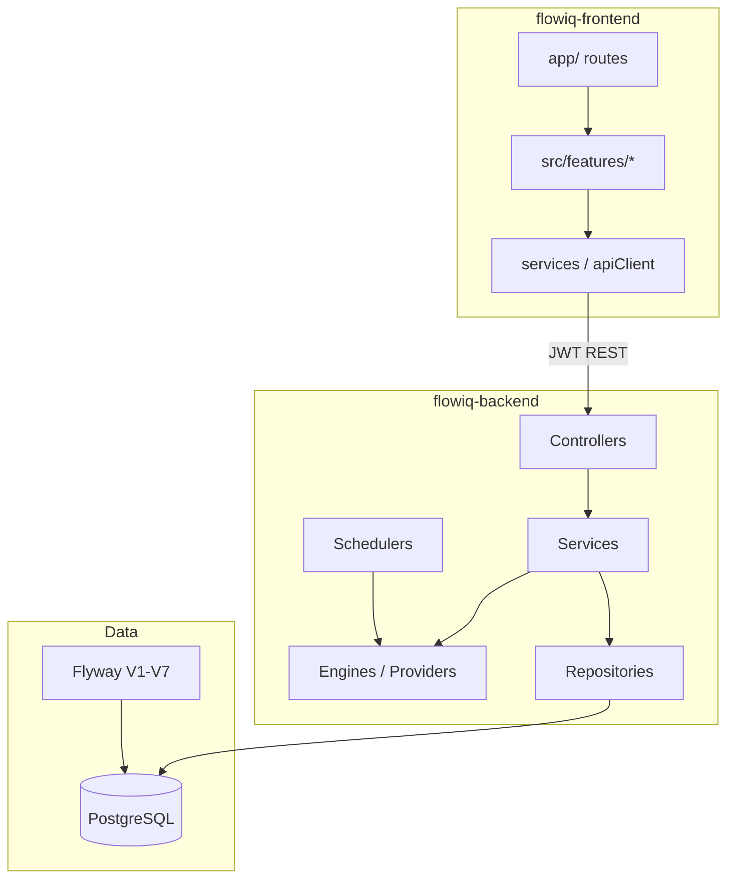
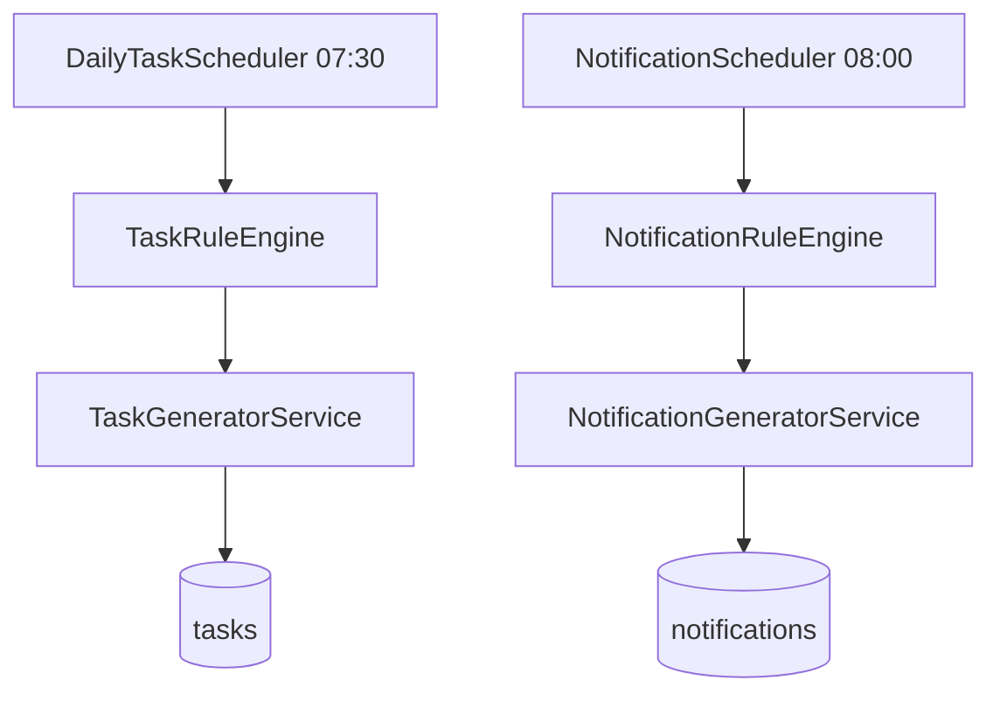
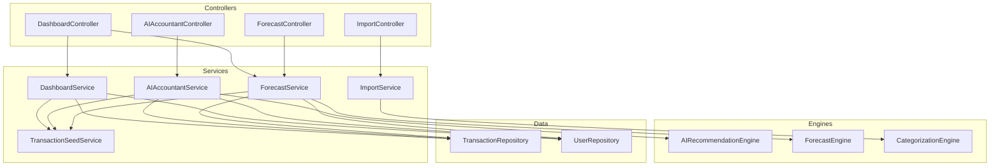
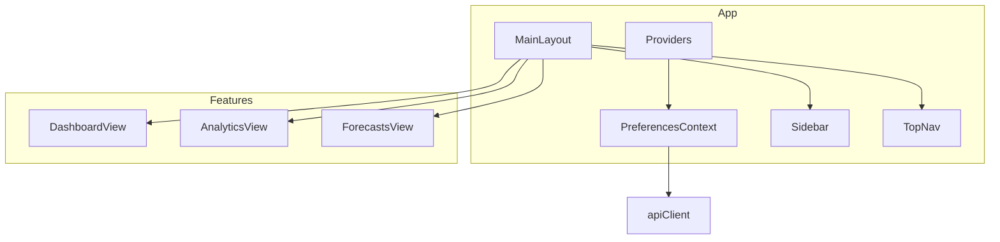
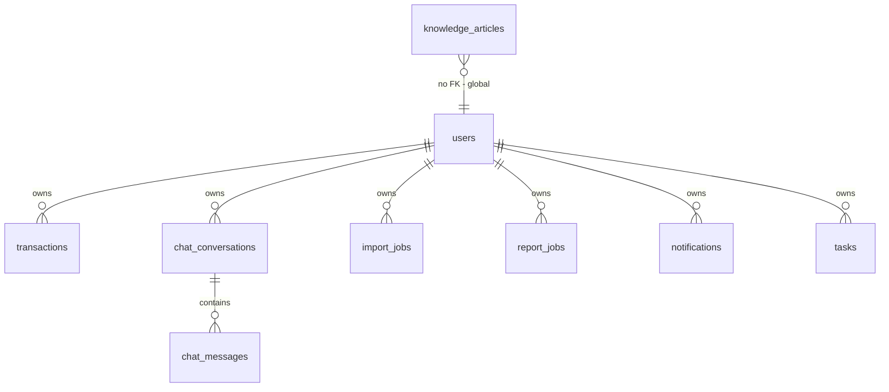
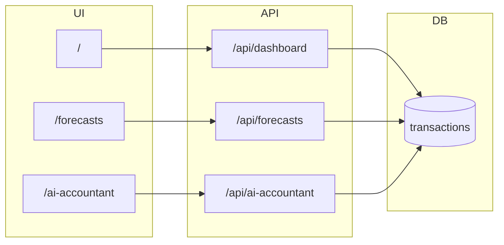

# System Component Catalog

**Audit date:** 2026-06-23  
**Source of truth:** `flowiq-backend` + `flowiq-frontend` source code  
**Stack:** Spring Boot 3.5 / Java 17 / PostgreSQL 15 / Next.js 16 / React 19

### Production column legend

| Value | Meaning |
|-------|---------|
| **Yes** | Active in deployed MVP runtime (REST, scheduler, or UI route) |
| **Partial** | Registered but unused, mock/static data path, or placeholder UI |
| **No** | Dead code — no callers |

---

## System Overview

---

# Backend (`flowiq-backend`)

## Controllers

HTTP entry points. All except auth/health/Swagger require JWT (`SecurityConfig`).

| Class | Path | Purpose | Dependencies | Entry points | Production |
|-------|------|---------|--------------|--------------|------------|
| `AuthController` | `/api/auth` | Register, login, me, logout | `AuthService` | `POST /register`, `/login`; `GET /me`; `POST /logout` | **Yes** |
| `HealthController` | `/api/health` | Liveness/readiness | — | `GET /`, `/ping` | **Yes** |
| `DashboardController` | `/api/dashboard` | Stats, insights, charts, widgets | `DashboardService`, `ForecastService`, `TaskService`, `KnowledgeService` | 9 GET endpoints | **Yes** |
| `TransactionController` | `/api/transactions` | CRUD + summary | `TransactionService` | `GET`, `POST`, `GET /{id}`, `/summary` | **Yes** |
| `AnalyticsController` | `/api/analytics` | Trends, FOP insights | `AnalyticsService` | 6 GET endpoints | **Yes** |
| `ForecastController` | `/api/forecasts` | Forecast Center metrics | `ForecastService` | `/revenue` … `/summary` | **Yes** |
| `AIAccountantController` | `/api/ai-accountant` | AI accountant module | `AIAccountantService` | `/health`, `/recommendations`, `/tax-advisor`, `/forecasts`, `POST /chat` | **Yes** |
| `ChatController` | `/api/chat` | Standalone chat | `ChatService` | `/conversations`, `POST /message` | **Yes** |
| `ImportController` | `/api/imports` | CSV upload | `ImportService` | `POST /upload`, `GET`, `GET /{id}` | **Yes** |
| `ReportsController` | `/api/reports` | Report jobs | `ReportsService` | list, preview, generate, download | **Yes** |
| `TaskController` | `/api/tasks` | Tasks CRUD + suggestions | `TaskService` | list, today, upcoming, grouped, suggestions, `POST` | **Yes** |
| `NotificationController` | `/api/notifications` | In-app notifications | `NotificationService` | list, unread-count, summary | **Yes** |
| `NotificationPreferenceController` | `/api/settings/notifications` | Per-user notification preferences | `NotificationPreferenceService` | `GET`, `PUT`, `POST /reset` | **Yes** |
| `BusinessGuideController` | `/api/business-guide` | Knowledge base API | `KnowledgeService` | articles, search, categories, dashboard-snapshot | **Yes** |
| `ProfileController` | `/api/profile` | Personal profile, FOP, password, sessions | `ProfileService`, `SessionService`, `AvatarStorageService` | `GET/PUT /profile`, `/fop`, `/change-password`, `/sessions/*`, avatar upload | **Yes** |

**Files:** `src/main/java/com/flowiq/**/**Controller.java` (13 classes)

```mermaid
flowchart LR
    subgraph Public
        AUTH[AuthController]
        HEALTH[HealthController]
    end

    subgraph Protected
        DASH[DashboardController]
        TX[TransactionController]
        AN[AnalyticsController]
        FC[ForecastController]
        AI[AIAccountantController]
        CH[ChatController]
        IMP[ImportController]
        REP[ReportsController]
        TSK[TaskController]
        NOT[NotificationController]
        BG[BusinessGuideController]
    end

    JWT[JwtAuthenticationFilter] --> Protected
    Public --> JWT
```

---

## Services

Business orchestration layer (`@Service` + security helpers).

| Class | Purpose | Key dependencies | Entry points | Production |
|-------|---------|------------------|--------------|------------|
| `AuthService` | Register/login, JWT issuance | `UserRepository`, `JwtService`, `AuthenticationManager`, `PasswordEncoder` | `AuthController` | **Yes** |
| `DashboardService` | Dashboard stats, inline AI insights, health | `TransactionRepository`, `UserRepository`, `TransactionSeedService` | `DashboardController` | **Yes** |
| `TransactionService` | Transaction CRUD, filters, pagination | `TransactionRepository`, `UserRepository` | `TransactionController` | **Yes** |
| `AnalyticsService` | FOP/tax analytics, trends | `TransactionRepository`, `TransactionSeedService`, `AnalyticsInsightProvider`† | `AnalyticsController`, `AIAccountantService`, `ReportsService` | **Yes** (†provider unused) |
| `ForecastService` | Forecast Center orchestration | `ForecastEngine`, `RuleBasedForecastProvider`, `TransactionSeedService` | `ForecastController`, `DashboardController` | **Yes** |
| `AIAccountantService` | Recommendations, chat, tax, inline forecasts | `AIRecommendationEngine`, `AnalyticsService`, `AIInsightProvider`‡ | `AIAccountantController` | **Yes** (‡no impl beans) |
| `ChatService` | Chat persistence + template replies | `ChatConversationRepository`, `TransactionSeedService` | `ChatController` | **Yes** |
| `ImportService` | CSV parse, categorize, persist | `CategorizationEngine`, `CsvImportStrategyResolver`, generators | `ImportController` | **Yes** |
| `ReportsService` | Report preview/generate/download | `ReportFileGenerator`, `AnalyticsService`, generators | `ReportsController` | **Yes** |
| `TaskService` | Task list, CRUD, snapshot, rule trigger | `TaskRuleEngine`, `TransactionSeedService` | `TaskController`, `DashboardController` | **Yes** |
| `NotificationService` | Read/mark notifications | `NotificationRepository`, `UserRepository` | `NotificationController` | **Yes** |
| `NotificationPreferenceService` | User notification settings, `isInAppEnabled` gate | `NotificationPreferenceRepository`, `UserRepository`, `AuditService` | `NotificationPreferenceController`, `NotificationGeneratorService` | **Yes** |
| `KnowledgeService` | Article search, categories, assist | `KnowledgeArticleRepository`, `DatabaseKnowledgeProvider`, `KnowledgeProvider` list | `BusinessGuideController`, `DashboardController` | **Yes** |
| `TransactionSeedService` | Auto-seed demo transactions | `TransactionRepository` | Called from 7 domain services | **Yes** |
| `TransactionInsightService` | Build analysis context for future AI | `TransactionRepository` | **None** | **No** |
| `DemoUserSeedService` | Create `demo@flowiq.ai` on startup | `UserRepository`, `PasswordEncoder` | `ApplicationRunner` | **Yes** (risk in prod) |
| `TaskGeneratorService` | Persist generated tasks | `TaskRepository`, `NotificationGeneratorService` | `TaskRuleEngine`, `ImportService`, `ReportsService` | **Yes** |
| `NotificationGeneratorService` | Persist notifications (preference-gated) | `NotificationRepository`, `NotificationPreferenceService` | `NotificationRuleEngine`, import/report hooks | **Yes** |
| `JwtService` | JWT create/validate | `application.properties` secrets | `AuthService`, `JwtAuthenticationFilter` | **Yes** |
| `CustomUserDetailsService` | Load user for Spring Security | `UserRepository` | `SecurityConfig`, JWT filter | **Yes** |

† `AnalyticsInsightProvider` injected, never invoked. ‡ `AIInsightProvider` loop runs with empty list.

---

## Repositories

Spring Data JPA interfaces.

| Interface | Entity | Purpose | Used by | Production |
|-----------|--------|---------|---------|------------|
| `UserRepository` | `User` | Auth, user lookup | Auth, all tenant services | **Yes** |
| `TransactionRepository` | `Transaction` | Aggregations, CRUD | Dashboard, Analytics, Forecast, AI, Chat, Import, Reports, Tasks, engines | **Yes** |
| `ChatConversationRepository` | `ChatConversation`, `ChatMessage` | Chat history | `ChatService` | **Yes** |
| `ImportJobRepository` | `ImportJob` | Import job status | `ImportService` | **Yes** |
| `ReportJobRepository` | `ReportJob` | Report metadata + file bytes | `ReportsService` | **Yes** |
| `NotificationRepository` | `Notification` | In-app notifications | `NotificationService`, `NotificationGeneratorService` | **Yes** |
| `NotificationPreferenceRepository` | `NotificationPreference` | User notification settings | `NotificationPreferenceService` | **Yes** |
| `TaskRepository` | `Task` | Compliance/business tasks | `TaskService`, `TaskGeneratorService` | **Yes** |
| `KnowledgeArticleRepository` | `KnowledgeArticle` | Business Guide content | `KnowledgeService` | **Yes** |

---

## Entities (JPA)

| Entity | Table | Purpose | FK / scope | Production |
|--------|-------|---------|------------|------------|
| `User` | `users` | Accounts, roles | — | **Yes** |
| `Transaction` | `transactions` | Financial rows | `user_id` → `users` | **Yes** |
| `ChatConversation` | `chat_conversations` | Chat threads | `user_id` | **Yes** |
| `ChatMessage` | `chat_messages` | Chat messages | `conversation_id` | **Yes** |
| `ImportJob` | `import_jobs` | CSV import runs | `user_id` (no FK in V1) | **Yes** |
| `ReportJob` | `report_jobs` | Generated reports | `user_id` (no FK in V1) | **Yes** |
| `Notification` | `notifications` | Alerts | `user_id` | **Yes** |
| `NotificationPreference` | `notification_preferences` | Per-type/channel toggles | `user_id` → `users` | **Yes** |
| `Task` | `tasks` | Tasks | `user_id` → `users` | **Yes** |
| `KnowledgeArticle` | `knowledge_articles` | KB articles (global) | No `user_id` | **Yes** |

**Enums (non-table):** `TaskStatus`, `TaskPriority`, `TaskType`, `NotificationType`, `NotificationSeverity`, `NotificationChannel`, `KnowledgeCategory`.

---

## Schedulers

| Class | Cron | Purpose | Dependencies | Production |
|-------|------|---------|--------------|------------|
| `DailyTaskScheduler` | `0 30 7 * * *` | Daily task generation per active user | `UserRepository`, `TaskRuleEngine` | **Yes** (single instance assumed) |
| `NotificationScheduler` | `0 0 8 * * *` | Daily notifications per active user | `UserRepository`, `NotificationRuleEngine` | **Yes** |

**Enable:** `@EnableScheduling` on `FlowiqBackendApplication`.

---

## Engines

Rule / calculation components (`@Component` or `@Service`).

| Class | Type | Purpose | Called by | Production |
|-------|------|---------|-----------|------------|
| `AIRecommendationEngine` | Engine | FOP/tax/expense recommendations | `AIAccountantService` | **Yes** |
| `ForecastEngine` | Engine | Rolling avg, trends, projections | `ForecastService` | **Yes** |
| `RuleBasedForecastProvider` | Provider/Engine | Forecast narrative insights | `ForecastService` | **Yes** |
| `CategorizationEngine` | Engine | CSV transaction categorization | `ImportService` | **Yes** |
| `DefaultCategoryRules` | Rules (static) | Keyword categorization | `CategorizationEngine` | **Yes** |
| `NotificationRuleEngine` | Engine | Threshold/calendar notifications | `NotificationScheduler`, events | **Yes** |
| `TaskRuleEngine` | Engine | Compliance task rules | `DailyTaskScheduler`, `TaskService` | **Yes** |
| `DatabaseKnowledgeProvider` | Provider | Search scoring + assist | `KnowledgeService` | **Yes** |

**Report renderers (engine-like):** `OpenPdfReportRenderer`, `PoiReportRenderer`, `ReportFileGenerator`, `PdfFontProvider` — used by `ReportsService`. **Yes**

**CSV strategies:** `MonobankCsvStrategy`, `PrivatBankCsvStrategy`, `UniversalCsvStrategy`, `CsvImportStrategyResolver` — used by `ImportService`. **Yes**

**Checker (frontend only):** `eligibility-engine.ts` — client-side FOP checker. **Partial** (no backend)

---

## Providers (extension interfaces)

| Interface | Implementation | Purpose | Consumer | Production |
|-----------|----------------|---------|----------|------------|
| `AIInsightProvider` | *none* | LLM recommendations/chat | `AIAccountantService` | **Partial** (wired, empty) |
| `AnalyticsInsightProvider` | *none* | LLM analytics narratives | `AnalyticsService` | **No** (never called) |
| `ForecastProvider` | `RuleBasedForecastProvider` | Forecast insights | `ForecastService` | **Yes** |
| `KnowledgeProvider` | `DatabaseKnowledgeProvider` | Search assist | `KnowledgeService` | **Yes** |
| `CategorizationProvider` | *none* | AI categorization | `CategorizationEngine` | **Partial** (wired, empty) |

---

## Configurations

| Class | Purpose | Entry / effect | Production |
|-------|---------|----------------|------------|
| `SecurityConfig` | JWT filter chain, public paths, BCrypt | All `/api/*` | **Yes** |
| `CorsConfig` | CORS allowlist (localhost, Vercel) | Browser clients | **Yes** |
| `OpenApiConfig` | Swagger / OpenAPI Bearer auth | `/swagger-ui`, `/v3/api-docs` | **Yes** |
| `AppPreferences` | Thread-local locale/currency from headers | `AppPreferencesFilter` | **Yes** |
| `AppPreferencesFilter` | Reads `X-App-Language`, `X-App-Currency` | Before security filters | **Yes** |
| `FeatureFlags` | `flowiq.features.bank-integrations-enabled` | Config properties | **Yes** (flag=false) |
| `ApiErrorResponses` | OpenAPI annotation helper | Controllers | **Yes** |

**Bootstrap:** `FlowiqBackendApplication` — `@SpringBootApplication`, `@EnableScheduling`.

**Exception handling:** `GlobalExceptionHandler` (`@ControllerAdvice`) — maps exceptions to `ErrorResponse`. **Yes**

---

## Filters & Security Components

| Class | Role | Dependencies | Production |
|-------|------|--------------|------------|
| `JwtAuthenticationFilter` | Bearer JWT → `SecurityContext` | `JwtService`, `CustomUserDetailsService` | **Yes** |
| `AppPreferencesFilter` | Locale/currency headers | `AppPreferences` | **Yes** |
| `JwtService` | Token build/parse/validate | `jwt.*` properties | **Yes** |
| `UserPrincipal` | `UserDetails` + `userId`, `role` | `User` entity | **Yes** |
| `CustomUserDetailsService` | Load user by email | `UserRepository` | **Yes** |

**Public routes (no JWT):** `/api/health/**`, `/api/auth/register`, `/api/auth/login`, Swagger.

---

## Backend Dependency Diagram

---

# Frontend (`flowiq-frontend`)

## Routes (`app/`)

| Route | Page file | Feature view | API-backed | Production |
|-------|-----------|--------------|------------|------------|
| `/` | `app/page.tsx` | `DashboardView` | **Yes** | **Yes** |
| `/login` | `app/login/page.tsx` | `LoginForm` | **Yes** | **Yes** |
| `/register` | `app/register/page.tsx` | `RegisterForm` | **Yes** | **Yes** |
| `/transactions` | `app/transactions/page.tsx` | Transactions | **Yes** | **Yes** |
| `/analytics` | `app/analytics/page.tsx` | Analytics | **Yes** | **Yes** |
| `/forecasts` | `app/forecasts/page.tsx` | Forecasts | **Yes** | **Yes** |
| `/ai-accountant` | `app/ai-accountant/page.tsx` | AI Accountant | **Yes** | **Yes** |
| `/chat` | `app/chat/page.tsx` | Chat | **Yes** | **Yes** |
| `/imports` | `app/imports/page.tsx` | Imports | **Yes** | **Yes** |
| `/reports` | `app/reports/page.tsx` | Reports | **Yes** | **Yes** |
| `/tasks` | `app/tasks/page.tsx` | Tasks | **Yes** | **Yes** |
| `/notifications` | `app/notifications/page.tsx` | Notifications | **Yes** | **Yes** |
| `/business-guide` | `app/business-guide/page.tsx` | Business Guide | **Partial** (mixed API + mock) | **Yes** |
| `/business-guide/articles/[slug]` | dynamic | Article detail | **Yes** | **Yes** |
| `/business-guide/groups/[slug]` | dynamic | FOP group detail | **Partial** (mock) | **Yes** |
| `/settings` | `app/settings/page.tsx` | Settings | **Partial** (localStorage only) | **Yes** |
| `/integrations` | `app/integrations/page.tsx` | Redirect | — | **Partial** → coming-soon |
| `/coming-soon/integrations` | `app/coming-soon/integrations/page.tsx` | Placeholder | Mock | **Partial** |

**Layout pattern:** Protected pages wrap `MainLayout` (client auth guard). Auth pages use `AuthLayout`.

---

## Features (`src/features/`)

| Feature | Purpose | Key exports | Production |
|---------|---------|-------------|------------|
| `dashboard` | Dashboard widgets | `DashboardView`, components | **Yes** |
| `transactions` | Transaction list/CRUD | `TransactionsView`, `useTransactions` | **Yes** |
| `analytics` | Charts, FOP insights | `AnalyticsView`, `useAnalytics` | **Yes** |
| `forecasts` | Forecast Center | `ForecastsView`, `useForecasts` | **Yes** |
| `ai-accountant` | AI Accountant UI | `AIAccountantView`, `useAIAccountant` | **Yes** |
| `chat` | Standalone chat UI | Chat components | **Yes** |
| `imports` | CSV upload UI | `useImports` | **Yes** |
| `reports` | Report generation UI | `useReports` | **Yes** |
| `tasks` | Task management | `useTasks` | **Yes** |
| `notifications` | Notification inbox | `useNotifications` | **Yes** |
| `notification-preferences` | Settings notification toggles | `NotificationPreferencesView`, `useNotificationPreferences` | **Yes** |
| `business-guide` | KB + static FOP/tax/KVED | hooks, `business-guide.service` | **Partial** |
| `business-guide/checker` | FOP eligibility wizard | `eligibility-engine`, `useEligibilityChecker` | **Partial** (client-only) |
| `auth` | Login/register forms | `LoginForm`, `RegisterForm` | **Yes** |
| `settings` | Preferences UI | `SettingsView` (General, Profile, Security, Notifications, Appearance) | **Yes** |
| `integrations` | Bank integrations UI | mock data | **Partial** |

---

## Services (API clients)

| Service | File | Backend prefix | Production |
|---------|------|----------------|------------|
| `apiClient` | `src/services/api.ts` | Base axios + JWT headers | **Yes** |
| `authService` | `src/services/auth.service.ts` | `/api/auth` | **Yes** |
| `dashboardService` | `src/services/dashboard.service.ts` | `/api/dashboard` | **Yes** |
| `chatService` | `src/services/chat.service.ts` | `/api/chat` | **Yes** |
| `transactionService` | `features/transactions/services/transactionService.ts` | `/api/transactions` | **Yes** |
| `analyticsService` | `features/analytics/services/analyticsService.ts` | `/api/analytics` | **Yes** |
| `forecastService` | `features/forecasts/services/forecast.service.ts` | `/api/forecasts` | **Yes** |
| `aiAccountantService` | `features/ai-accountant/services/aiAccountantService.ts` | `/api/ai-accountant` | **Yes** |
| `importService` | `features/imports/services/importService.ts` | `/api/imports` | **Yes** |
| `reports.service` | `features/reports/services/reports.service.ts` | `/api/reports` | **Yes** |
| `task.service` | `features/tasks/services/task.service.ts` | `/api/tasks` | **Yes** |
| `notification.service` | `features/notifications/services/notification.service.ts` | `/api/notifications` | **Yes** |
| `notification-preferences.service` | `features/notification-preferences/services/notification-preferences.service.ts` | `/api/settings/notifications` | **Yes** |
| `knowledge.service` | `features/business-guide/services/knowledge.service.ts` | `/api/business-guide` | **Yes** |
| `business-guide.service` | `features/business-guide/services/business-guide.service.ts` | — (local mock) | **Partial** |
| `tax-profile.service` | `src/services/tax-profile.service.ts` | — (mock-data) | **Partial** |
| `integrations.service` | `src/services/integrations.service.ts` | — (mock) | **Partial** |
| `checker.service` | `checker/services/checker.service.ts` | — (client engine) | **Partial** |

---

## Hooks

| Hook | Feature | Calls | Production |
|------|---------|-------|------------|
| `useTransactions` | transactions | `transactionService` | **Yes** |
| `useAnalytics` | analytics | `analyticsService` | **Yes** |
| `useForecasts` | forecasts | `forecastService` | **Yes** |
| `useAIAccountant` | ai-accountant | `aiAccountantService` | **Yes** |
| `useImports` | imports | `importService` | **Yes** |
| `useReports` | reports | `reports.service` | **Yes** |
| `useTasks` | tasks | `task.service` | **Yes** |
| `useNotifications` | notifications | `notification.service` | **Yes** |
| `useBusinessGuide` | business-guide | mixed services | **Partial** |
| `useBusinessGuideSearch` | business-guide | `knowledge.service` | **Yes** |
| `useKnowledgeArticles` | business-guide | API | **Yes** |
| `useKnowledgeArticle` | business-guide | API | **Yes** |
| `useFopGroup` | business-guide | mock service | **Partial** |
| `useKvedSearch` | business-guide | mock service | **Partial** |
| `useEligibilityChecker` | checker | client engine | **Partial** |

Dashboard uses components with direct `dashboardService` calls (no dedicated `useDashboard` hook).

---

## Contexts

| Context | File | State | Persistence | Production |
|---------|------|-------|-------------|------------|
| `PreferencesContext` | `src/shared/context/PreferencesContext.tsx` | language, currency, theme | `localStorage` | **Yes** |

**Provider tree:** `Providers.tsx` wraps app with `PreferencesContext` + theme.

---

## Shared Components

| Group | Components | Purpose | Production |
|-------|------------|---------|------------|
| **Layout** | `MainLayout`, `Sidebar`, `TopNav`, `AmbientBackground` | App shell, auth guard | **Yes** |
| **Providers** | `Providers`, `ThemeScript` | Context + FOUC prevention | **Yes** |
| **Brand** | `FlowiqIcon` | Logo | **Yes** |
| **Theme** | `ThemeToggle` | Dark/light toggle | **Yes** |
| **UI (shadcn/Radix)** | `button`, `card`, `input`, `dialog`, `dropdown-menu`, `tabs`, `sheet`, `tooltip`, `badge`, `avatar`, `clearable-input` | Design system primitives | **Yes** |

---

# Database

## Tables

| Table | Migration | Purpose | Tenant scope | Production |
|-------|-----------|---------|--------------|------------|
| `users` | V1 | User accounts | Global | **Yes** |
| `transactions` | V1, V2 (`auto_categorized`) | Financial data | `user_id` | **Yes** |
| `chat_conversations` | V1 | Chat threads | `user_id` | **Yes** |
| `chat_messages` | V1 | Messages | via conversation | **Yes** |
| `import_jobs` | V1 | Import status | `user_id` | **Yes** |
| `report_jobs` | V1 | Report files/metadata | `user_id` | **Yes** |
| `notifications` | V3 | In-app alerts | `user_id` | **Yes** |
| `tasks` | V4 | Tasks | `user_id` FK | **Yes** |
| `knowledge_articles` | V5 | Business Guide content | Global (seed data) | **Yes** |
| `flyway_schema_history` | Flyway | Migration audit | System | **Yes** |

---

## Relationships

| Relationship | Enforced in SQL | Notes |
|--------------|-----------------|-------|
| `users` → `transactions` | ✅ FK V1 | Core tenant boundary |
| `users` → `chat_*` | ✅ FK V1 | |
| `users` → `tasks` | ✅ FK V4 | |
| `users` → `notifications` | ⚠️ No FK V3 | Index on `user_id` only |
| `users` → `import_jobs` / `report_jobs` | ⚠️ No FK V1 | Index on `user_id` |
| `knowledge_articles` | — | Shared catalog, Flyway seed INSERTs |

---

## Flyway Migrations

| Version | File | Purpose | Production |
|---------|------|---------|------------|
| V1 | `V1__initial_schema.sql` | `users`, `transactions`, chat, import_jobs, report_jobs | **Yes** (applied on startup) |
| V2 | `V2__add_auto_categorized_column.sql` | `transactions.auto_categorized` | **Yes** |
| V3 | `V3__create_notifications_table.sql` | `notifications` + indexes | **Yes** |
| V4 | `V4__create_tasks_table.sql` | `tasks` + FK to `users` | **Yes** |
| V5 | `V5__create_knowledge_articles_table.sql` | `knowledge_articles` + seed articles | **Yes** |

**Config:** `spring.flyway.enabled=true`, `ddl-auto=validate`, `spring.flyway.locations=classpath:db/migration`.

---

# Cross-Stack Module Map

| Module | Backend controller | Frontend route | DB tables |
|--------|-------------------|----------------|-----------|
| Auth | `AuthController` | `/login`, `/register` | `users` |
| Dashboard | `DashboardController` | `/` | `transactions` |
| Transactions | `TransactionController` | `/transactions` | `transactions` |
| Analytics | `AnalyticsController` | `/analytics` | `transactions` |
| Forecasts | `ForecastController` | `/forecasts` | `transactions` |
| AI Accountant | `AIAccountantController` | `/ai-accountant` | `transactions` |
| Chat | `ChatController` | `/chat` | `chat_*` |
| Imports | `ImportController` | `/imports` | `import_jobs`, `transactions` |
| Reports | `ReportsController` | `/reports` | `report_jobs`, `transactions` |
| Tasks | `TaskController` | `/tasks` | `tasks` |
| Notifications | `NotificationController` | `/notifications` | `notifications` |
| Business Guide | `BusinessGuideController` | `/business-guide` | `knowledge_articles` |

---

# Components Not in Production Path

| Component | Reason |
|-----------|--------|
| `TransactionInsightService` | Zero callers |
| `AnalyticsInsightProvider` | Injected, never invoked |
| `AIInsightProvider` / `CategorizationProvider` implementations | Interfaces only |
| `business-guide.service` mock methods | Static local data |
| `tax-profile.service` | Commented API; uses mock |
| `integrations` UI | Redirect + mock |
| EMAIL/TELEGRAM notification channels | Enum only; `IN_APP` used |

---

## Related Documents

| Document | Link |
|----------|------|
| Architect cheat sheet | [ARCHITECT_REVIEW_CHEAT_SHEET.md](ARCHITECT_REVIEW_CHEAT_SHEET.md) |
| Technical debt | [TECHNICAL_DEBT_REGISTER.md](TECHNICAL_DEBT_REGISTER.md) |
| Data sources | [data-sources.md](data-sources.md) |
| AI component audit | [AI_DOCUMENTATION_AUDIT_REPORT.md](AI_DOCUMENTATION_AUDIT_REPORT.md) |

**Prepared:** 2026-06-23  
**Maintain:** Update when adding controllers, routes, or Flyway V6+
