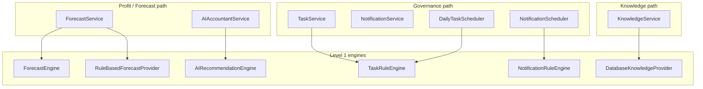

# ADR-003: AI Quality Factory (Distributed Intelligence Layer)

**Status:** Accepted  
**Date:** 2026-06-17  
**Context:** FlowIQ requires multiple types of financial intelligence — recommendations, forecasts, compliance tasks, notifications, categorization, knowledge assist — without a single LLM dependency. Teams may extend individual domains independently.

## Decision

Adopt a **three-level hierarchical model** implemented as **distributed Spring components**, not a monolithic orchestrator or central factory class:

| Level | Role | As-built implementation |
|-------|------|-------------------------|
| **Level 1** | Intelligence units | Rule engines (`AIRecommendationEngine`, `ForecastEngine`, `NotificationRuleEngine`, etc.) |
| **Level 2** | Domain orchestrators | Services (`AIAccountantService`, `ForecastService`, `KnowledgeService`, …) |
| **Level 3** | Composition | Spring Application Context + `@Autowired(required = false) List<Provider>` |

**Naming note:** Classes `AiQualityFactory`, `PrIntelligenceOrchestrator`, `GovernanceIntelligenceOrchestrator`, and `FailureIntelligenceOrchestrator` do **not** exist in code. The conceptual paths map to service + engine combinations documented in [AI Quality Factory](../ai-quality-factory.md).

## Why Hierarchical Model

1. **Domain boundaries** — Forecast math, FOP compliance, and knowledge search have different inputs, lifecycles, and test strategies
2. **Independent evolution** — `ForecastEngine` can ship unit tests at 99% coverage without touching notification rules
3. **Pluggable LLM** — ADR-001 provider interfaces attach per domain, not through one god-object
4. **Scheduler isolation** — Governance path (`TaskRuleEngine`, `NotificationRuleEngine`) runs on cron, separate from request-scoped forecast path

## Why Not One Orchestrator

| Concern | Single orchestrator problem | Distributed approach |
|---------|----------------------------|----------------------|
| Coupling | One change risks all intelligence outputs | Package-level isolation (`forecasts/`, `notifications/`, `tasks/`) |
| Testing | Large integration surface | 7 unit test classes on engines/services |
| Scaling | All logic in one JVM thread per request | Schedulers + on-demand paths separated |
| Team ownership | Merge conflicts on one file | Parallel work on domain packages |

## Domain Orchestrator Mapping

## Consequences

### Positive

- **Scalability:** Add new `ForecastProvider` bean without modifying `AIAccountantService`
- **Testability:** Pure engines (`ForecastEngine`, `AIRecommendationEngine`) testable without Spring context
- **Maintainability:** FOP tax constants localized per domain (with known duplication trade-off)
- **Auditability:** Rule-based outputs are deterministic — suitable for compliance review

### Negative

- No single entry point to trace all intelligence — requires documentation (see [AI Agents Architecture](../ai-agents-architecture.md))
- Duplicated FOP/tax constants across engines
- Provider priority rules differ per service (`KnowledgeService` vs `ForecastService`)

## Extension Scenarios

| Scenario | Extension point |
|----------|-----------------|
| OpenAI recommendations | New `@Component` implementing `AIInsightProvider` |
| Claude forecast narratives | New `ForecastProvider` with `@Order(HIGHEST_PRECEDENCE)` |
| RAG knowledge search | Non-`DatabaseKnowledgeProvider` `KnowledgeProvider` bean |
| AI categorization on import | `CategorizationProvider` implementation |
| New compliance rule | Add method to `TaskRuleEngine` or `NotificationRuleEngine` |
| Executive PDF insights | Extend `ReportsService` — separate from AI layer |

## Alternatives Considered

1. **Single `IntelligenceOrchestrator` service** — rejected (tight coupling, hard to test)
2. **AI microservice** — deferred (monolith sufficient for MVP)
3. **Event-driven CQRS** — deferred (complexity vs team size)
4. **Prompt-only LLM without rules** — rejected (ADR-001, compliance risk)

## Related

- [ADR-001: Pluggable AI Providers](001-pluggable-ai-providers.md)
- [AI Quality Factory](../ai-quality-factory.md)
- [AI Agents Architecture](../ai-agents-architecture.md)
