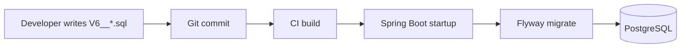

# ADR-005: Flyway Selection

**Status:** Accepted  
**Date:** 2026-06-17  
**Context:** FlowIQ requires versioned, repeatable database schema evolution. Hibernate must not auto-modify production schema (`ddl-auto=validate`).

## Decision

Use **Flyway** for all schema changes:

- Migration files: `src/main/resources/db/migration/V{version}__{description}.sql`
- Applied automatically on application startup (`spring.flyway.enabled=true`)
- Current versions: **V1–V5** (users, transactions, chat, imports, reports, notifications, tasks, knowledge articles)

**Dependencies:** `flyway-core`, `flyway-database-postgresql` in `pom.xml`.

## Why Flyway

| Benefit | FlowIQ usage |
|---------|--------------|
| Version ordering | `V1` → `V5` linear history in `flyway_schema_history` |
| SQL-first | Migrations are plain SQL — reviewable in PRs, no XML/YAML abstraction |
| Spring Boot integration | Zero-config startup migration |
| Repeatability | Same migrations across local Docker, CI, staging, prod |

## Why Not Manual SQL Scripts

| Manual scripts problem | Flyway solution |
|------------------------|-----------------|
| No audit trail of what ran where | `flyway_schema_history` table |
| Drift between environments | Single migration source in Git |
| Forgotten scripts on deploy | Automatic apply on startup |
| No CI gate | Future: `flyway validate` in pipeline |

Manual scripts remain acceptable for **one-off data fixes** in ops runbooks — not for schema changes.

## Why Not Liquibase

| Factor | Flyway preferred |
|--------|------------------|
| Format | FlowIQ team writes SQL directly — Flyway's one-file-per-version is simpler |
| Learning curve | Lower for developers already reading `V5__create_knowledge_articles_table.sql` |
| Spring Boot default culture | Flyway is common in Spring greenfield projects |
| Rollback | Both require discipline; neither auto-rollbacks in Community editions |

Liquibase XML/YAML changelogs add indirection without benefit for current team size.

## Schema Versioning Benefits

| Practice | Rule |
|----------|------|
| One logical change per migration | e.g. `V3__create_notifications_table.sql` |
| Never edit applied migrations | Add `V6` to alter, don't rewrite `V3` |
| Idempotent-safe DDL | `IF NOT EXISTS` where appropriate |
| Hibernate validates only | `ddl-auto=validate` — Flyway owns DDL |

## Rollback Strategy

Flyway Community Edition does **not** auto-execute rollback scripts. FlowIQ uses a **forward-only** strategy:

| Scenario | Approach |
|----------|----------|
| Bad migration before deploy | Fix SQL before merge; never deploy broken version |
| Bad migration in production | Deploy **new** migration `V{n+1}` that reverses DDL (e.g. `DROP TABLE`) |
| Local dev reset | `docker compose down -v` + restart — acceptable dev-only |
| Production data loss risk | Backup before migrate; test on staging copy |

**Optional future:** `U{n}__undo_description.sql` with Flyway Teams undo — not configured today.

### Pre-deploy checklist

1. Review migration SQL in PR
2. Run against local PostgreSQL with production-like data volume
3. Verify `flyway_schema_history` after startup
4. Confirm Hibernate starts without `validate` errors

## Consequences

### Positive

- Schema is code — reviewed, versioned, reproducible
- New developers get correct schema on first `./mvnw spring-boot:run`
- Aligns with [ADR-004](004-postgresql-selection.md) PostgreSQL choice

### Negative

- No automatic down-migration in Community edition
- Renaming migration files after apply breaks checksums — requires `flyway repair`
- Baseline needed if migrating legacy Hibernate-managed DB

## Alternatives Considered

1. **Hibernate `ddl-auto=update`** — rejected for production (unsafe, non-auditable)
2. **JPA-only schema generation** — rejected (no version history)
3. **Manual DBA scripts** — rejected (environment drift)

## Related

- [Database Migrations](../../database/migrations.md)
- [ADR-004: PostgreSQL Selection](004-postgresql-selection.md)
