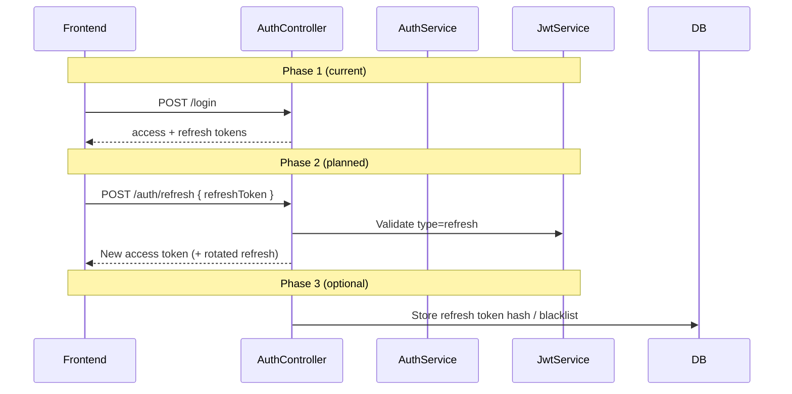

# ADR-006: JWT Authentication Strategy

**Status:** Accepted  
**Date:** 2026-06-17  
**Context:** FlowIQ is a stateless REST API consumed by a Next.js SPA. Server-side sessions would require sticky sessions or shared session store. Mobile clients may be added later.

## Decision

Use **stateless JWT authentication** with Spring Security:

- **Access token** — short-lived JWT in `Authorization: Bearer` header
- **Refresh token** — longer-lived JWT returned in login/register response body
- **Password storage** — BCrypt via `UserDetailsService`
- **Validation** — `JwtAuthenticationFilter` on protected routes

**Library:** `io.jsonwebtoken` (JJWT) in `JwtService`.

## Why Stateless Authentication

| Benefit | FlowIQ impact |
|---------|---------------|
| Horizontal scaling | No server-side session store; any backend instance validates JWT |
| SPA-friendly | Frontend stores token in `localStorage`, attaches via axios interceptor |
| API clarity | Each request self-contained — suitable for future mobile app |
| Cloud-native | Aligns with containerized deployment (no Redis session cluster required for MVP) |

## Why JWT (Not Session Cookies)

| Factor | JWT choice |
|--------|------------|
| Cross-origin | Frontend (`localhost:3000` / Vercel) → backend (`localhost:8080`) — Bearer header avoids cookie SameSite complexity |
| Stateless API | No session lookup on every request |
| OpenAPI / Swagger | "Authorize" with Bearer token is standard |
| Industry pattern | Familiar to developers integrating third-party clients |

**Trade-off:** JWT revocation is harder than server sessions — see limitations below.

## Access Token Lifecycle

| Parameter | Value | Config key |
|-----------|-------|------------|
| Algorithm | HS256 (symmetric) | `jwt.secret` |
| Expiration | **24 hours** (86,400,000 ms) | `jwt.access-token-expiration` |
| Claims | `sub` (email), `type=access`, `exp` | `JwtService.generateAccessToken()` |
| Validation | Signature + expiry + `type=access` | `JwtAuthenticationFilter` |

**Frontend behavior** (`api.ts`):

- Stores access token in `localStorage` key `token`
- Attaches `Authorization: Bearer <token>` on each request
- On 401 (non-auth endpoints): clears `token`, `refreshToken`, `user` — redirects to login

## Refresh Token (Current vs Roadmap)

### Current implementation

| Aspect | Status |
|--------|--------|
| Generated on login/register | ✅ `AuthService` → `jwtService.generateRefreshToken()` |
| Returned in `AuthResponse.refreshToken` | ✅ |
| Stored in frontend `localStorage` | ✅ |
| `POST /api/auth/refresh` endpoint | ❌ **Not implemented** |
| Server-side refresh token revocation | ❌ Not implemented |
| Refresh token rotation | ❌ Not implemented |

Refresh token expiration: **7 days** (`jwt.refresh-token-expiration=604800000`).

### Refresh token roadmap

**Phase 2 tasks:**

1. Add `POST /api/auth/refresh` with refresh token body
2. Validate `type=refresh` claim in `JwtService`
3. Axios interceptor: on 401, attempt refresh before logout
4. Document in [Authentication API](../../api/authentication-api.md)

**Phase 3 (production hardening):**

- Refresh token family / rotation
- `jti` claim + Redis or DB denylist for logout
- Move `jwt.secret` to environment secret manager

## Limitations of Current Implementation

| Limitation | Risk | Mitigation |
|------------|------|------------|
| No refresh endpoint | User re-logs after 24h | Implement Phase 2 |
| JWT in `localStorage` | XSS can steal token | CSP, sanitize inputs; consider `httpOnly` cookie alternative |
| Symmetric HS256 secret in properties | Secret leak forges tokens | Externalize secret; rotate in prod |
| Logout is client-only | Token valid until expiry | Short access TTL; future denylist |
| No role enforcement on all endpoints | `ADMIN`/`VIEWER` roles exist but partially enforced | See `docs/security/authorization.md` |
| Dev secret in `application.properties` | Must not ship to prod | Profile-specific config |

## Consequences

### Positive

- Simple integration for frontend and Swagger
- No session infrastructure for MVP
- Works with Docker/Kubernetes scale-out

### Negative

- Token revocation requires additional design
- Refresh token currently unused — wasted client storage
- 24h access window is long for high-security deployments

## Alternatives Considered

1. **Server-side sessions + Redis** — deferred (ops overhead for MVP)
2. **OAuth2 / Keycloak** — deferred (enterprise SSO not required yet)
3. **API keys only** — rejected (no user identity model)
4. **Opaque tokens + introspection** — deferred (adds auth service hop)

## Related

- [JWT Flow](../../security/jwt-flow.md)
- [Authentication API](../../api/authentication-api.md)
- [ADR-007: Layered Architecture](007-layered-architecture.md)
- [ADR-008: Frontend Architecture](008-frontend-architecture.md)
