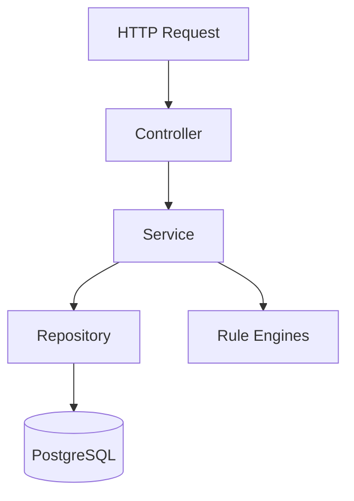

# ADR-007: Layered Architecture (Backend)

**Status:** Accepted  
**Date:** 2026-06-17  
**Context:** FlowIQ backend is a Spring Boot monolith with 15+ REST endpoints, multiple domain packages (forecasts, tasks, notifications, knowledge), and growing business logic. Structure must support testing and team parallelization.

## Decision

Adopt classic **three-layer architecture** with optional domain packages:

```
Controller → Service → Repository → Entity (JPA)
```

**Cross-cutting:** `config/`, `security/`, `dto/`, `exception/`, domain-specific sub-packages (`forecasts/`, `tasks/`, etc.).

## Layer Responsibilities

| Layer | Package | Responsibility |
|-------|---------|----------------|
| **Controller** | `controller/`, `*/controller/` | HTTP mapping, validation (`@Valid`), OpenAPI annotations, status codes |
| **Service** | `service/`, `*/service/` | Business logic, orchestration, transactions (`@Transactional`), seed calls |
| **Repository** | `repository/`, `*/repository/` | Data access — Spring Data JPA interfaces |
| **Entity** | `entity/`, `*/entity/` | JPA mappings, table definitions |
| **DTO** | `dto/` | API request/response objects — decoupled from entities |

**Rule engines** (`AIRecommendationEngine`, `ForecastEngine`, `*RuleEngine`) sit as `@Component` beans injected into services — not controllers.

## Why Controller → Service → Repository



| Principle | Application |
|-----------|-------------|
| **Separation of concerns** | Controllers don't query `EntityManager`; repositories don't return `ResponseEntity` |
| **Single responsibility** | `ForecastService` orchestrates; `ForecastEngine` calculates |
| **Testability** | Services unit-tested with mocked repositories (see `ForecastServiceTest`) |
| **API stability** | DTOs evolve independently of JPA entities |

## Advantages

### Testability

- **7 unit test classes** mock repositories and dependencies — no `@SpringBootTest` required
- Pure engines (`ForecastEngine`, `AIRecommendationEngine`) testable with zero mocks
- Controllers thin enough to defer `@WebMvcTest` to integration phase

### Maintainability

- New endpoint: add controller method → service method → repository query if needed
- Domain packages (`com.flowiq.forecasts`) colocate engine + service + DTO for forecast feature
- Exception handling centralized in `exception/` (`@ControllerAdvice`)

### Separation of Concerns

| Concern | Layer |
|---------|-------|
| JWT extraction | `security/JwtAuthenticationFilter` |
| Locale/currency headers | `config/AppPreferencesFilter` |
| FOP tax rules | `AnalyticsService`, `ForecastService` |
| SQL | Repository interfaces + Flyway migrations |

## Domain Package Pattern

For larger features, nested structure extends the three layers:

```
com.flowiq.forecasts/
├── controller/ForecastController.java
├── service/ForecastService.java
├── engine/ForecastEngine.java
├── provider/RuleBasedForecastProvider.java
└── dto/
```

This is **layered architecture within a vertical slice** — not full CQRS or hexagonal ports/adapters.

## Consequences

### Positive

- Predictable location for new code
- Aligns with Spring Boot conventions and documentation
- Enables [ADR-003](003-ai-quality-factory.md) domain orchestrators without new architectural paradigm

### Negative

- Anemic domain model risk — logic often in services, not entities
- Cross-service calls (`ReportsService` → `AnalyticsService`) require discipline to avoid cycles
- Some duplication (FOP constants across services)

## Alternatives Considered

1. **Hexagonal (ports/adapters)** — deferred (ceremony exceeds MVP team size)
2. **CQRS + event sourcing** — rejected (overkill for CRUD-heavy app)
3. **Controller → Repository direct** — rejected (untestable, fat controllers)
4. **Microservices per module** — rejected (operational cost)

## Related

- [Backend Architecture](../backend-architecture.md)
- [ADR-003: AI Quality Factory](003-ai-quality-factory.md)
- [ADR-006: JWT Authentication](006-jwt-authentication-strategy.md)
- [Unit Test Coverage](../../UNIT-TEST-COVERAGE.md)
