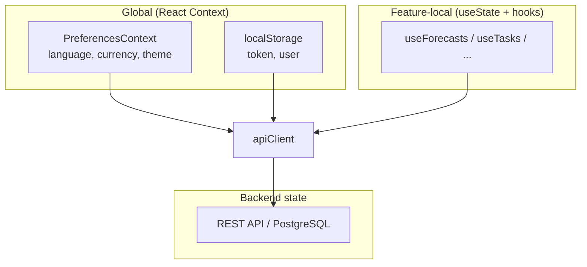

# ADR-008: Frontend Architecture

**Status:** Accepted  
**Date:** 2026-06-17  
**Context:** FlowIQ frontend is a Ukrainian/English financial dashboard SPA requiring SEO-light internal pages, fast iteration, and clear module boundaries matching backend domains.

## Decision

Use **Next.js 16 App Router** with:

- **Feature-based** folder structure under `src/features/`
- **Service layer** (`*.service.ts`) for API calls via shared `apiClient`
- **Custom hooks** (`use*.ts`) for data fetching and UI state per feature
- **React Context** for global preferences (language, currency, theme)
- **No global state library** (no Redux, Zustand, TanStack Query in dependencies)

**Stack:** React 19, TypeScript, Tailwind CSS 4, Radix UI, axios, Recharts.

## Why Next.js

| Requirement | Next.js fit |
|-------------|-------------|
| React ecosystem | Team uses component model, hooks, TypeScript |
| App Router | File-based routing in `app/` — one `page.tsx` per module route |
| Standalone output | `output: "standalone"` in `next.config.ts` — Docker deployment |
| Vercel deployment | Production CORS target `flowiq.vercel.app` |
| i18n-ready | Custom i18n via `PreferencesContext` + translation keys |

**Not using (today):** Server Components for data fetching — most pages are client components calling REST API.

## Why Feature-Based Structure

```
src/features/
├── dashboard/     components/, hooks/, index.ts
├── transactions/  components/, hooks/, services/
├── forecasts/
├── analytics/
├── ai-accountant/
├── business-guide/  (+ checker/ sub-feature)
├── imports/
├── reports/
├── tasks/
├── notifications/
├── chat/
├── settings/
└── integrations/

src/services/       # Shared: api.ts, auth, dashboard, chat
src/shared/         # context/, i18n/, theme/, ui/
app/                # Next.js routes → import feature views
```

| Benefit | Example |
|---------|---------|
| Colocation | `forecast.service.ts` lives beside `useForecasts.ts` and chart components |
| Backend parity | Feature folder maps 1:1 to backend module (`/api/forecasts` → `features/forecasts`) |
| Lazy ownership | Team can work in `features/reports` without touching `features/chat` |
| Barrel exports | `features/dashboard/index.ts` controls public API of feature |

## Why Service Layer

| Without service layer | With service layer |
|----------------------|-------------------|
| axios calls scattered in components | Single place for endpoint paths, types |
| Duplicate auth header logic | `apiClient` interceptor attaches JWT + `X-App-Language` + `X-App-Currency` |
| Hard to mock in tests | Services mockable (when tests added) |

**Pattern:**

```typescript
// features/forecasts/services/forecast.service.ts
export async function getForecastSummary() {
  const { data } = await apiClient.get("/forecasts/summary");
  return data;
}

// features/forecasts/hooks/useForecasts.ts
// useState + useEffect → calls forecast.service.ts
```

Shared `src/services/api.ts` — base URL from `NEXT_PUBLIC_API_URL`, 401 handling.

## State Management Approach



| State type | Mechanism | Persistence |
|------------|-----------|-------------|
| Auth token | `localStorage` | Browser |
| Language, currency, theme | `PreferencesContext` + `localStorage` | Browser |
| Module data (transactions, forecasts) | Feature hooks (`useState`) | Fetched on mount, not cached globally |
| Form UI state | Component `useState` | Ephemeral |

**Why no Redux/React Query:**

- MVP scope — modules load independently, no complex cache invalidation graph
- Preferences are the only true cross-cutting client state
- Adding TanStack Query is a future option when cache/stale-while-revalidate is needed

## Hybrid Data Sources (Documented)

Most features call **real API**. Exceptions (frontend-only mock):

- `tax-profile.service.ts` → `mock-data/tax-profile*.ts`
- `business-guide.service.ts` → static FOP groups, taxes, KVED
- `checker/` → client-side eligibility engine

See [Data Sources](../data-sources.md).

## Consequences

### Positive

- Fast feature development with clear folder conventions
- Deployable to Vercel or Docker with minimal config
- TypeScript end-to-end with backend DTO alignment

### Negative

- No shared server-side data cache — duplicate fetches if user navigates repeatedly
- No Next.js middleware auth guard — client-side redirect only
- Feature hooks pattern inconsistent across modules (some use more `useEffect` than others)

## Alternatives Considered

1. **Create React App / Vite SPA** — rejected (Next.js routing + Vercel + standalone Docker)
2. **Redux Toolkit global store** — rejected (unnecessary for current state complexity)
3. **Monolithic `components/` folder** — rejected (doesn't scale with 12+ modules)
4. **tRPC / GraphQL** — rejected (backend is OpenAPI REST)

## Related

- [Frontend Architecture](../frontend-architecture.md)
- [State Management](../../frontend/state-management.md)
- [ADR-006: JWT Authentication](006-jwt-authentication-strategy.md)
- [ADR-007: Layered Architecture](007-layered-architecture.md)
