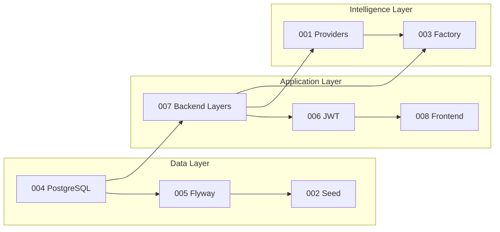

# ADR Coverage Report

**Generated:** 2026-06-17  
**Scope:** Architectural decisions across `flowiq-backend` and `flowiq-frontend`  
**ADR location:** `docs/architecture/adr/`

---

## Executive Summary

| Metric | Value |
|--------|-------|
| **Documented ADRs** | **8** |
| **Accepted** | 8 |
| **Proposed / Draft** | 0 |
| **Superseded** | 0 |
| **Estimated decision coverage** | **~72%** of major architectural choices |

FlowIQ now has ADRs covering **data**, **migrations**, **security**, **backend/frontend structure**, **AI architecture**, and **demo seed strategy**. Several production-critical decisions remain **undocumented as formal ADRs**.

---

## Documented Decisions (ADR Registry)

| ADR | Decision | Status | Code anchor |
|-----|----------|--------|-------------|
| [001](adr/001-pluggable-ai-providers.md) | Interface-based AI providers + rule-based defaults | Accepted | `AIInsightProvider`, `ForecastProvider`, `*RuleEngine` |
| [002](adr/002-transaction-seed-strategy.md) | Auto-seed demo transactions on first access | Accepted | `TransactionSeedService.seedIfEmpty()` |
| [003](adr/003-ai-quality-factory.md) | Distributed 3-level intelligence (no monolith orchestrator) | Accepted | `AIAccountantService`, `ForecastService`, engines |
| [004](adr/004-postgresql-selection.md) | PostgreSQL 15 as sole RDBMS | Accepted | `application.properties`, `compose.yaml` |
| [005](adr/005-flyway-selection.md) | Flyway SQL migrations, forward-only rollback | Accepted | `db/migration/V1–V5` |
| [006](adr/006-jwt-authentication-strategy.md) | Stateless JWT access + refresh (endpoint TBD) | Accepted | `JwtService`, `JwtAuthenticationFilter` |
| [007](adr/007-layered-architecture.md) | Controller → Service → Repository | Accepted | Package structure `com.flowiq.*` |
| [008](adr/008-frontend-architecture.md) | Next.js App Router + feature folders + service layer | Accepted | `src/features/`, `app/`, `api.ts` |

---

## ADR Dependency Overview

---

## Architectural Decisions NOT Yet Documented (ADR Gaps)

Priority candidates for ADR-009+:

| # | Decision (as-built) | Evidence in code | Suggested ADR | Priority |
|---|---------------------|------------------|---------------|----------|
| 1 | **Hardcoded FOP/tax constants** duplicated in 4+ services | `AnalyticsService`, `ForecastService`, `*RuleEngine` | ADR-009: Tax Configuration Strategy | **High** |
| 2 | **Monolith vs microservices** — single Spring Boot deployable | One `pom.xml`, no service mesh | ADR-010: Monolithic Deployment | Medium |
| 3 | **CSV-only import** (no bank API) | `ImportService`, feature flag off | ADR-011: Bank Data Ingestion (partial — see roadmap) | Medium |
| 4 | **Rule-based chat** vs LLM chat | `ChatService.generateReply()` templates | ADR-012: Chat Response Strategy | Low |
| 5 | **No audit log** | No entity/table | ADR-013: Audit Logging (when implemented) | High |
| 6 | **Frontend mock hybrid** for Business Guide | `business-guide.service.ts` static data | ADR-014: Frontend Data Fallback Strategy | Medium |
| 7 | **Scheduled jobs** cron times (07:30 tasks, 08:00 notifications) | `DailyTaskScheduler`, `NotificationScheduler` | ADR-015: Background Job Scheduling | Low |
| 8 | **OpenPDF + Apache POI** for reports | `OpenPdfReportRenderer`, `PoiReportRenderer` | ADR-016: Report Rendering Stack | Low |
| 9 | **BCrypt + role enum** without full RBAC enforcement | `User.role`, partial authz | ADR-017: Authorization Model | **High** |
| 10 | **Docker multi-stage** build with `-DskipTests` | `Dockerfile` | ADR-018: Container Build Strategy | Low |
| 11 | **CI/CD absence** — manual deploy | No `.github/workflows` | ADR-019: CI/CD (when implemented) | **High** |
| 12 | **i18n via headers** (`X-App-Language`) not DB | `AppPreferencesFilter` | ADR-020: Localization Architecture | Medium |
| 13 | **Demo user seed** on startup | `DemoUserSeedService` | ADR-021: Demo Account Strategy | Low |
| 14 | **CORS allowlist** for Vercel + localhost | `CorsConfig.java` | ADR-022: CORS Policy | Low |

---

## Decisions Documented Elsewhere (Not ADRs)

These are described in module docs or architecture guides but lack formal ADR status:

| Topic | Location | ADR recommended? |
|-------|----------|----------------|
| Bank integrations phased rollout | `roadmap/BANK_INTEGRATIONS_ROADMAP.md` | When Phase 1 starts |
| LLM vendor selection | `ai/future-llm-integration.md` | When provider ships |
| Production deployment target | `deployment/production-deployment.md` | Yes — ADR-019 related |
| Data protection / GDPR | `security/data-protection.md` | Before EU launch |

---

## Coverage by Domain

| Domain | ADRs | Coverage | Gap |
|--------|------|----------|-----|
| **Database** | 004, 005 | **90%** | JSONB strategy, connection pooling |
| **Security** | 006 | **60%** | RBAC, audit, token revocation |
| **Backend structure** | 007 | **85%** | Domain package conventions informal |
| **Frontend** | 008 | **80%** | Mock hybrid, no middleware auth |
| **AI / Intelligence** | 001, 003 | **85%** | Chat strategy, analytics provider unused |
| **Data / Demo** | 002 | **70%** | No `source` column on transactions |
| **Operations** | — | **20%** | CI/CD, monitoring, secrets |
| **Integrations** | — | **30%** | CSV only; roadmap only |

---

## Recommendations

### Immediate (before architect sign-off)

1. **ADR-009** — FOP/tax constants externalization (config service vs DB vs properties)
2. **ADR-017** — Authorization model (`ADMIN`/`USER`/`VIEWER` enforcement plan)
3. Link ADR index from [Architecture Review Readiness](../ARCHITECTURE_REVIEW_READINESS.md)

### Short-term (before production)

4. **ADR-019** — CI/CD pipeline decision (GitHub Actions + deploy targets)
5. **ADR-013** — Audit logging when implemented
6. Implement **ADR-006 Phase 2** — `POST /api/auth/refresh`

### Maintenance

- Add ADR when changing database engine, auth mechanism, or AI provider strategy
- Mark ADR-002 **Superseded** if demo seed is replaced by explicit onboarding
- Review ADR coverage quarterly — target **85%+** decision coverage

---

## Score Impact

| Metric | Before ADR audit | After ADR audit |
|--------|------------------|-----------------|
| ADR count | 1 | **8** |
| ADR dimension (Architecture Review Readiness) | 55/100 | **~78/100** |
| Overall Architecture Documentation Health | 79/100 | **~83/100** (estimated) |

---

## Related

- [ADR Index & Dependency Diagram](adr/README.md)
- [Architecture Review Readiness](../ARCHITECTURE_REVIEW_READINESS.md)
- [Documentation Index](../../index.md)
