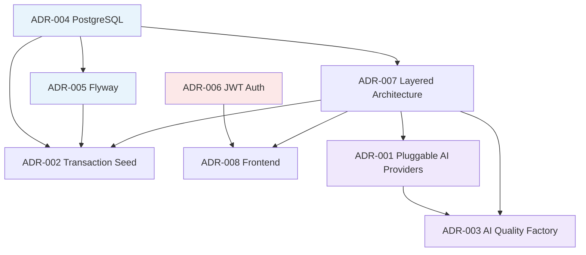

# Architecture Decision Records (ADR)

FlowIQ architectural decisions are documented as short, immutable records. Each ADR captures **context**, **decision**, **consequences**, and **alternatives considered**.

**Format template:** Follow [ADR-001](001-pluggable-ai-providers.md).

## ADR Index

| ID | Title | Status | Date | Scope |
|----|-------|--------|------|-------|
| [001](001-pluggable-ai-providers.md) | Pluggable AI Providers | Accepted | 2026-06-11 | AI / LLM integration |
| [002](002-transaction-seed-strategy.md) | Transaction Seed Strategy | Accepted | 2026-06-17 | Data / demo UX |
| [003](003-ai-quality-factory.md) | AI Quality Factory (Distributed Intelligence) | Accepted | 2026-06-17 | AI architecture |
| [004](004-postgresql-selection.md) | PostgreSQL Selection | Accepted | 2026-06-17 | Database |
| [005](005-flyway-selection.md) | Flyway Selection | Accepted | 2026-06-17 | Database migrations |
| [006](006-jwt-authentication-strategy.md) | JWT Authentication Strategy | Accepted | 2026-06-17 | Security |
| [007](007-layered-architecture.md) | Layered Architecture (Backend) | Accepted | 2026-06-17 | Backend structure |
| [008](008-frontend-architecture.md) | Frontend Architecture | Accepted | 2026-06-17 | Frontend structure |

## ADR Summary Table

| ADR | Problem | Decision | Key trade-off |
|-----|---------|----------|---------------|
| **001** | Lock-in to one LLM vendor | Interface-based providers + rule defaults | Two code paths (rules + LLM) |
| **002** | Empty state on first login | Auto-seed transactions in PostgreSQL | Demo/real data mixing risk |
| **003** | Multiple intelligence domains | 3-level distributed model, no monolith orchestrator | No single trace entry point |
| **004** | Database engine choice | PostgreSQL 15 | No document store for events yet |
| **005** | Schema evolution | Flyway SQL migrations, forward-only | No auto-rollback (Community) |
| **006** | SPA authentication | Stateless JWT access + refresh (refresh endpoint TBD) | Token revocation limited |
| **007** | Backend code organization | Controller → Service → Repository | Anemic domain model risk |
| **008** | Frontend code organization | Next.js + feature folders + service layer | No global data cache library |

## ADR Dependency Diagram

**Legend:** Blue = data layer · Red = security · Purple = intelligence layer

### Dependency explanations

| Edge | Meaning |
|------|---------|
| 004 → 005 | Flyway manages PostgreSQL schema |
| 004 → 002 | Seed writes to PostgreSQL `transactions` |
| 005 → 002 | Seed relies on migrated schema |
| 004 → 007 | JPA repositories target PostgreSQL |
| 007 → 001 | Services inject provider interfaces |
| 007 → 002 | `TransactionSeedService` lives in service layer |
| 001 → 003 | Factory model builds on provider pattern |
| 007 → 003 | Domain services are Level-2 orchestrators |
| 006 → 008 | Frontend axios attaches JWT |
| 007 → 008 | REST API mirrors backend layers |

## How to Add a New ADR

1. Copy structure from ADR-001
2. Assign next number: `00N-short-title.md`
3. Set status: `Proposed` → `Accepted` / `Superseded` / `Deprecated`
4. Update this README index and [ADR Coverage Report](ADR_COVERAGE_REPORT.md)
5. Link from related architecture docs

## Related

- [Architecture Review Readiness](../ARCHITECTURE_REVIEW_READINESS.md)
- [ADR Coverage Report](ADR_COVERAGE_REPORT.md)
- [Documentation Index](../../index.md)
