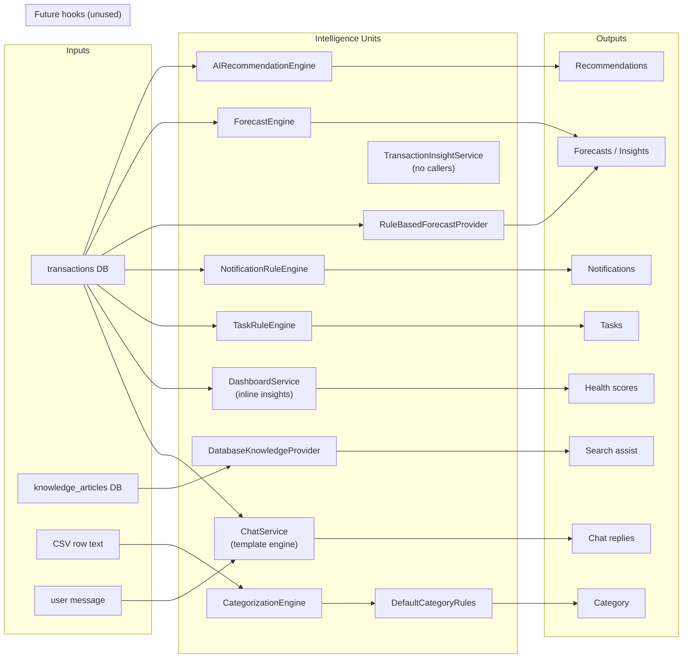

# Intelligence Units Architecture (As-Built)

**As-built:** 2026-06-23 (code-verified)

## Terminology

FlowIQ does not use a formal `Agent` class hierarchy. This document describes **intelligence units** — Spring `@Component` beans that transform structured input into financial guidance output. They are the functional equivalent of agents in a multi-agent design.

**Provider interfaces** (`AIInsightProvider`, `ForecastProvider`, etc.) are extension slots for future LLM backends — documented separately where no implementation exists.

---

## Architecture Diagram

---

## Intelligence Unit Catalog

### 1. AIRecommendationEngine

| Attribute | Value |
|-----------|-------|
| **File** | `src/main/java/com/flowiq/aiaccountant/AIRecommendationEngine.java` |
| **Type** | Engine (`@Component`) |
| **Called by** | `AIAccountantService.getRecommendations()` |
| **Production** | Yes |
| **Real calls** | Yes — `generate(FinancialSnapshot)` |
| **Future hook** | No |

**Purpose:** Generate prioritized FOP/tax/expense/profit recommendations from a financial snapshot.

**Input:** `FinancialSnapshot` — YTD revenue/expenses, MoM changes, FOP limit usage %, category breakdowns, profit trend flags, locale.

**Output:** `List<AIRecommendationResponse>` — id, severity (`CRITICAL`/`WARNING`/`SUCCESS`/`INFO`), title, message.

**Use cases:**
- AI Accountant recommendations panel (`GET /api/ai-accountant/recommendations`)
- Merged with optional `AIInsightProvider` output

**Key rules:** FOP limit >80% → CRITICAL; expense change >20% → WARNING; infrastructure share >25% with expense growth → WARNING; profit growing 3 months → SUCCESS; tax and revenue growth signals.

---

### 2. ForecastEngine

| Attribute | Value |
|-----------|-------|
| **File** | `src/main/java/com/flowiq/forecasts/engine/ForecastEngine.java` |
| **Type** | Engine (`@Component`) |
| **Called by** | `ForecastService` only |
| **Production** | Yes |
| **Real calls** | Yes — `projectMonths`, `analyzeTrend`, `rollingAverage`, `sumHorizon` |
| **Future hook** | No |

**Purpose:** Mathematical projection of revenue, expenses, profit from historical monthly aggregates.

**Input:** `List<MonthlyFinancialData>` — per-month revenue, expenses, profit.

**Output:** Projections, `TrendAnalysis` (percent change), horizon sums, months-until-FOP-limit estimates.

**Use cases:**
- Forecast Center all endpoints (`/api/forecasts/revenue`, `/expenses`, `/profit`, `/taxes`, `/fop-limit`, `/summary`)
- Dashboard forecast snapshot widget

**Parameters:** Rolling average window = 3 months; trend window = 6; projection horizon = 12 months.

---

### 3. RuleBasedForecastProvider

| Attribute | Value |
|-----------|-------|
| **Package** | `com.flowiq.forecasts.provider` |
| **Type** | `@Component`, implements `ForecastProvider` |
| **Consumed by** | `ForecastService` |

**Purpose:** Narrative insights and warnings layered on top of `ForecastEngine` math.

**Input:** `ForecastProvider.ForecastContext` — trend percents, months until FOP limit, locale, monthly data.

**Output:** `List<ForecastInsightDto>`, `List<ForecastWarningDto>` with severity (`INFO`/`WARNING`/`CRITICAL`).

**Use cases:**
- Forecast summary insights and warning banners
- FOP limit exhaustion projection alerts

**Key rules:** Revenue trend messaging; FOP limit within 12 months → escalating severity; expense growth vs revenue; profit decline warnings.

---

### 4. DatabaseKnowledgeProvider

| Attribute | Value |
|-----------|-------|
| **Package** | `com.flowiq.knowledge.provider` |
| **Type** | `@Component`, implements `KnowledgeProvider` |
| **Consumed by** | `KnowledgeService` |

**Purpose:** Rank knowledge articles and generate search assist summary (rule-based, not LLM).

**Input:** `KnowledgeSearchContext` — query string, candidate articles, primary article hint, locale.

**Output:** `KnowledgeAssistResult` — summary text, primary article DTO, related articles (up to 4).

**Use cases:**
- Business Guide search (`GET /api/business-guide/search`)
- Dashboard business guide snapshot

**Scoring:** Weighted keyword matching — see [AI Quality Factory](ai-quality-factory.md#3-knowledge-search-relevance--databaseknowledgeproviderscore).

---

### 5. CategorizationEngine + DefaultCategoryRules

| Attribute | Value |
|-----------|-------|
| **Package** | `com.flowiq.categorization` |
| **Type** | `@Component` engine + rule set |
| **Consumed by** | `ImportService` |

**Purpose:** Auto-categorize imported transactions from bank CSV description text.

**Input:** Transaction description, optional type/category hints from CSV.

**Output:** `CategorizationResult` — resolved category, transaction type (`REVENUE`/`EXPENSE`), confidence flag.

**Use cases:**
- CSV import pipeline (`POST /api/imports/upload`)
- Sets `auto_categorized` column on transaction

**Flow:** `DefaultCategoryRules` keyword match first → optional `CategorizationProvider` beans (none active).

---

### 6. NotificationRuleEngine

| Attribute | Value |
|-----------|-------|
| **Package** | `com.flowiq.notifications.service` |
| **Type** | `@Service` rule engine |
| **Consumed by** | `NotificationScheduler` (08:00), event hooks on import/report |

**Purpose:** Generate threshold-based and calendar-based notifications.

**Input:** `User` + user's `transactions` from repository.

**Output:** Notifications via `NotificationGeneratorService` → `notifications` table.

**Use cases:**
- Daily scheduled alerts
- FOP limit usage 70/85/95%
- Expense spike, revenue drop, profit growth (3 months)
- Tax deadline reminders (30/14/7/3/1 days)
- Import/report completion notifications

---

### 7. TaskRuleEngine

| Attribute | Value |
|-----------|-------|
| **Package** | `com.flowiq.tasks.service` |
| **Type** | `@Service` rule engine |
| **Consumed by** | `DailyTaskScheduler` (07:30), `TaskService.ensureGeneratedTasks` |

**Purpose:** Generate compliance and business tasks from financial state and calendar.

**Input:** `User` + user's `transactions`.

**Output:** Tasks via `TaskGeneratorService` → `tasks` table (deduplicated by rule key).

**Use cases:**
- FOP limit review tasks (priority by usage %)
- Tax payment, ESV, quarterly/annual declaration tasks
- Expense growth review, monthly report reminder

---

### 8. DashboardService (Inline Intelligence)

| Attribute | Value |
|-----------|-------|
| **File** | `src/main/java/com/flowiq/service/DashboardService.java` |
| **Package** | `com.flowiq.service` |
| **Type** | Service (embedded rule methods) |
| **Called by** | `DashboardController` |
| **Production** | Yes |
| **Real calls** | Yes |
| **Future hook** | No — does not inject provider interfaces |
| **Endpoints** | `/api/dashboard/insights`, `/health`, `/summary`, `/stats`, charts |

**Purpose:** Dashboard-specific AI insights, business health score, natural-language summary.

**Input:** Current-month and previous-month transaction aggregates.

**Output:** `AIInsightResponse`, `BusinessHealthResponse`, `AISummaryResponse`.

**Use cases:**
- Dashboard widgets — insights list, health gauge, AI summary text
- Independent scoring from AI Accountant health (different formula)

---

### 9. ChatService (Template Engine)

| Attribute | Value |
|-----------|-------|
| **Package** | `com.flowiq.service` |
| **Type** | `@Service` |
| **Endpoints** | `/api/chat/message`, conversation CRUD |

**Purpose:** Persist chat and generate keyword-matched replies using live transaction data.

**Input:** User message text + transaction aggregates (revenue, expenses, profit, cash flow).

**Output:** `SendChatMessageResponse` — assistant reply stored in `chat_messages`.

**Use cases:**
- Standalone chat module (distinct from `/api/ai-accountant/chat`)
- Answers about revenue, expenses, profit, cash flow when keywords match

**Note:** `AIAccountantService.chat()` is a separate path (`POST /api/ai-accountant/chat`) with its own templates and optional `AIInsightProvider`. `AIAccountantService.getForecasts()` (`GET /api/ai-accountant/forecasts`) uses inline `buildForecast()` — **not** `ForecastEngine` / `ForecastService`.

---

### 10. TransactionInsightService

| Attribute | Value |
|-----------|-------|
| **File** | `src/main/java/com/flowiq/service/TransactionInsightService.java` |
| **Package** | `com.flowiq.service` |
| **Type** | Service (data preparation) |
| **Called by** | **None** — grep shows zero references outside this class |
| **Production** | Spring bean registered, never invoked |
| **Real calls** | No |
| **Future hook** | Yes |

**Purpose:** Aggregate transactions into `TransactionAnalysisContext` for a date range (`buildAnalysisContext`).

**Input:** `User`, `from`, `to` dates.

**Output:** `TransactionAnalysisContext` — `transactionCount`, `totalRevenue`, `totalExpenses`, `netProfit`, `List<TransactionSnapshot>` (per-row type/amount/category/description/date). **No** aggregated category breakdown.

**Use cases today:** None. Not used by `DashboardService.getInsights()` (that method uses inline month-over-month rules).

**Planned use:** Input context for future `AIInsightProvider` / LLM transaction analysis.

---

### 11. AnalyticsService (FOP Intelligence)

| Attribute | Value |
|-----------|-------|
| **File** | `src/main/java/com/flowiq/service/AnalyticsService.java` |
| **Type** | Service |
| **Called by** | `AnalyticsController`, `AIAccountantService` (tax advisor / snapshot), `ReportsService` |
| **Production** | Yes |
| **Real calls** | Yes — inline FOP/tax/trend calculations |
| **Future hook** | `AnalyticsInsightProvider` injected in constructor, **never invoked** |
| **Endpoints** | `/api/analytics/*` |

**Purpose:** FOP group resolution, tax calculations, trend analytics from transactions.

**Input:** User transactions (seeded if empty).

**Output:** `AnalyticsOverviewResponse`, `FopInsightsResponse`, trend DTOs.

**Use cases:**
- Analytics module
- Feeds `ReportsService` and `AIAccountantService.getTaxAdvisor()`
- Hardcoded FOP limits and tax rates (not from external API)

**Note:** `AnalyticsInsightProvider` is injected but **not invoked** in current code.

---

## Provider Interfaces (Extension Slots — No LLM Impl)

| Interface | File | Wired in | Invoked | Active impl |
|-----------|------|----------|---------|-------------|
| `AIInsightProvider` | `aiaccountant/AIInsightProvider.java` | `AIAccountantService` | Yes (empty list) | **None** |
| `ForecastProvider` | `forecasts/provider/ForecastProvider.java` | `ForecastService` | Yes (summary insights) | `RuleBasedForecastProvider` |
| `KnowledgeProvider` | `knowledge/provider/KnowledgeProvider.java` | `KnowledgeService` | Yes | `DatabaseKnowledgeProvider` |
| `AnalyticsInsightProvider` | `analytics/AnalyticsInsightProvider.java` | `AnalyticsService` | **No** (field unused) | **None** |
| `CategorizationProvider` | `categorization/CategorizationProvider.java` | `CategorizationEngine` | Yes (empty list) | **None** (rules in engine) |

---

## Invocation Matrix

| Unit | Trigger | REST exposure |
|------|---------|---------------|
| AIRecommendationEngine | AI Accountant request | `/api/ai-accountant/recommendations` |
| AIAccountantService.buildForecast | AI Accountant forecasts tab | `/api/ai-accountant/forecasts` (not `ForecastEngine`) |
| ForecastEngine + RuleBasedForecastProvider | Forecast Center request | `/api/forecasts/*`, `/api/dashboard/forecast-snapshot` |
| DatabaseKnowledgeProvider | Search request | `/api/business-guide/search` |
| CategorizationEngine | CSV upload | `/api/imports/upload` |
| NotificationRuleEngine | Cron 08:00, events | `/api/notifications` (read) |
| TaskRuleEngine | Cron 07:30, task page load | `/api/tasks/*` |
| DashboardService rules | Dashboard load | `/api/dashboard/*` |
| AnalyticsService | Analytics load | `/api/analytics/*` |
| ChatService templates | Chat message | `/api/chat/message` |
| TransactionInsightService | — (no REST) | Not invoked |

---

## Related

- [AI Quality Factory](ai-quality-factory.md)
- [Data Sources](data-sources.md)
- [AI Architecture](ai-architecture.md)
