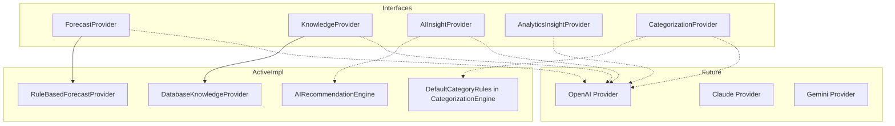

# AI Architecture

FlowIQ uses a **pluggable provider pattern** for AI capabilities. Production behavior today is **deterministic and rule-based** — suitable for auditing and offline operation. External LLM backends plug in as Spring beans.

> **End-to-end flows:** [flows/ai-flow.md](flows/ai-flow.md) · [flows/forecast-flow.md](flows/forecast-flow.md)

## Provider Interfaces



| Interface | Package | Consumer | Active implementation |
|-----------|---------|----------|----------------------|
| `ForecastProvider` | `forecasts.provider` | `ForecastService` | `RuleBasedForecastProvider` only |
| `KnowledgeProvider` | `knowledge.provider` | `KnowledgeService.search` | `DatabaseKnowledgeProvider` only |
| `AIInsightProvider` | `aiaccountant` | `AIAccountantService` | **None** — rules in `AIRecommendationEngine` |
| `AnalyticsInsightProvider` | `analytics` | `AnalyticsService` | **None** — injected, never called |
| `CategorizationProvider` | `categorization` | `CategorizationEngine` | **None** — `DefaultCategoryRules` in engine |

## Component Quick Reference

| Component | Type | Caller | Production calls | Future hook |
|-----------|------|--------|------------------|-------------|
| `DashboardService` | Service | `DashboardController` | Yes | No |
| `AIAccountantService` | Service | `AIAccountantController` | Yes | `AIInsightProvider` |
| `AIRecommendationEngine` | Engine | `AIAccountantService` | Yes | No |
| `ForecastService` | Service | `ForecastController`, `DashboardController` | Yes | `ForecastProvider` |
| `ForecastEngine` | Engine | `ForecastService` | Yes | No |
| `RuleBasedForecastProvider` | Provider | `ForecastService` | Yes (summary) | No |
| `AnalyticsService` | Service | `AnalyticsController`, `AIAccountantService` | Yes | `AnalyticsInsightProvider` unused |
| `CategorizationEngine` | Engine | `ImportService` | Yes | `CategorizationProvider` |
| `TransactionInsightService` | Service | **None** | No | Yes |
| `ChatService` | Service | `ChatController` | Yes | No |
| `KnowledgeService` | Service | `BusinessGuideController`, `DashboardController` | Yes | `KnowledgeProvider` |

## Selection Logic

### Forecast (`ForecastService.getSummary()`)

```java
@Autowired(required = false)
private List<ForecastProvider> forecastProviders;
```

- `RuleBasedForecastProvider` always supplies baseline insights and **all** warnings.
- Additional `ForecastProvider` beans (excluding `RuleBasedForecastProvider`) append insights only.
- Metric endpoints (`/revenue`, `/expenses`, etc.) use `ForecastEngine` math only — no provider narratives.

Source: `ForecastService.java` ~lines 196–209.

### Knowledge (`KnowledgeService.resolveAssistResult()`)

First non-`DatabaseKnowledgeProvider` bean returns `assistSearch()`; otherwise `DatabaseKnowledgeProvider`.

### Categorization (`CategorizationEngine.categorize()`)

1. `DefaultCategoryRules` keyword matching (built into engine)
2. Optional `CategorizationProvider` beans
3. Fallback `"Other"`

### AI Accountant (`AIAccountantService`)

1. `AIRecommendationEngine.generate(snapshot)` for recommendations
2. Merge optional `AIInsightProvider.getRecommendations()`
3. Chat: optional `AIInsightProvider.answerChat()` → else keyword templates

## AI Accountant Flow

See [flows/ai-flow.md](flows/ai-flow.md) for sequence diagrams (recommendations, chat, dashboard, categorization, knowledge).

## Related Documents

- [flows/ai-flow.md](flows/ai-flow.md)
- [Providers](../ai/providers.md)
- [Forecast Engine](../ai/forecast-engine.md)
- [Knowledge Search](../ai/knowledge-search.md)
- [Future LLM Integration](../ai/future-llm-integration.md)
- [AI Agents Architecture](ai-agents-architecture.md)
