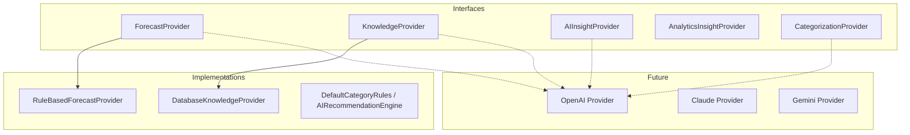
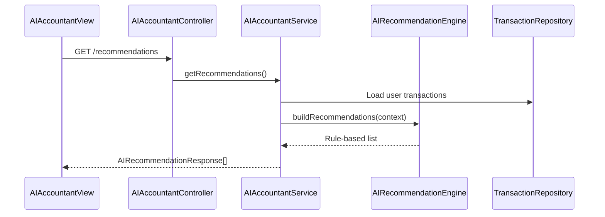

# AI Architecture

FlowIQ uses a **pluggable provider pattern** for AI capabilities. Production behavior today is **deterministic and rule-based** — suitable for auditing and offline operation. External LLM backends plug in as Spring beans.

## Provider Interfaces



| Interface | Package | Consumer | Current Impl |
|-----------|---------|----------|--------------|
| `ForecastProvider` | `forecasts.provider` | `ForecastService` | `RuleBasedForecastProvider` |
| `KnowledgeProvider` | `knowledge.provider` | `KnowledgeService.search` | `DatabaseKnowledgeProvider` |
| `AIInsightProvider` | `aiaccountant` | `AIAccountantService` | None (rules in `AIRecommendationEngine`) |
| `AnalyticsInsightProvider` | `analytics` | `AnalyticsService` | None |
| `CategorizationProvider` | `categorization` | `CategorizationEngine` | `DefaultCategoryRules` first |

## Selection Logic

### Forecast (`ForecastService`)
```java
@Autowired(required = false)
private List<ForecastProvider> forecastProviders;
```
Uses all registered providers; `RuleBasedForecastProvider` always present.

### Knowledge (`KnowledgeService`)
Non-`DatabaseKnowledgeProvider` beans take priority for `assistSearch()`.

### Categorization (`CategorizationEngine`)
1. `DefaultCategoryRules` (keyword matching)
2. Optional `CategorizationProvider` beans

## AI Accountant Flow



Chat endpoint uses transaction context + optional `AIInsightProvider` beans.

## Design Rationale

See [ADR-001: Pluggable AI Providers](adr/001-pluggable-ai-providers.md).

## Related Documents

- [Providers](../ai/providers.md)
- [Forecast Engine](../ai/forecast-engine.md)
- [Knowledge Search](../ai/knowledge-search.md)
- [Future LLM Integration](../ai/future-llm-integration.md)
