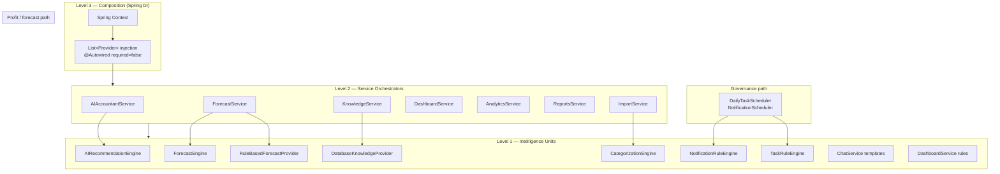
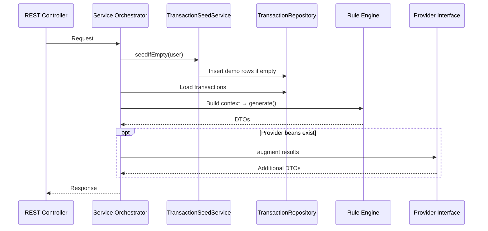

# Intelligence Layer Architecture (As-Built)

**As-built:** 2026-06-23 (verified against code)  
**Package roots:** `com.flowiq.aiaccountant`, `com.flowiq.forecasts`, `com.flowiq.knowledge`, `com.flowiq.categorization`, `com.flowiq.notifications`, `com.flowiq.tasks`, `com.flowiq.service`  
**Audit:** [AI_DOCUMENTATION_AUDIT_REPORT.md](AI_DOCUMENTATION_AUDIT_REPORT.md)

## Important Naming Note

The codebase does **not** contain classes named `AiQualityFactory`, `PrIntelligenceOrchestrator`, `GovernanceIntelligenceOrchestrator`, or `FailureIntelligenceOrchestrator`. There are also **no** `*Agent.java` types.

The intelligence layer is implemented as a **distributed Spring component model**: rule engines, service orchestrators, and pluggable provider interfaces (ADR-001). This document maps the **conceptual three-level model** to **actual classes**.

| Conceptual name | As-built equivalent |
|-----------------|---------------------|
| Level 1: AI Agents | Rule engines + inline intelligence components (see [AI Agents Architecture](ai-agents-architecture.md)) |
| Level 2: Orchestrators | Domain services (`AIAccountantService`, `ForecastService`, etc.) |
| Level 3: AiQualityFactory | Spring Application Context + `List<Provider>` injection pattern |
| Pr Intelligence | `ForecastService` + `ForecastEngine` + `RuleBasedForecastProvider` + `AIAccountantService` profit/revenue paths |
| Governance Intelligence | `TaskRuleEngine` + `NotificationRuleEngine` + schedulers |
| Failure Intelligence | Warning/alert generation in `RuleBasedForecastProvider`, `NotificationRuleEngine`, `AIRecommendationEngine` |
| Executive reporting | `ReportsService` — financial PDF/CSV/Excel exports (not AI executive dashboards) |

---

## Purpose

The intelligence layer provides **deterministic, auditable** financial guidance for Ukrainian FOP users:

- Recommendations and health scores
- Revenue/expense/tax/FOP forecasts
- Compliance tasks and threshold notifications
- Transaction categorization on import
- Knowledge base search assistance
- Dashboard insights and chat template replies

External LLM backends are **planned** via provider interfaces; production behavior is **100% rule-based** today.

---

## Three-Level Architecture



### Level 1 — Intelligence Units

Atomic rule processors. Each accepts structured context (transactions, snapshots, search queries) and returns DTOs. No HTTP, no persistence logic.

See full inventory: [AI Agents Architecture](ai-agents-architecture.md).

### Level 2 — Service Orchestrators

Services load user data, optionally seed demo transactions, build context objects, invoke Level 1 units, merge optional provider outputs, and expose REST endpoints.

| Orchestrator | Domain | Key endpoints |
|--------------|--------|---------------|
| `AIAccountantService` | Recommendations, health, tax advisor, chat | `/api/ai-accountant/*` |
| `ForecastService` | Revenue, expense, profit, tax, FOP forecasts | `/api/forecasts/*` |
| `KnowledgeService` | Article search + assist | `/api/business-guide/*` |
| `DashboardService` | Stats, insights, health, summary | `/api/dashboard/*` |
| `AnalyticsService` | FOP insights, trends | `/api/analytics/*` |
| `ReportsService` | Report preview/generate | `/api/reports/*` |
| `ImportService` | CSV → categorized transactions | `/api/imports/*` |

### Level 3 — Composition Layer

There is no central factory class. Composition works as follows:

1. **Spring `@Component` registration** — all rule engines auto-discovered.
2. **Provider lists** — services inject `List<ForecastProvider>`, `List<AIInsightProvider>`, etc. with `@Autowired(required = false)`.
3. **Selection logic:**
   - Forecast: `RuleBasedForecastProvider` for baseline summary insights + all warnings; additional `ForecastProvider` beans append summary insights only (`ForecastService.getSummary()`).
   - Knowledge: non-`DatabaseKnowledgeProvider` beans take priority for `assistSearch()`.
   - Categorization: `DefaultCategoryRules` first (inside `CategorizationEngine`), then `CategorizationProvider` beans.
   - AI Accountant: `AIRecommendationEngine` first, then merge from `AIInsightProvider` beans (none registered today).
   - Analytics: `AnalyticsInsightProvider` injected in constructor but **not invoked** — FOP logic is inline in `AnalyticsService`.

```java
// AIAccountantService — recommendations + chat
@Autowired(required = false) List<AIInsightProvider> insightProviders;

// ForecastService — summary insights only
@Autowired(required = false) List<ForecastProvider> forecastProviders;

// AnalyticsService — field stored, never used (as of 2026-06-23)
@Autowired(required = false) List<AnalyticsInsightProvider> insightProviders;
```

---

## Orchestrator Mapping (Conceptual → Code)

### Profit / Revenue Intelligence (`PrIntelligenceOrchestrator` equivalent)

**Components:** `ForecastService`, `ForecastEngine`, `RuleBasedForecastProvider`, `AIAccountantService`, `AIRecommendationEngine`, `AnalyticsService`

**Flow:**
1. Load transactions (seed if empty).
2. `ForecastEngine` computes rolling averages, trends, 12-month projections.
3. `RuleBasedForecastProvider` emits insights (revenue trend, FOP limit months, expense warnings).
4. `AIAccountantService.buildSnapshot()` aggregates YTD metrics for `AIRecommendationEngine`.
5. `AIAccountantService.getForecasts()` uses **inline** `buildForecast()` — not `ForecastEngine`.

### Governance Intelligence (`GovernanceIntelligenceOrchestrator` equivalent)

**Components:** `TaskRuleEngine`, `NotificationRuleEngine`, `DailyTaskScheduler`, `NotificationScheduler`, `TaskGeneratorService`, `NotificationGeneratorService`

**Flow:**
1. Schedulers run daily at 07:30 (tasks) and 08:00 (notifications).
2. Rule engines evaluate FOP limit usage, tax deadlines, ESV, expense spikes.
3. Generators persist deduplicated `tasks` and `notifications` rows.

### Failure / Risk Intelligence (`FailureIntelligenceOrchestrator` equivalent)

**Components:** `RuleBasedForecastProvider` (warnings), `NotificationRuleEngine` (alerts), `AIRecommendationEngine` (CRITICAL/WARNING recommendations), `DashboardService` (health degradation)

**Flow:**
1. Threshold breaches (FOP >70/85/95%, expense spike >20%, revenue drop) trigger alerts.
2. Forecast warnings project FOP limit exhaustion within N months.
3. Health scores decrease on negative signals.

---

## Executive Reporting

**Not an AI subsystem** — financial export pipeline.

| Component | Role |
|-----------|------|
| `ReportsService` | Builds `ReportData` from transactions + `AnalyticsService.getFopInsights()` |
| `ReportFileGenerator` | Dispatches to renderers |
| `OpenPdfReportRenderer` | PDF output |
| `PoiReportRenderer` | Excel output |
| CSV renderer | Inline in generator |

**Report types:** `PROFIT_AND_LOSS`, `CASH_FLOW`, `REVENUE_SUMMARY`, `EXPENSE_SUMMARY`, `TAX_SUMMARY`, `FOP_SUMMARY`

On successful generation: creates notification + optional task via generators.

---

## Scoring Models

Three independent scoring systems exist in production code.

### 1. Dashboard Business Health — `DashboardService`

| Input | Current-month revenue and expenses |
|-------|----------------------------------|
| Formula | `score = 60 + profitMargin%`, clamped 0–100; revenue = 0 → 50 |
| Status | excellent ≥90, good ≥75, fair ≥60, else poor |
| Endpoint | `GET /api/dashboard/health` |

### 2. AI Accountant Health — `AIAccountantService`

| Input | Full `FinancialSnapshot` (YTD, FOP limit %, trends) |
|-------|-----------------------------------------------------|
| Base | 70 |
| Adjustments | +10 profit>0 / −15 else; −20 FOP>90% / −10 FOP>70%; −10 expense growth>25%; +10 profit growing 3 months; +5 revenue growth>5% |
| Status | excellent ≥85, good ≥70, fair ≥50, else poor |
| Endpoint | `GET /api/ai-accountant/health` |

### 3. Knowledge Search Relevance — `DatabaseKnowledgeProvider.score()`

| Signal | Weight |
|--------|--------|
| Title match | +12 |
| Tag match | +10 |
| Summary match | +8 |
| Content match | +3 |
| FOP group keyword (1/2/3) | +20 |
| Tax type (ЄСВ, військовий, єдиний) | +15–25 |
| KVED pattern `\d{2}\.\d{2}` | +30 |
| `view_count` | tie-breaker |

---

## Interaction Diagram



---

## Future: LLM Provider Plug-In

When an `AIInsightProvider` or `ForecastProvider` implementation is added as a `@Component`:

1. No changes to controllers required.
2. Service merges provider output with rule-based baseline.
3. See [Future LLM Integration](../ai/future-llm-integration.md).

---

## Related

- [AI Agents Architecture](ai-agents-architecture.md)
- [AI Architecture](ai-architecture.md)
- [ADR-001: Pluggable AI Providers](adr/001-pluggable-ai-providers.md)
- [Data Sources](data-sources.md)
