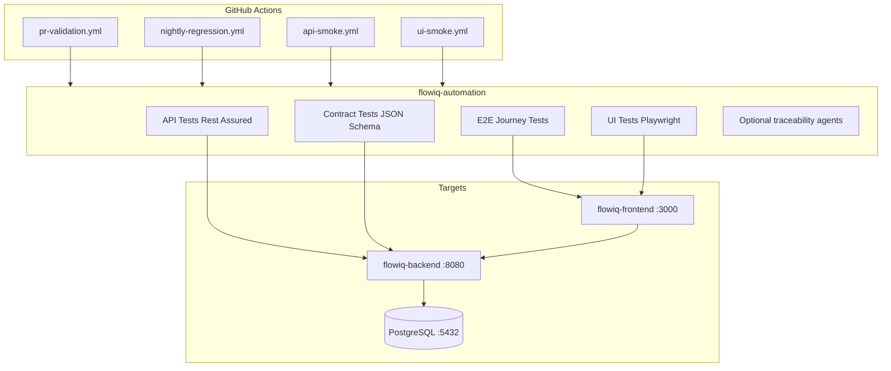
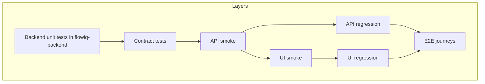
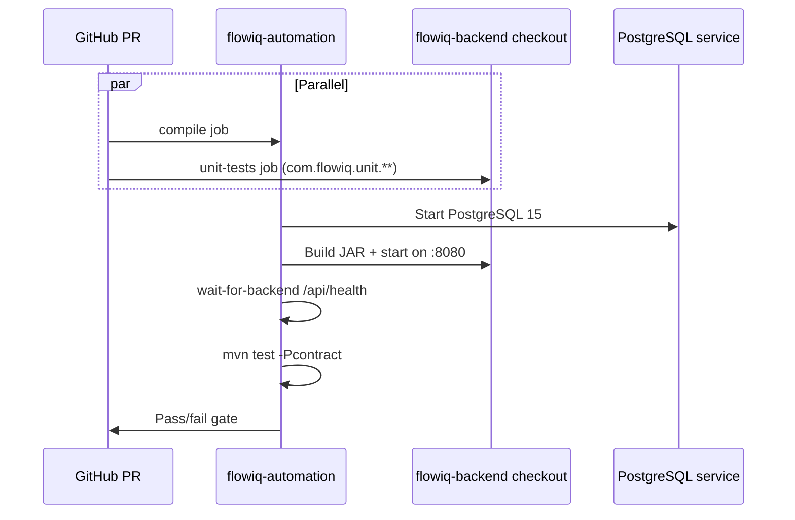
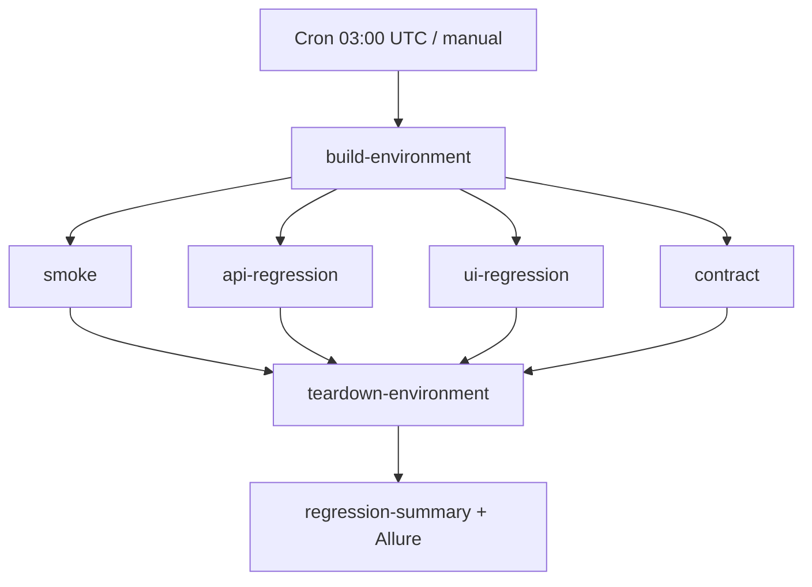

# Automation Architecture

**As-built:** 2026-06-28  
**Repository:** `flowiq-automation`  
**Stack:** Java 17, TestNG, Rest Assured, Playwright (Java), Maven profiles

## Purpose

`flowiq-automation` is a **cross-repository test harness** that validates `flowiq-backend` and `flowiq-frontend` together. It is not a deployable application — it orchestrates API, UI, contract, and E2E tests in CI.

## System Context



## Test Layer Structure



| Layer | Location | Runner |
|-------|----------|--------|
| Backend unit | `flowiq-backend/src/test` | Surefire in backend CI |
| Contract | `flowiq-automation` `-Pcontract` | TestNG + live backend |
| API smoke/regression | `flowiq-automation` `-Papi-smoke` / `-Papi-regression` | Rest Assured |
| UI smoke/regression | `flowiq-automation` `-Pui-smoke` / `-Pui-regression` | Playwright Java |
| E2E | `flowiq-automation` E2E package | Playwright + API setup |

## Maven Profiles (Key)

| Profile | Purpose |
|---------|---------|
| `contract` | OpenAPI JSON Schema validation against running backend |
| `api-smoke` | Fast API health + auth + critical paths |
| `api-regression` | Full API suite |
| `ui-smoke` | Login shell + key pages |
| `ui-regression` | Extended UI coverage |
| `e2e` | End-to-end user journeys |

Environment flag: `-Denv=local|ci|stage|dev`

## PR Validation Architecture



**Workflow:** `.github/workflows/pr-validation.yml`

## Nightly Regression Architecture

Ephemeral Docker stack — build once, parallel test jobs, teardown.



Shared stack reuse via GHCR images or `ci-images.tar` fallback — see `flowiq-automation/docs/automation/CI_INFRASTRUCTURE.md`.

## Feature Traceability

21 features mapped in `docs/qa/TRACEABILITY_MATRIX.md`:

| Feature area | API tests | UI/E2E |
|--------------|-----------|--------|
| Auth | ✅ | ✅ |
| Dashboard | ✅ | ✅ |
| Transactions | ✅ | ✅ |
| Imports | ✅ | ✅ |
| Forecasts | ✅ | ✅ |
| Reports | ✅ | ✅ |
| Tasks | ✅ | ✅ |
| Notifications | ✅ | Partial |
| Business Guide | ✅ | Partial |
| AI Accountant | ✅ | Partial |

## Optional AI Agents

Maven profiles run documentation traceability agents (requirements ↔ tests) — development tooling, not production.

```
com.flowiq.agents.traceability
```

## Local Execution

```bash
# Contract (requires running backend + PostgreSQL)
cd flowiq-automation
mvn test -Pcontract -Denv=local

# API smoke against stage
mvn test -Papi-smoke -Denv=stage
```

## Related

- [cicd-architecture.md](cicd-architecture.md)
- [test-architecture.md](test-architecture.md)
- `flowiq-automation/docs/CI-CD.md`
- `flowiq-automation/docs/qa/TRACEABILITY_MATRIX.md`
