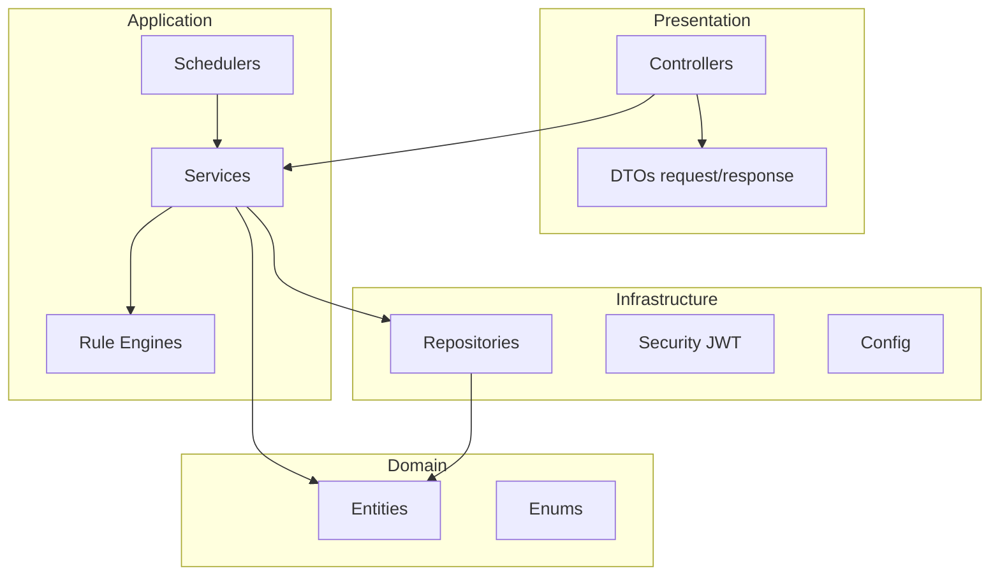
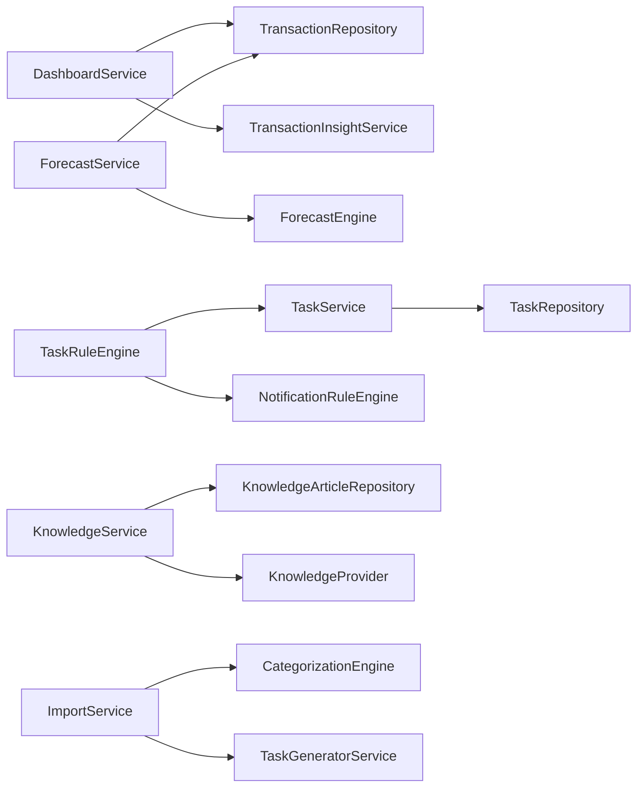

# Backend Architecture

**Entry point:** `com.flowiq.FlowiqBackendApplication`  
**Base API path:** `/api`  
**Source root:** `src/main/java/com/flowiq/`

## Layered Structure

## Package Layout

### Core (`com.flowiq`)

| Package | Responsibility |
|---------|----------------|
| `controller` | Auth, Health, Transactions, Imports, Dashboard, Analytics, AI Accountant, Chat, Reports |
| `service` | Core business services |
| `entity` | User, Transaction, Chat, ImportJob, ReportJob |
| `repository` | Spring Data JPA for core entities |
| `dto.request` / `dto.response` | API contracts with `@Schema` |
| `config` | Security, CORS, OpenAPI, `AppPreferencesFilter` |
| `security` | JWT, `UserPrincipal`, filter chain |
| `exception` | `GlobalExceptionHandler`, `ErrorResponse` |
| `util` | `CurrencyFormatter`, `TransactionDateValidator` |

### Feature Modules

| Package | Controllers | Persistence |
|---------|-------------|-------------|
| `forecasts` | `ForecastController` | Stateless (reads `TransactionRepository`) |
| `tasks` | `TaskController` | `tasks` table |
| `notifications` | `NotificationController` | `notifications` table |
| `knowledge` | `BusinessGuideController` | `knowledge_articles` table |

### Supporting

| Package | Role |
|---------|------|
| `aiaccountant` | `AIRecommendationEngine`, `AIInsightProvider` |
| `analytics` | `AnalyticsInsightProvider` |
| `categorization` | `CategorizationEngine`, `DefaultCategoryRules` |
| `importcsv` | Bank CSV parsers |
| `reports` | PDF (`OpenPdfReportRenderer`), Excel (`PoiReportRenderer`) |

## Controllers (14 total, 70+ endpoints)

See [OpenAPI Overview](../api/openapi-overview.md) for full endpoint list.

## Services — Key Interactions

## Schedulers

| Class | Cron | Action |
|-------|------|--------|
| `NotificationScheduler` | `0 0 8 * * *` | `NotificationRuleEngine.generateForUser` for all active users |
| `DailyTaskScheduler` | `0 30 7 * * *` | `TaskRuleEngine.generateForUser` for all active users |

> **Note:** Class renamed from `TaskScheduler` to `DailyTaskScheduler` to avoid Spring Boot `taskScheduler` bean conflict.

## Configuration

| File | Purpose |
|------|---------|
| `application.properties` | DB, JWT, Flyway, upload limits, OpenAPI |
| `compose.yaml` | PostgreSQL 15 for local dev |

## Exception Handling

`GlobalExceptionHandler` (`@RestControllerAdvice`):

| Exception | HTTP |
|-----------|------|
| `MethodArgumentNotValidException` | 400 + field errors |
| `BadRequestException` | 400 |
| `UnauthorizedException`, `BadCredentialsException` | 401 |
| `ResourceNotFoundException` | 404 |
| `Exception` | 500 |

## Seed Data

| Component | Trigger | Data |
|-----------|---------|------|
| `DemoUserSeedService` | `ApplicationRunner` | `demo@flowiq.ai` |
| `TransactionSeedService` | On empty DB | 6 months demo transactions |
| Flyway V5 | Migration | 20 knowledge articles |

## Related Documents

- [Frontend Architecture](frontend-architecture.md)
- [Database Architecture](database-architecture.md)
- Module docs in [modules/](../modules/)
