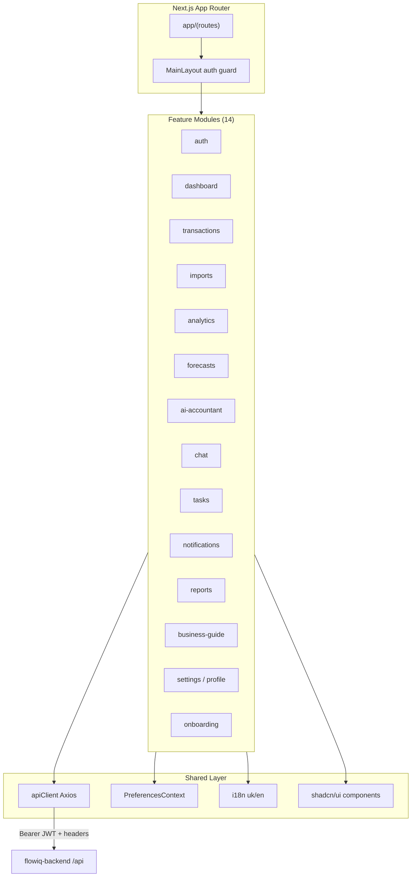
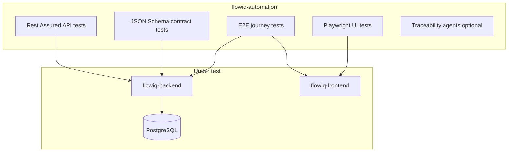

# C4 Model — Level 3: Component Diagram (Backend)

**As-built:** 2026-06-28  
**Scope:** Spring Boot backend JVM — major components inside the API container

## Backend Component Diagram

```mermaid
flowchart TB
    subgraph Presentation["Presentation Layer"]
        AUTH_C[AuthController]
        PROF_C[ProfileController]
        TX_C[TransactionController]
        IMP_C[ImportController]
        DASH_C[DashboardController]
        AN_C[AnalyticsController]
        FC_C[ForecastController]
        AI_C[AIAccountantController]
        CH_C[ChatController]
        TSK_C[TaskController]
        NOT_C[NotificationController]
        NP_C[NotificationPreferenceController]
        REP_C[ReportsController]
        BG_C[BusinessGuideController]
        HL_C[HealthController]
        GEH[GlobalExceptionHandler]
    end

    subgraph Security["Security & Cross-Cutting"]
        JWT_F[JwtAuthenticationFilter]
        JWT_S[JwtService]
        CORS[CorsConfig]
        APF[AppPreferencesFilter]
        CID[CorrelationIdFilter]
        AUD[AuditAspect / AuditService]
    end

    subgraph Application["Application Services"]
        AUTH_S[AuthService]
        TX_S[TransactionService]
        IMP_S[ImportService]
        DASH_S[DashboardService]
        AN_S[AnalyticsService]
        FC_S[ForecastService]
        AI_S[AIAccountantService]
        CH_S[ChatService]
        REP_S[ReportsService]
        KS[KnowledgeService]
        TS[TaskService]
        NS[NotificationService]
        NPS[NotificationPreferenceService]
        FPS[FopProfileService]
        SS[SessionService]
        TSS[TransactionSeedService]
    end

    subgraph Engines["Rule Engines & Providers"]
        FE[ForecastEngine]
        RFP[RuleBasedForecastProvider]
        ARE[AIRecommendationEngine]
        CE[CategorizationEngine]
        NRE[NotificationRuleEngine]
        TRE[TaskRuleEngine]
        NGS[NotificationGeneratorService]
        TGS[TaskGeneratorService]
        DKP[DatabaseKnowledgeProvider]
        FP_LIST["ForecastProvider* (optional)"]
        AIP_LIST["AIInsightProvider* (optional)"]
    end

    subgraph Schedulers["Schedulers"]
        DS[DailyTaskScheduler 07:30]
        NSCH[NotificationScheduler 08:00]
    end

    subgraph Persistence["Persistence"]
        REPOS[JPA Repositories]
        PG[(PostgreSQL)]
    end

    AUTH_C --> AUTH_S
    PROF_C --> FPS & SS
    TX_C --> TX_S
    IMP_C --> IMP_S
    DASH_C --> DASH_S
    AN_C --> AN_S
    FC_C --> FC_S
    AI_C --> AI_S
    CH_C --> CH_S
    REP_C --> REP_S
    BG_C --> KS
    TSK_C --> TS
    NOT_C --> NS
    NP_C --> NPS

    JWT_F --> JWT_S
    JWT_F --> Presentation

    AUTH_S --> JWT_S & SS & FPS
    IMP_S --> CE & NGS & TGS
    FC_S --> FE & RFP & FP_LIST
    AI_S --> ARE & AIP_LIST
    KS --> DKP
    REP_S --> NGS & TGS

    DS --> TRE
    NSCH --> NRE
    NRE --> NGS
    TRE --> TGS

    Application --> REPOS
    Engines --> REPOS
    REPOS --> PG
    AUD --> PG
```

`*` = optional Spring beans via `@Autowired(required = false)` — no LLM implementations in production.

## Component Responsibilities

| Component group | Count | Responsibility |
|-----------------|-------|----------------|
| **Controllers** | 15 | HTTP mapping, validation, OpenAPI annotations, `@Auditable` on selected endpoints |
| **Core services** | 12+ | Business orchestration, user scoping from JWT |
| **Rule engines** | 6 | Deterministic FOP/tax/financial logic |
| **Schedulers** | 2 | Daily batch generation for tasks and notifications |
| **Repositories** | 12+ | Spring Data JPA — one per aggregate/table group |
| **Security** | 4 filters/config | JWT, CORS, preferences, correlation ID |

## Frontend Component Diagram (Summary)

Detail: [frontend-architecture.md](../frontend-architecture.md).

## Automation Component Diagram (Summary)

Detail: [automation-architecture.md](../automation-architecture.md).

## Related

- [Container Diagram](c4-container.md)
- [Backend Architecture](../backend-architecture.md)
- [Module Dependencies](../module-dependencies.md)
