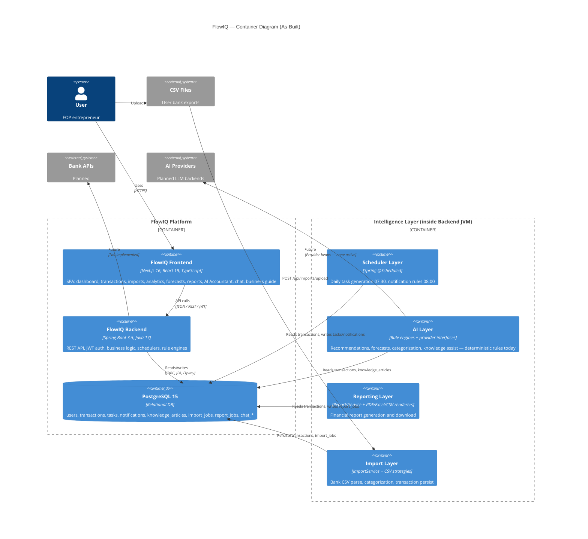
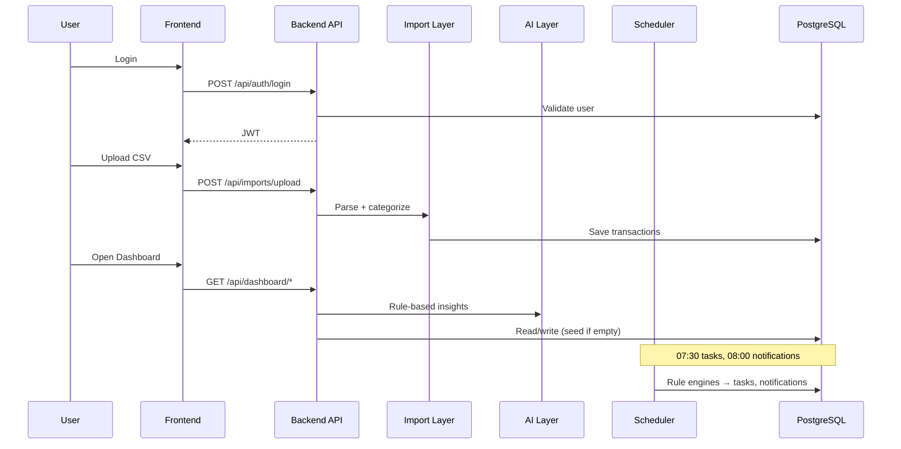

# C4 Model — Level 2: Container Diagram

**As-built:** 2026-06-17  
**Repositories:** `flowiq-frontend` (Next.js 16), `flowiq-backend` (Spring Boot 3.5)

## Container Diagram

## Container Descriptions

### FlowIQ Frontend

| Attribute | Value |
|-----------|-------|
| **Technology** | Next.js 16, React 19, TypeScript, Tailwind CSS |
| **Location** | `flowiq-frontend/` |
| **Deployment** | Vercel (`flowiq.vercel.app` in backend CORS) or Docker (`Dockerfile` with `output: standalone`) |
| **Responsibilities** | UI routing, auth token storage, API client (`src/services/api.ts`), i18n (en/uk), preferences (language/currency/theme in `localStorage`) |
| **API base URL** | `NEXT_PUBLIC_API_URL` or `http://localhost:8080/api` |

**Hybrid data:** Most modules call backend API. Business Guide profile/groups/taxes/KVED and tax profile card use **frontend static mock data**. See [Data Sources](../data-sources.md).

### FlowIQ Backend

| Attribute | Value |
|-----------|-------|
| **Technology** | Spring Boot 3.5.14, Java 17, Spring Security, Spring Data JPA |
| **Location** | `flowiq-backend/` |
| **Deployment** | JAR or Docker (`Dockerfile` multi-stage, healthcheck `/api/health`) |
| **Responsibilities** | REST controllers, services, JWT auth, Flyway migrations, OpenAPI/Swagger |

**Package layout:** `controller/`, `service/`, `entity/`, `repository/`, plus domain packages: `forecasts/`, `knowledge/`, `notifications/`, `tasks/`, `categorization/`, `aiaccountant/`, `reports/`.

### PostgreSQL

| Attribute | Value |
|-----------|-------|
| **Version** | 15 (Alpine in `compose.yaml`) |
| **Migrations** | Flyway V1–V5 in `src/main/resources/db/migration/` |
| **Tables** | `users`, `transactions`, `chat_conversations`, `chat_messages`, `import_jobs`, `report_jobs`, `notifications`, `tasks`, `knowledge_articles` |

Local dev: `compose.yaml` or Spring Docker Compose (`spring.docker.compose.enabled=true`).

### Scheduler Layer

| Component | Schedule | Responsibility |
|-----------|----------|----------------|
| `DailyTaskScheduler` | `0 30 7 * * *` (07:30 daily) | Iterates active users → `TaskRuleEngine.generateForUser()` |
| `NotificationScheduler` | `0 0 8 * * *` (08:00 daily) | Iterates active users → `NotificationRuleEngine.generateForUser()` |

On-demand generation also runs when user opens Tasks (`TaskService.ensureGeneratedTasks`).

### AI Layer

Not a separate deployable container — runs inside the backend JVM.

| Component type | Classes | Role |
|----------------|---------|------|
| Rule engines | `AIRecommendationEngine`, `ForecastEngine`, `RuleBasedForecastProvider`, `DatabaseKnowledgeProvider`, `CategorizationEngine`, `NotificationRuleEngine`, `TaskRuleEngine` | Deterministic FOP/tax/financial logic |
| Inline intelligence | `DashboardService`, `ChatService`, `AnalyticsService` | Health scores, insights, template chat replies |
| Provider interfaces | `AIInsightProvider`, `ForecastProvider`, `KnowledgeProvider`, `AnalyticsInsightProvider`, `CategorizationProvider` | Extension points for future LLM — **no external implementations** |
| Data prep | `TransactionInsightService` | Builds analysis context (future AI hook) |

See [AI Quality Factory](../ai-quality-factory.md) and [AI Agents Architecture](../ai-agents-architecture.md).

### Reporting Layer

| Component | Role |
|-----------|------|
| `ReportsController` | REST: list, preview, generate, download |
| `ReportsService` | Aggregates from `AnalyticsService` + transactions, persists `ReportJob` |
| `ReportFileGenerator` | Routes to PDF (`OpenPdfReportRenderer`), Excel (`PoiReportRenderer`), CSV |
| **Report types** | `PROFIT_AND_LOSS`, `CASH_FLOW`, `REVENUE_SUMMARY`, `EXPENSE_SUMMARY`, `TAX_SUMMARY`, `FOP_SUMMARY` |

### Import Layer

| Component | Role |
|-----------|------|
| `ImportController` | `POST /api/imports/upload`, list jobs |
| `ImportService` | Orchestrates parse → categorize → persist |
| `CsvImportStrategyResolver` | Selects Monobank / PrivatBank / Universal strategy |
| `CategorizationEngine` | Keyword rules (`DefaultCategoryRules`) + optional `CategorizationProvider` |

## Communication Patterns

## Related

- [Context Diagram](c4-context.md)
- [Backend Architecture](../backend-architecture.md)
- [Frontend Architecture](../frontend-architecture.md)
- [Data Sources](../data-sources.md)
