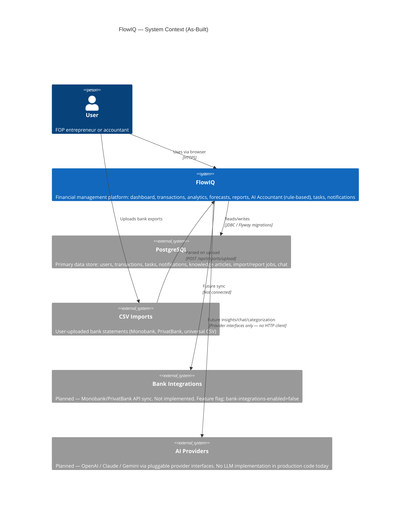

# C4 Model — Level 1: System Context

**As-built:** 2026-06-17  
**Scope:** FlowIQ platform (backend + frontend)  
**Source of truth:** `flowiq-backend`, `flowiq-frontend` repositories

## Purpose

FlowIQ is a Ukrainian FOP (sole proprietor) financial management platform. Users track revenue and expenses, import bank CSV statements, receive rule-based insights, forecasts, tasks, and notifications.

## Context Diagram

## Actors

| Actor | Description |
|-------|-------------|
| **User** | Authenticated FOP user. Registers/logs in, manages transactions, imports CSV, views dashboard and reports. Demo user: `demo@flowiq.ai` / `demo123` (seeded on startup). |

## External Systems

| System | Status | Interaction |
|--------|--------|-------------|
| **PostgreSQL 15** | **Active** | All persistent data. Flyway migrations V1–V5. Hibernate `ddl-auto=validate`. |
| **CSV Imports** | **Active** | Real user data path. `ImportService` + `MonobankCsvStrategy`, `PrivatBankCsvStrategy`, `UniversalCsvStrategy`. Max file 10 MB. |
| **Bank Integrations** | **Planned** | No `IntegrationController`, no bank API clients. UI hidden behind coming-soon route. See [Bank Integrations Roadmap](../../roadmap/BANK_INTEGRATIONS_ROADMAP.md). |
| **AI Providers** | **Planned** | Five provider interfaces (`AIInsightProvider`, `ForecastProvider`, `KnowledgeProvider`, `AnalyticsInsightProvider`, `CategorizationProvider`). Production behavior is **rule-based** only. See [ADR-001](../adr/001-pluggable-ai-providers.md). |

## Key Boundaries

- **In scope:** Browser UI (Next.js), REST API (Spring Boot), PostgreSQL, CSV file upload.
- **Out of scope (today):** Live bank APIs, external LLM APIs, email/Telegram delivery, multi-tenant companies table.
- **Demo data:** `TransactionSeedService` auto-seeds 6 months of sample transactions into PostgreSQL when a user has no data — not a separate external system.

## Authentication Context

Users authenticate with **JWT** (access + refresh tokens). Frontend stores token and sends `Authorization: Bearer` on API calls. CORS allows `localhost:3000` and `https://flowiq.vercel.app`.

## Related

- [Container Diagram](c4-container.md)
- [Data Sources](../data-sources.md)
- [System Overview](../system-overview.md)
