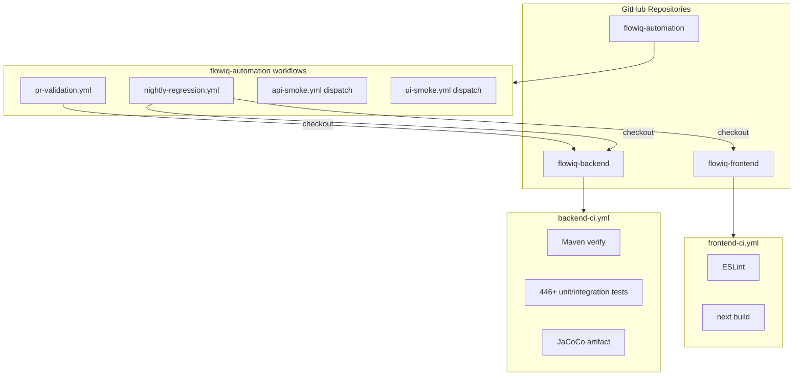
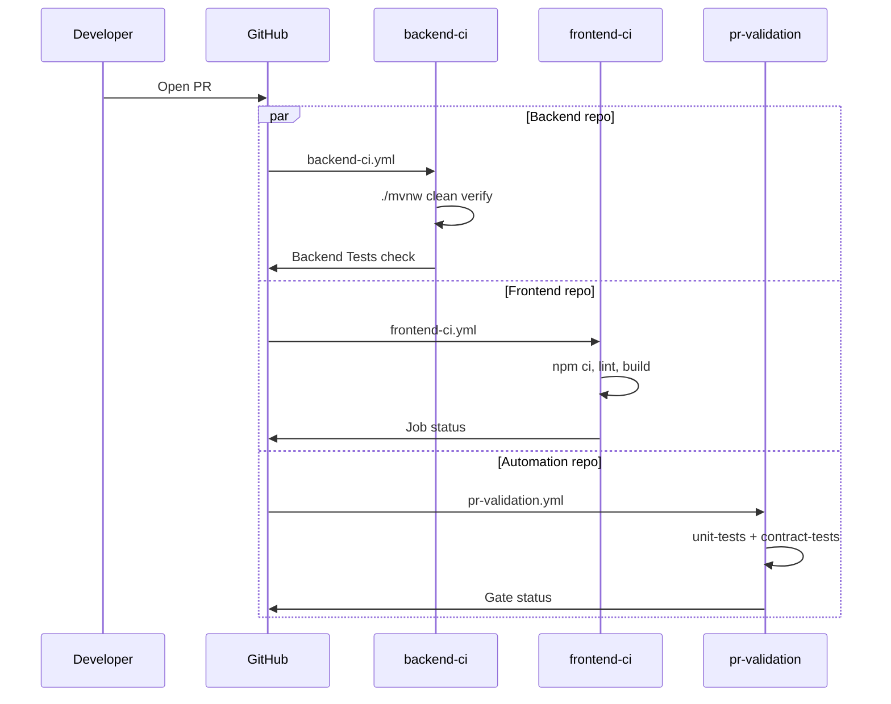
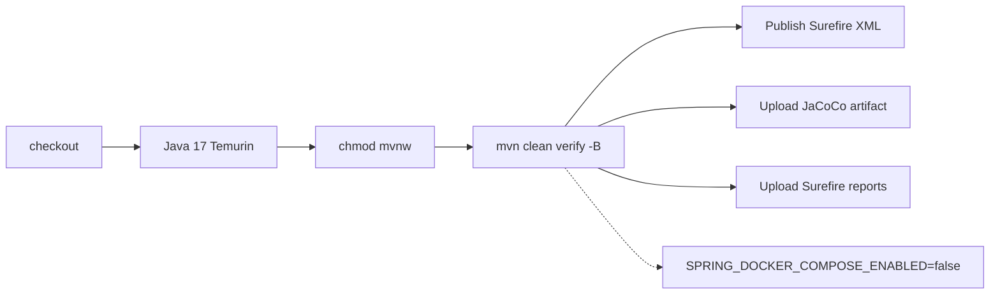
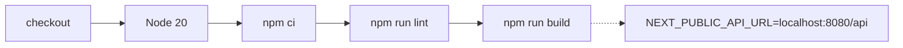
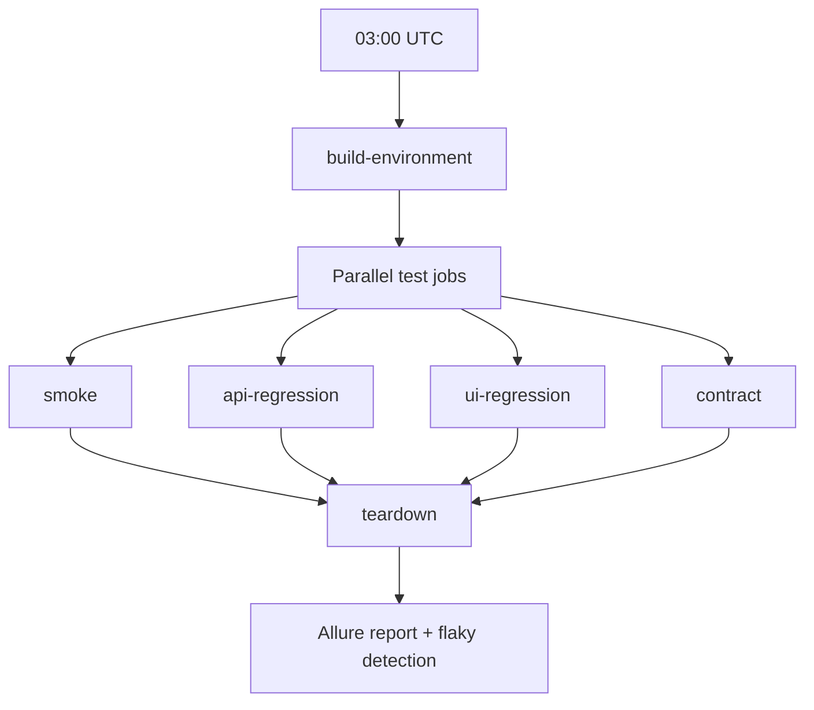
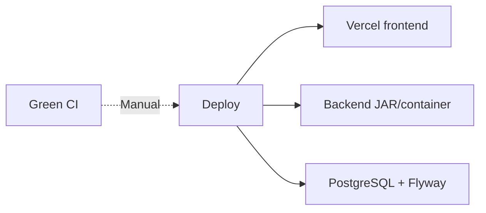

# CI/CD Architecture

**As-built:** 2026-06-28  
**Scope:** All three FlowIQ repositories — build, test, and quality gates

> Operational runbooks: [deployment/ci-cd-as-built.md](../deployment/ci-cd-as-built.md), `flowiq-automation/docs/CI-CD.md`

## Multi-Repository CI Topology

## Trigger Matrix

| Workflow | Repository | Trigger | Purpose |
|----------|------------|---------|---------|
| `backend-ci.yml` | backend | PR + push `main` | Compile, test, JaCoCo |
| `frontend-ci.yml` | frontend | PR + push `main` | Lint, build |
| `pr-validation.yml` | automation | PR + push `main`/`develop` | Backend unit + contract |
| `nightly-regression.yml` | automation | Cron 03:00 UTC + manual | Full stack regression |
| `api-smoke.yml` | automation | Manual dispatch | Stage/dev API smoke |
| `ui-smoke.yml` | automation | Manual dispatch | Stage/dev UI smoke |

## PR Validation Flow

## Backend CI Pipeline

| Step | Detail |
|------|--------|
| Tests | Unit, controller (`@WebMvcTest`), integration (Testcontainers PostgreSQL) |
| Coverage | JaCoCo ~81% line coverage (informational gate) |
| Timeout | 20 minutes |

## Frontend CI Pipeline

**Gap:** Vitest exists locally but is **not** in CI.

## Nightly Regression Pipeline

Docker stack: backend + frontend + PostgreSQL built from checked-out repos.

## Quality Gates

| Gate | Backend CI | Frontend CI | Automation PR | Blocks merge |
|------|------------|-------------|---------------|--------------|
| Compile | ✅ | ✅ | ✅ | Yes |
| Unit tests | ✅ | — | ✅ (backend unit) | Yes |
| Integration tests | ✅ (in verify) | — | — | Yes |
| Contract tests | — | — | ✅ | Yes (automation repo) |
| Lint | — | ✅ | — | Yes |
| TypeScript | — | ✅ via build | — | Yes |
| JaCoCo threshold | — | — | — | No |
| E2E nightly | — | — | ✅ (scheduled) | No |
| CVE scan | ❌ | ❌ | ❌ | — |

## CD (Deployment) — Not Implemented

No GitHub Actions deploy workflow. See [CI/CD Evolution Plan](../deployment/CI_CD_EVOLUTION_PLAN.md).

## Secrets & Variables (Automation)

| Secret / variable | Used by |
|-------------------|---------|
| `BACKEND_REPOSITORY` | Cross-repo checkout |
| `TEST_USER_EMAIL`, `TEST_USER_PASSWORD` | Smoke, nightly |
| `GH_PAT` | Private backend checkout (optional) |

## Artifact Retention

| Artifact | Retention |
|----------|-----------|
| JaCoCo (backend CI) | 30 days |
| Surefire reports | 14 days |
| Allure (nightly/smoke) | 14 days |
| PR contract logs | 7 days |

## Related

- [test-architecture.md](test-architecture.md)
- [automation-architecture.md](automation-architecture.md)
- [deployment-architecture.md](deployment-architecture.md)
