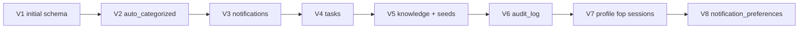

# Database ER Diagram

**As-built:** 2026-06-28  
**Engine:** PostgreSQL 15+  
**Migrations:** Flyway V1–V8

> Schema details: [database-architecture.md](database-architecture.md), [../database/entities.md](../database/entities.md)

## Full Entity-Relationship Diagram

```mermaid
erDiagram
    users ||--o| fop_profiles : "1:1"
    users ||--o{ user_sessions : "has"
    users ||--o{ transactions : "owns"
    users ||--o{ chat_conversations : "owns"
    users ||--o{ import_jobs : "owns"
    users ||--o{ report_jobs : "owns"
    users ||--o{ notifications : "receives"
    users ||--o{ tasks : "has"
    users ||--o{ notification_preferences : "configures"
    users ||--o{ audit_log : "actor optional"

    chat_conversations ||--o{ chat_messages : "contains"

    users {
        bigserial id PK
        varchar email UK
        varchar password
        varchar name
        varchar first_name
        varchar last_name
        varchar phone
        varchar company
        varchar role
        varchar avatar_url
        boolean is_active
        boolean email_verified
        timestamptz created_at
        timestamptz updated_at
    }

    fop_profiles {
        bigserial id PK
        bigint user_id FK UK
        int fop_group
        varchar tax_system
        varchar kved_code
        boolean vat_payer
        timestamptz updated_at
    }

    user_sessions {
        bigserial id PK
        bigint user_id FK
        varchar refresh_token_hash
        varchar user_agent
        varchar ip_address
        timestamptz expires_at
        timestamptz created_at
    }

    transactions {
        bigserial id PK
        bigint user_id FK
        varchar type
        numeric amount
        varchar category
        varchar description
        date transaction_date
        boolean auto_categorized
        timestamptz created_at
    }

    import_jobs {
        bigserial id PK
        bigint user_id
        varchar file_name
        bigint file_size
        varchar bank_format
        varchar status
        int rows_processed
        int rows_imported
        int errors_count
        timestamptz created_at
    }

    report_jobs {
        bigserial id PK
        bigint user_id
        varchar report_type
        varchar format
        varchar status
        date period_from
        date period_to
        varchar file_name
        bigint file_size
        bytea file_content
        timestamptz created_at
    }

    chat_conversations {
        bigserial id PK
        bigint user_id FK
        varchar title
        timestamptz created_at
        timestamptz updated_at
    }

    chat_messages {
        bigserial id PK
        bigint conversation_id FK
        varchar role
        text content
        timestamptz created_at
    }

    notifications {
        bigserial id PK
        bigint user_id
        varchar type
        varchar severity
        varchar channel
        varchar title
        text message
        varchar action_url
        boolean is_read
        varchar deduplication_key
        timestamptz created_at
    }

    tasks {
        bigserial id PK
        bigint user_id FK
        varchar title
        text description
        varchar type
        varchar priority
        varchar status
        date due_date
        varchar deduplication_key
        varchar action_url
        timestamptz created_at
        timestamptz completed_at
    }

    notification_preferences {
        bigserial id PK
        bigint user_id FK
        varchar notification_type
        varchar channel
        boolean enabled
        timestamptz updated_at
    }

    knowledge_articles {
        bigserial id PK
        varchar slug UK
        varchar category
        varchar title_uk
        varchar title_en
        text content_uk
        text content_en
        text tags
        int view_count
        timestamptz published_at
    }

    audit_log {
        bigserial id PK
        bigint actor_user_id FK
        varchar actor_email
        varchar event_type
        varchar outcome
        varchar resource_type
        bigint resource_id
        jsonb metadata
        varchar correlation_id
        timestamptz created_at
    }
```

## Migration Timeline



## Table Groups

| Group | Tables | Isolation |
|-------|--------|-----------|
| **Identity** | `users`, `fop_profiles`, `user_sessions` | Per user |
| **Ledger** | `transactions`, `import_jobs` | Per user |
| **Workflow** | `tasks`, `notifications`, `notification_preferences` | Per user |
| **Content** | `knowledge_articles` | Global shared |
| **Output** | `report_jobs` | Per user (BYTEA files) |
| **Chat** | `chat_conversations`, `chat_messages` | Per user |
| **Compliance** | `audit_log` | Append-only, optional actor FK |

## Key Constraints

| Constraint | Table | Purpose |
|------------|-------|---------|
| Unique email | `users` | One account per email |
| Unique slug | `knowledge_articles` | URL-safe article IDs |
| Unique `(user_id, deduplication_key)` | `notifications`, `tasks` | Prevent duplicate automation |
| Unique `(user_id, notification_type, channel)` | `notification_preferences` | One toggle per tuple |
| Partial unique dedup | `tasks`, `notifications` | `WHERE deduplication_key IS NOT NULL` |

## Multi-Tenancy

Row-level isolation via `user_id` on all user-scoped tables. No schema-per-tenant. Knowledge articles are global.

## Related

- [database-architecture.md](database-architecture.md)
- [../database/migrations.md](../database/migrations.md)
- [../database/relationships.md](../database/relationships.md)
