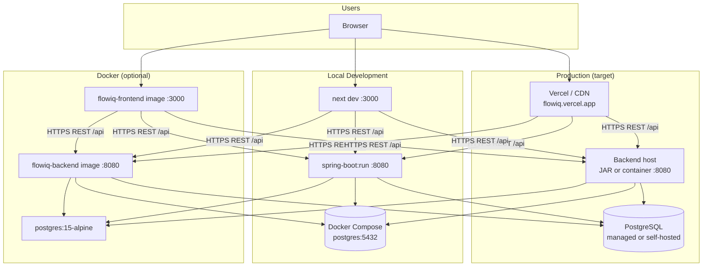
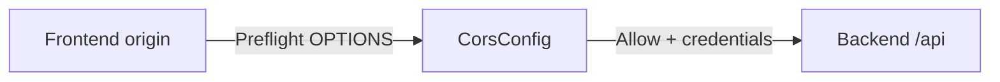
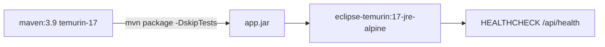
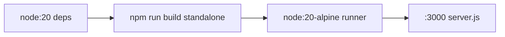
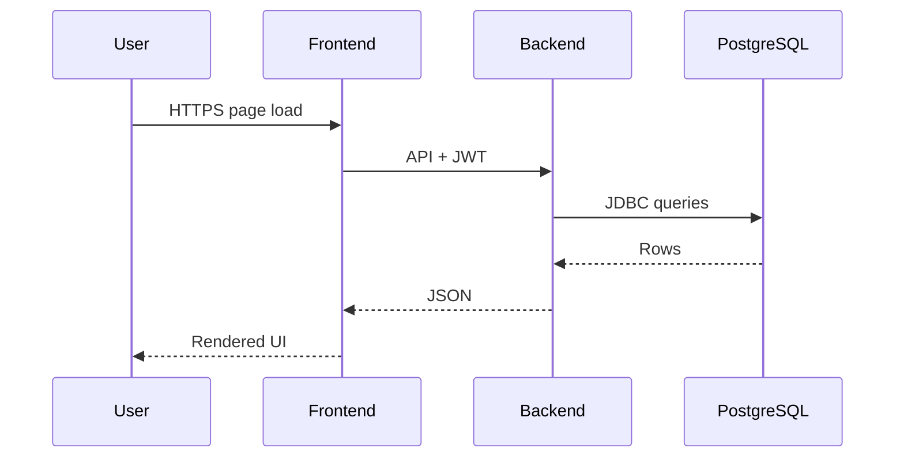

# Deployment Architecture

**As-built:** 2026-06-28  
**Scope:** Runtime topology for local, Docker, and production targets

## Deployment Diagram

## Component Deployment Matrix

| Component | Local dev | Docker | Production |
|-----------|-----------|--------|------------|
| **Frontend** | `npm run dev` | `flowiq-frontend/Dockerfile` standalone | Vercel or container |
| **Backend** | `./mvnw spring-boot:run` | `flowiq-backend/Dockerfile` | JAR or container |
| **PostgreSQL** | `compose.yaml` auto-start | `postgres:15-alpine` | Managed DB |
| **Flyway** | On backend startup | On backend startup | On backend startup |
| **Automation** | Local Maven | Nightly CI Docker stack | GitHub Actions only |

## Network & Ports

| Service | Port | Protocol |
|---------|------|----------|
| Frontend | 3000 | HTTP(S) |
| Backend API | 8080 | HTTP(S) |
| PostgreSQL | 5432 | TCP (internal) |
| Swagger UI | 8080/swagger-ui.html | HTTP (dev/staging) |

## Environment Configuration

### Backend (`application.properties`)

| Property | Dev default | Production |
|----------|-------------|------------|
| `spring.datasource.url` | `localhost:5432/flowiq` | Secrets / env var |
| `jwt.secret` | Dev placeholder | **Must override** |
| `spring.docker.compose.enabled` | `true` | `false` |
| `flowiq.demo-seed.enabled` | `true` (matchIfMissing) | Disable in prod |

Docker profile: `application-docker.properties` — JDBC host `postgres`.

### Frontend

| Variable | Purpose |
|----------|---------|
| `NEXT_PUBLIC_API_URL` | Backend base URL (build-time) |
| Default | `http://localhost:8080/api` |

## CORS Topology

Backend `CorsConfig` allowlist:

- `http://localhost:3000`, `http://localhost:3001`
- `https://flowiq.vercel.app`
- Docker frontend hostname (when used)

## Docker Images

### Backend Dockerfile

### Frontend Dockerfile

## Compose Layout

**Current:** `flowiq-backend/compose.yaml` — PostgreSQL only.

**Nightly CI:** `flowiq-automation` provides full-stack `docker-compose` for regression (backend + frontend + postgres).

No production full-stack compose in backend repo.

## Data Flow at Runtime

## Health Checks

| Target | Endpoint | Consumer |
|--------|----------|----------|
| Backend | `GET /api/health` | Docker HEALTHCHECK, automation wait script |
| Backend ping | `GET /api/health/ping` | Lightweight liveness |
| Frontend | HTTP :3000 | Docker HEALTHCHECK |

## CD Status

**Continuous deployment is not automated.** CI builds and tests; deployment is manual (Vercel, JAR, or Docker push).

See [cicd-architecture.md](cicd-architecture.md).

## Related

- [Docker deployment guide](../deployment/docker.md)
- [Production deployment](../deployment/production-deployment.md)
- [Environments](../deployment/environments.md)
- [Local setup](../deployment/local-setup.md)
