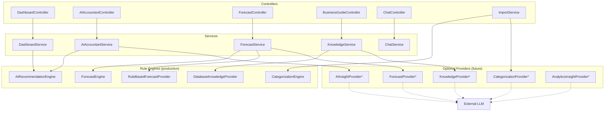
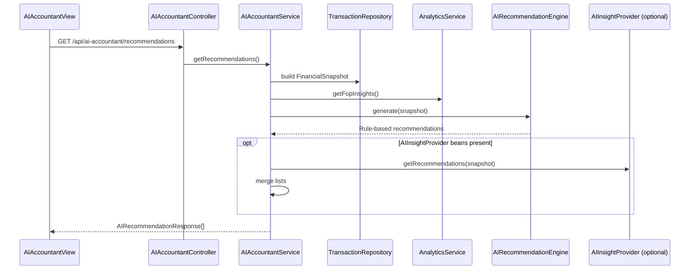
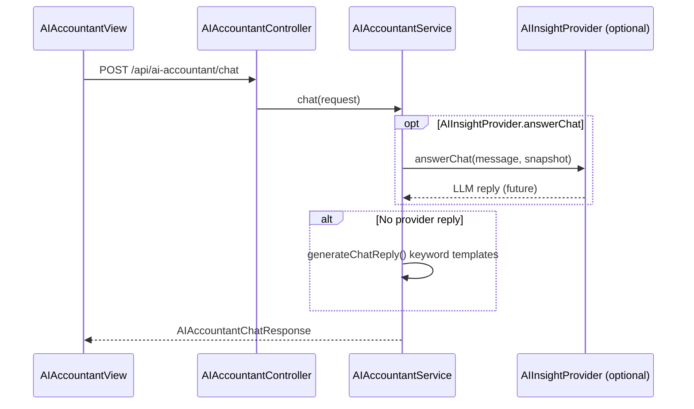
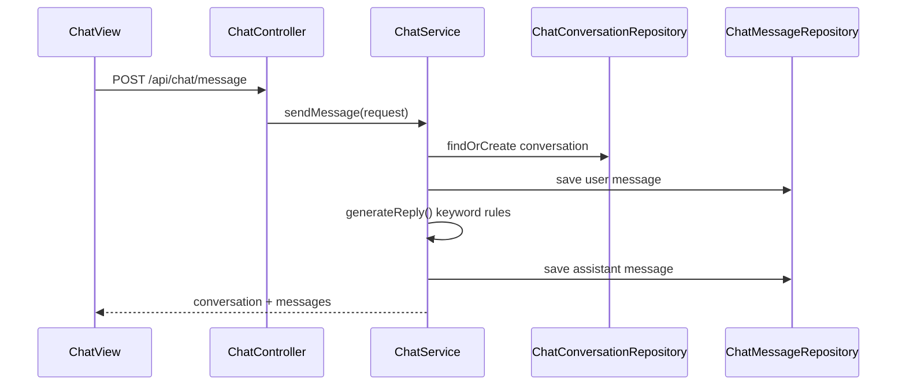
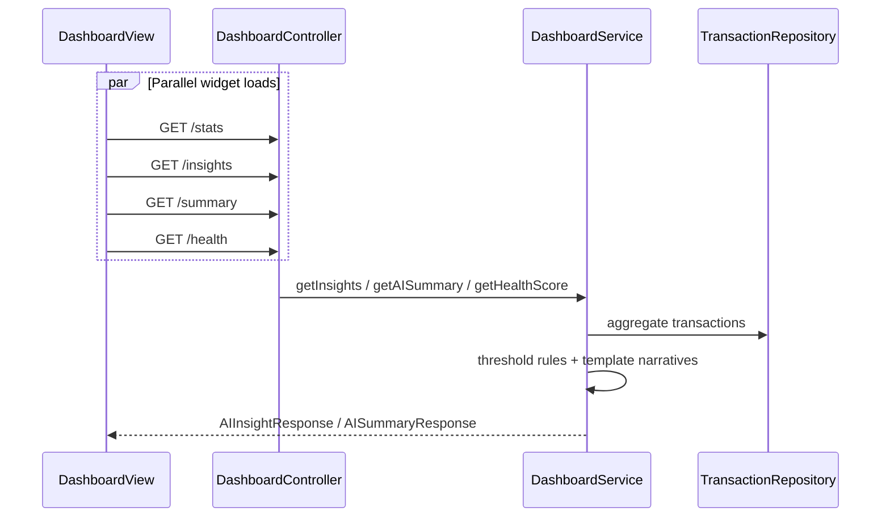
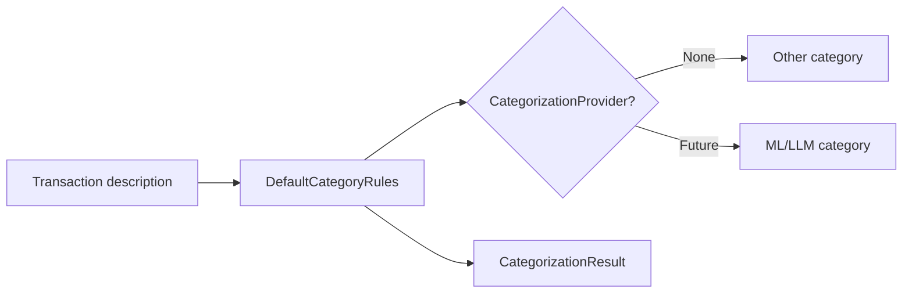
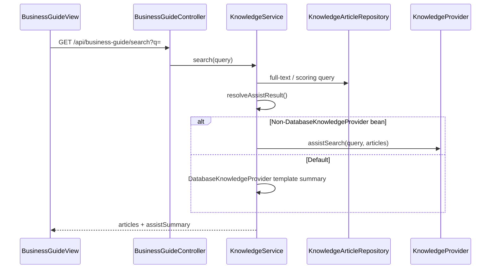

# AI & Intelligence Flow

**As-built:** 2026-06-28  
**Scope:** All rule-based "AI" capabilities and provider extension points

> Provider interface detail: [ai-architecture.md](../ai-architecture.md)

## Overview

Production AI features are **deterministic rule engines** inside the backend JVM. Five **provider interfaces** allow future LLM beans; none are wired today.

## Intelligence Architecture

## AI Accountant Recommendations Flow

## AI Accountant Chat Flow

## General Chat Flow (Separate Module)

**Note:** Two chat systems — different persistence and APIs.

## Dashboard AI Flow

## Categorization Flow (Import)

## Knowledge Search Assist Flow

## Provider Selection Summary

| Capability | Default (production) | Extension |
|------------|-------------------|-----------|
| Forecast insights | `RuleBasedForecastProvider` | `ForecastProvider` beans |
| Recommendations | `AIRecommendationEngine` | `AIInsightProvider` |
| Chat (AI Accountant) | Keyword templates | `AIInsightProvider.answerChat` |
| Chat (general) | Keyword templates | No provider hook |
| Categorization | `DefaultCategoryRules` | `CategorizationProvider` |
| Knowledge search | `DatabaseKnowledgeProvider` | Other `KnowledgeProvider` |
| Analytics narratives | Inline in `AnalyticsService` | `AnalyticsInsightProvider` (unused) |

## Related

- [ai-architecture.md](../ai-architecture.md)
- [ADR-001: Pluggable AI Providers](adr/001-pluggable-ai-providers.md)
- [Future LLM Integration](../../ai/future-llm-integration.md)
- [flows/forecast-flow.md](forecast-flow.md)
