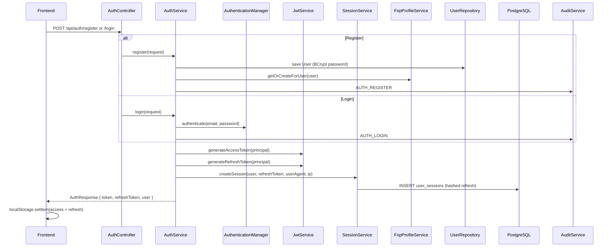
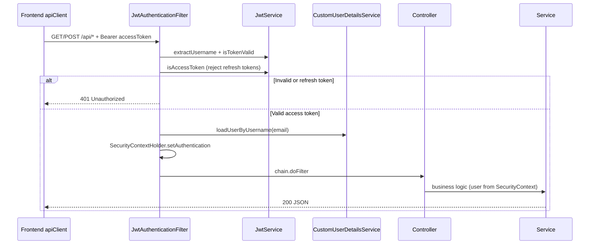
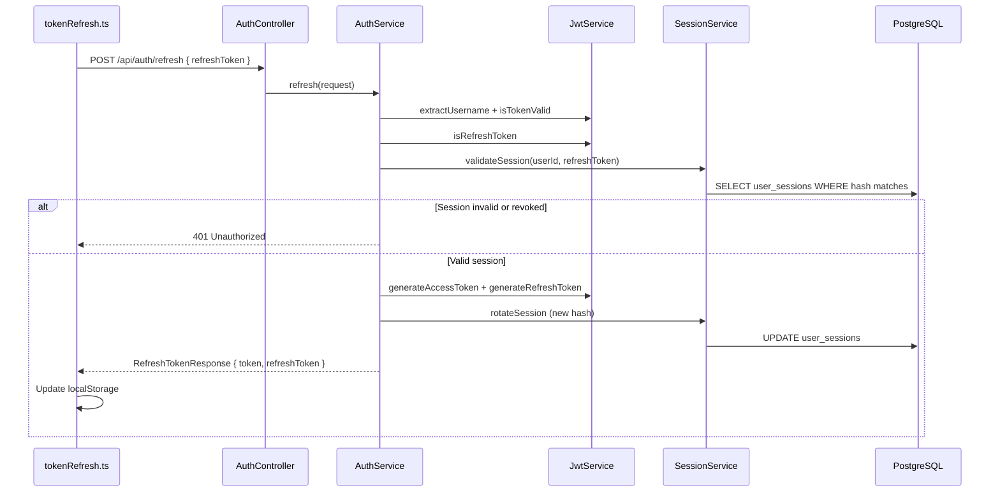
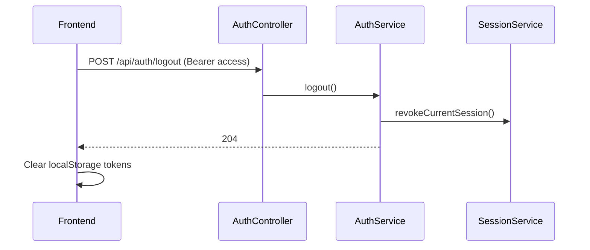
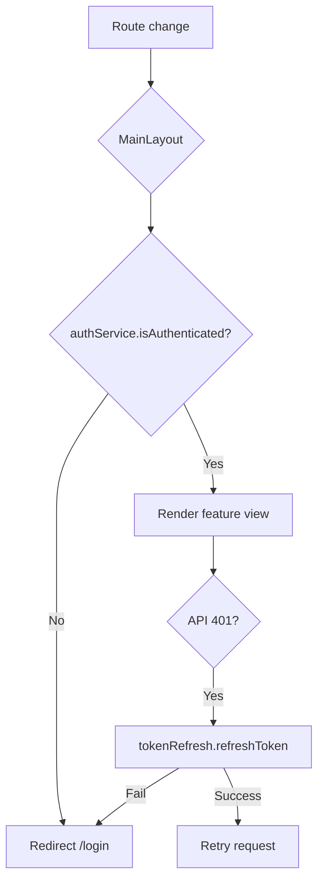

# Authentication Flow

**As-built:** 2026-06-28  
**Backend:** `AuthService`, `JwtService`, `SessionService`, `JwtAuthenticationFilter`  
**Frontend:** `authService`, `tokenRefresh.ts`, `apiClient`

## Overview

FlowIQ uses **stateless JWT authentication** with **server-side refresh token sessions**. Access tokens authorize API calls; refresh tokens rotate on each refresh and are stored hashed in `user_sessions`.

## Token Types

| Token | Claim `type` | Lifetime (dev) | Used for |
|-------|--------------|----------------|----------|
| Access | `access` | 24 h | `Authorization: Bearer` on all protected `/api/*` |
| Refresh | `refresh` | 7 d | `POST /api/auth/refresh` only |

## Login & Registration Sequence

## Protected Request Sequence

## Token Refresh Sequence

Frontend interceptor (`apiClient`) retries failed requests once after successful refresh on HTTP 401.

## Logout Sequence

Profile API also supports `POST /api/profile/sessions/logout-all` to revoke all sessions.

## Public vs Protected Routes

| Path pattern | Auth |
|--------------|------|
| `POST /api/auth/register`, `/login`, `/refresh` | Public |
| `GET /api/health`, `/api/health/ping` | Public |
| `GET /api/profile/avatars/{filename}` | Public |
| `/swagger-ui/**`, `/v3/api-docs/**` | Public |
| All other `/api/**` | JWT access token required |

Configured in `SecurityConfig`.

## Frontend Auth Guard

**Note:** No Next.js middleware — guard is client-side only in `MainLayout`.

## Security Considerations

| Topic | Implementation |
|-------|----------------|
| Password storage | BCrypt via `PasswordEncoder` |
| Refresh token storage (server) | SHA-256 hash in `user_sessions.refresh_token_hash` |
| Refresh token storage (client) | `localStorage` — XSS surface |
| Role enforcement | Roles in JWT; **no `@PreAuthorize`** today |
| Audit | `AUTH_*` events via `AuditService` |

## Related

- [ADR-006: JWT Authentication](adr/006-jwt-authentication-strategy.md)
- [Security: JWT Flow](../security/jwt-flow.md) — quick reference
- [Profile Architecture](PROFILE_ARCHITECTURE.md) — session management UI
- [SRS §6](../product/SRS.md) — security requirements
