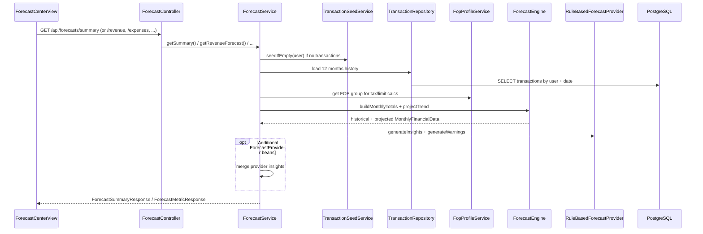
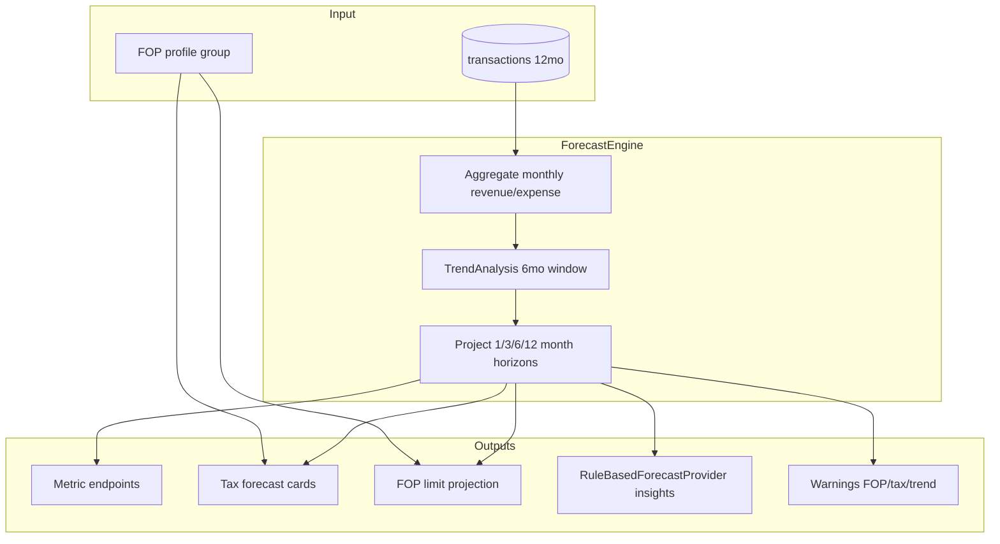
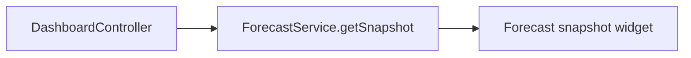
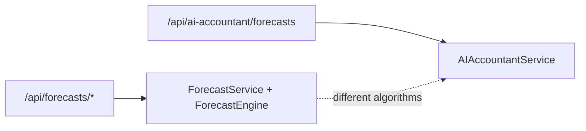
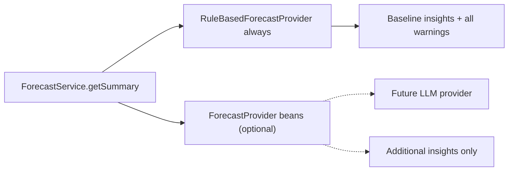

# Forecast Flow

**As-built:** 2026-06-28  
**Backend:** `ForecastController`, `ForecastService`, `ForecastEngine`, `RuleBasedForecastProvider`  
**Frontend:** `features/forecasts`

## Overview

Forecast Center projects revenue, expenses, profit, taxes, and FOP income limits using **historical transaction data** and **trend-based math**. Narrative insights and warnings come from `RuleBasedForecastProvider`; optional `ForecastProvider` beans can extend insights (none in production).

## Request Flow

## Engine Pipeline

## Forecast Horizons

| Constant | Value | Usage |
|----------|-------|---------|
| `FORECAST_HORIZONS` | 1, 3, 6, 12 months | All metric cards |
| History window | 12 months | Data load |
| Trend window | 6 months | Growth calculation |
| Rolling average | 3 months | Smoothing |

**Source:** `ForecastEngine.java`

## API Endpoints

| Endpoint | Returns |
|----------|---------|
| `GET /api/forecasts/revenue` | Historical + projected revenue series |
| `GET /api/forecasts/expenses` | Expense series |
| `GET /api/forecasts/profit` | Profit series |
| `GET /api/forecasts/taxes` | Tax forecast cards (single tax + ЄСВ estimate) |
| `GET /api/forecasts/fop-limit` | YTD vs annual limit, projected breach |
| `GET /api/forecasts/summary` | Combined dashboard + insights + warnings |

## Dashboard Integration

## Notification Integration

`NotificationRuleEngine` (daily 08:00) may create `AI_FORECAST_ANOMALY` notifications when forecast warnings match preference-enabled rules.

## Separate: AI Accountant Forecasts

`GET /api/ai-accountant/forecasts` uses **different logic** in `AIAccountantService` (simplified 3/6/12-month projection). Not identical to Forecast Center output.

## Extension Point (Future LLM)

## Related

- [ai-architecture.md](../ai-architecture.md)
- [Forecast Engine](../../ai/forecast-engine.md)
- [Forecast API](../../api/forecast-api.md)
- [flows/ai-flow.md](ai-flow.md)
