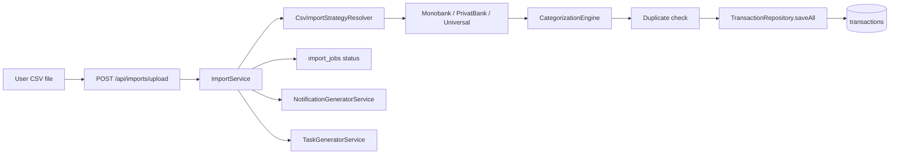
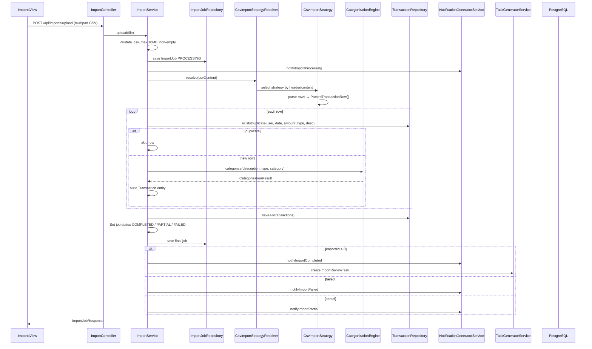
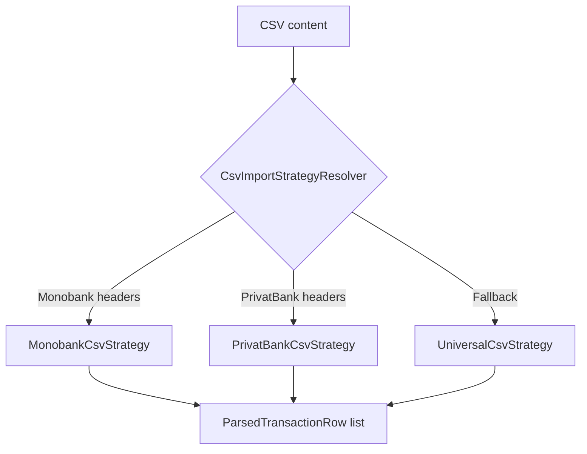
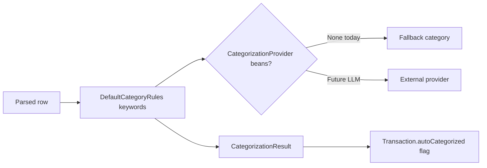
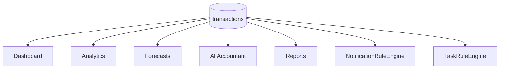

# CSV Import Flow

**As-built:** 2026-06-28  
**Backend:** `ImportController`, `ImportService`, `importcsv.*`  
**Frontend:** `features/imports`

## Overview

Bank data enters FlowIQ exclusively via **CSV upload** (max 10 MB). No live bank API integration exists. Parsed rows become `transactions`; downstream modules read from that table.

## High-Level Flow

## Detailed Upload Sequence

## Parser Strategy Selection

**Package:** `com.flowiq.importcsv`

## Categorization Pipeline

## Import Job States

| Status | Condition |
|--------|-----------|
| `PROCESSING` | Job created, parse in progress |
| `COMPLETED` | All rows imported, zero errors |
| `PARTIAL` | Some rows imported, some skipped/invalid |
| `FAILED` | Zero imported with errors, or parse failure |

## Downstream Consumers

Once `transactions` are populated:

## API Endpoints

| Method | Path | Purpose |
|--------|------|---------|
| POST | `/api/imports/upload` | Upload CSV |
| GET | `/api/imports` | List jobs + stats |
| GET | `/api/imports/{id}` | Job detail |

## Related

- [integration-architecture.md](../integration-architecture.md)
- [Transactions Module](../../modules/transactions.md)
- [SRS §3.4](../product/SRS.md)
