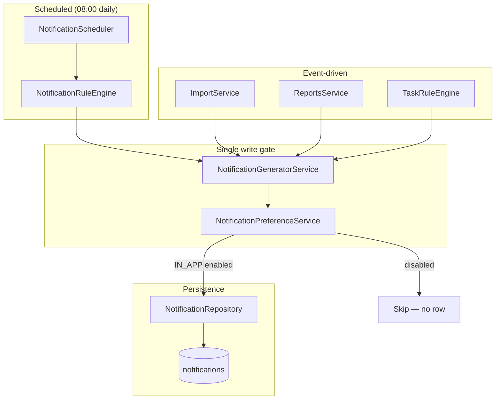
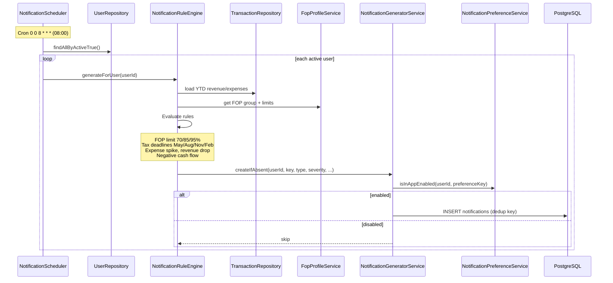
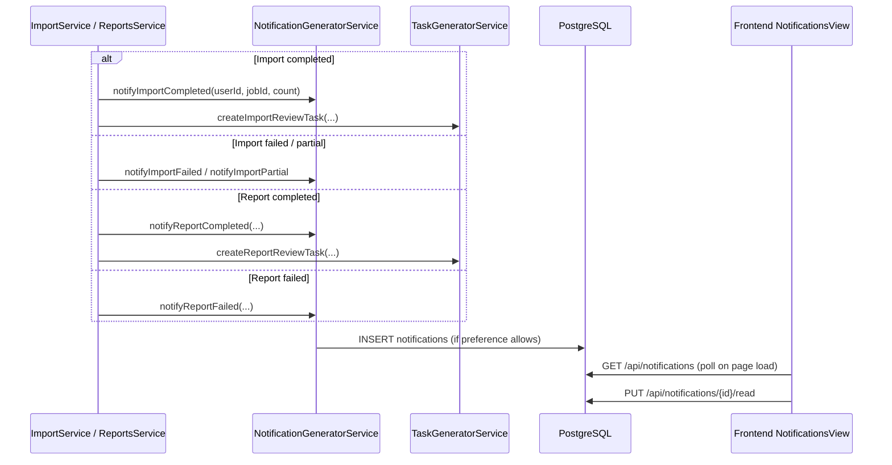
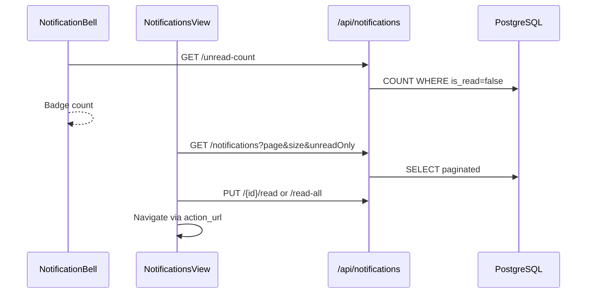
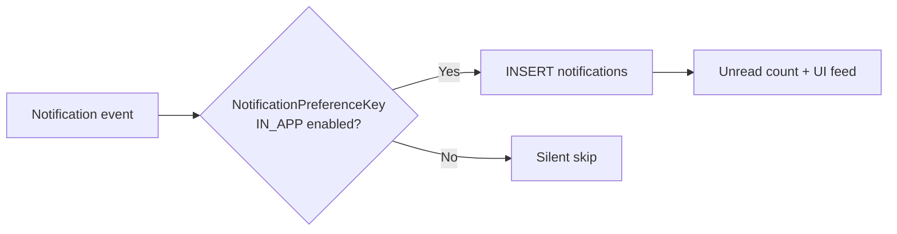
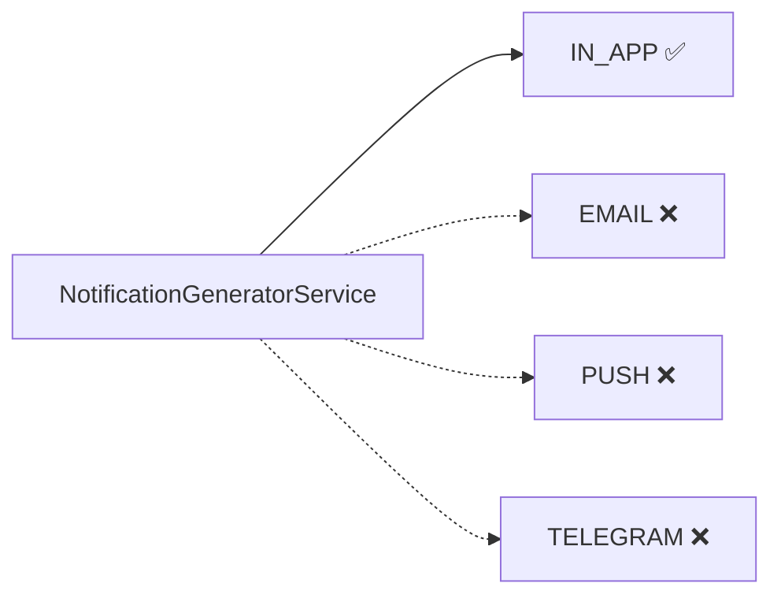

# Notification Flow

**As-built:** 2026-06-28  
**Scope:** End-to-end notification lifecycle — generation, preference gating, persistence, UI delivery

> Preference settings detail: [NOTIFICATION_ARCHITECTURE.md](../NOTIFICATION_ARCHITECTURE.md)

## Overview

Notifications are **IN_APP only** in production. All writes pass through `NotificationGeneratorService.createIfAbsent()`, which checks `NotificationPreferenceService.isInAppEnabled()` before inserting.

## Notification Model

| Attribute | Values |
|-----------|--------|
| **Types** | `TAX`, `FOP_LIMIT`, `FINANCIAL`, `AI_INSIGHT`, `REPORT`, `SYSTEM` |
| **Severities** | `INFO`, `SUCCESS`, `WARNING`, `CRITICAL` |
| **Channel (stored)** | Always `IN_APP` today |
| **Deduplication** | Unique `(user_id, deduplication_key)` |

## Generation Sources

## Daily Rule Engine Flow

## Event-Driven Notifications

## User Read Flow (Frontend)

### Deep link routes (`action_url`)

| URL | Trigger |
|-----|---------|
| `/imports` | Import lifecycle |
| `/business-guide` | FOP limit warnings |
| `/ai-accountant` | Tax deadlines |
| `/analytics` | Revenue/expense anomalies |
| `/tasks` | Task reminders |
| `/reports` | Report ready |

## Preference Gate (Summary)

24 preference keys in 5 categories — see [NOTIFICATION_ARCHITECTURE.md](../NOTIFICATION_ARCHITECTURE.md).

## Future: Multi-Channel Delivery

EMAIL, PUSH, TELEGRAM channels exist in schema and preferences UI (disabled / "Soon") but **no outbound dispatchers** are implemented.

## Related

- [NOTIFICATION_ARCHITECTURE.md](../NOTIFICATION_ARCHITECTURE.md)
- [Notification API](../api/notification-api.md)
- [SRS §13](../product/SRS.md)
