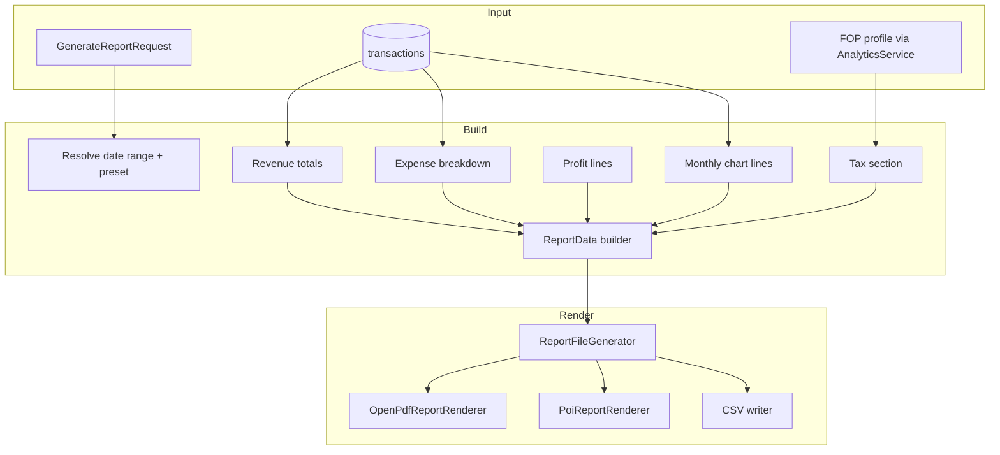
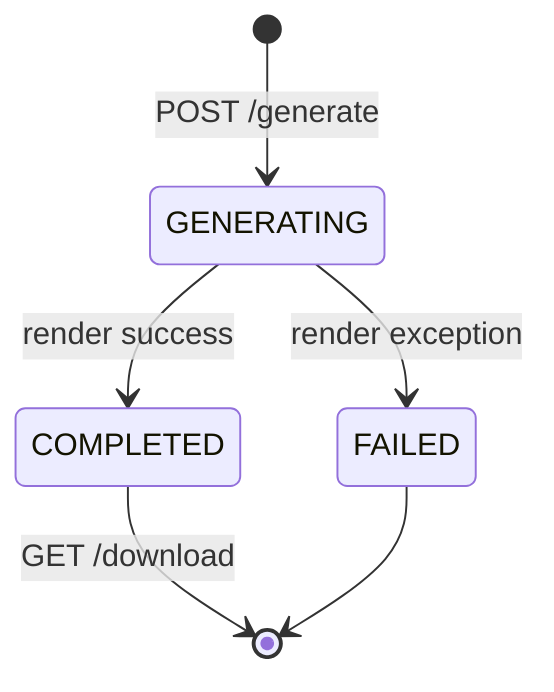

# Reporting Flow

**As-built:** 2026-06-28  
**Backend:** `ReportsController`, `ReportsService`, `ReportFileGenerator`  
**Frontend:** `features/reports`

## Overview

Reports aggregate transaction and FOP data into downloadable **PDF**, **Excel**, or **CSV** files. Files are stored as BYTEA in `report_jobs` and served via download endpoint. Generation is **synchronous** in the HTTP request thread despite `GENERATING` status.

## Report Types & Formats

| Report type | Enum |
|-------------|------|
| Profit and loss | `PROFIT_AND_LOSS` |
| Cash flow | `CASH_FLOW` |
| Revenue summary | `REVENUE_SUMMARY` |
| Expense summary | `EXPENSE_SUMMARY` |
| Tax summary | `TAX_SUMMARY` |
| FOP summary | `FOP_SUMMARY` |

| Format | Renderer |
|--------|----------|
| PDF | `OpenPdfReportRenderer` |
| Excel | `PoiReportRenderer` |
| CSV | Inline in `ReportFileGenerator` |

## End-to-End Flow

```mermaid
sequenceDiagram
    participant UI as ReportsView
    participant RC as ReportsController
    participant RS as ReportsService
    participant TSS as TransactionSeedService
    participant AN as AnalyticsService
    participant TR as TransactionRepository
    participant RFG as ReportFileGenerator
    participant RJR as ReportJobRepository
    participant NGS as NotificationGeneratorService
    participant TGS as TaskGeneratorService
    participant DB as PostgreSQL

    UI->>RC
    Note over UI: Optional: GET /preview
    UI->>RC: GET /api/reports/preview?dateFrom&dateTo
    RC->>RS: getPreview()
    RS->>TSS: seedIfEmpty(user)
    RS->>TR: aggregate range
    RS->>AN: getFopInsights()
    RS-->>UI: ReportPreviewResponse

    UI->>RC: POST /api/reports/generate
    RC->>RS: generate(request)
    RS->>TSS: seedIfEmpty(user)
    RS->>RS: buildReportData(type, dateRange)
    RS->>RJR: save ReportJob GENERATING
    RS->>RFG: generate(data, format)
    alt Success
        RFG-->>RS: byte[] content
        RS->>RJR: COMPLETED + file_content BYTEA
        RS->>NGS: notifyReportCompleted
        RS->>TGS: createReportReviewTask
    else Failure
        RS->>RJR: FAILED
        RS->>NGS: notifyReportFailed
        RS-->>UI: 400 Bad Request
    end
    RS-->>UI: ReportJobResponse

    UI->>RC: GET /api/reports/{id}/download
    RC->>RS: download(id)
    RS->>RJR: load file_content
    RS-->>UI: application/pdf or xlsx or csv
```

## Data Aggregation Pipeline



## Period Presets

| Preset | Range |
|--------|-------|
| `THIS_MONTH` | Current calendar month |
| `LAST_MONTH` | Previous calendar month |
| `QUARTER` | Current quarter |
| `YEAR` | Current calendar year |
| Custom | `dateFrom` + `dateTo` query params |

## Job Lifecycle



> **Implementation note:** Status transitions occur in a **single HTTP request** — no background worker.

## Side Effects on Completion

| Action | Service |
|--------|---------|
| In-app notification | `NotificationGeneratorService.notifyReportCompleted` |
| Review task | `TaskGeneratorService.createReportReviewTask` |
| Audit | `@Auditable` on `ReportsController.generate` |

## Storage Consideration

`report_jobs.file_content` (BYTEA) stores full file in PostgreSQL. Suitable for MVP; consider object storage (S3) at scale.

## API Endpoints

| Method | Path | Purpose |
|--------|------|---------|
| GET | `/api/reports` | List jobs + dashboard stats |
| GET | `/api/reports/preview` | Preview aggregates |
| POST | `/api/reports/generate` | Create and render report |
| GET | `/api/reports/{id}` | Job status |
| GET | `/api/reports/{id}/download` | File download |

## Related

- [Reports Module](../../modules/reports.md)
- [flows/notification-flow.md](notification-flow.md)
- [SRS §14](../product/SRS.md)
