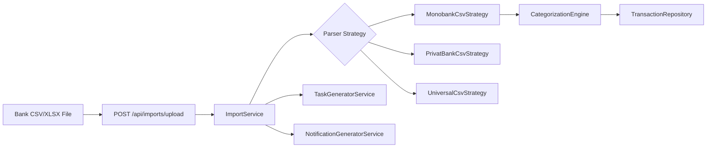

# Integration Architecture

## Current Data Source: Bank Statement Import

Flowiq does **not** connect to bank APIs. The only way to load bank transactions is **CSV/XLSX import** via the Imports module.

**Package:** `com.flowiq.importcsv`  
**Formats:** Monobank, PrivatBank, universal fallback  
**Post-import:** Review task + completion notification  
**User action:** Import your bank statement (not “connect your bank”)

All downstream modules (Analytics, Forecasts, AI Accountant, Reports, Dashboard) read from `transactions` populated by import or manual CRUD.

## Reports Export

| Format | Renderer | Library |
|--------|----------|---------|
| PDF | `OpenPdfReportRenderer` | OpenPDF |
| Excel | `PoiReportRenderer` | Apache POI |
| CSV | Inline in `ReportFileGenerator` | — |

### Frontend ↔ Backend

| Header | Set By | Used By |
|--------|--------|---------|
| `Authorization: Bearer` | Frontend `apiClient` | All protected endpoints |
| `X-App-Language` | `PreferencesContext` | `AppPreferencesFilter` → UK/EN content |
| `X-App-Currency` | `PreferencesContext` | `CurrencyFormatter` |

### CORS Allowed Origins

`CorsConfig`: `localhost:3000`, `localhost:3001`, `https://flowiq.vercel.app`

## Planned: Bank API Integrations (Coming Soon)

Bank integrations are **not active** in the UI. See [Bank Integrations Roadmap](../roadmap/BANK_INTEGRATIONS_ROADMAP.md).

| Feature | Status |
|---------|--------|
| Monobank API | Planned (Phase 2) |
| PrivatBank API | Planned (Phase 3) |
| Multi-bank aggregation | Planned (Phase 4) |
| Open Banking | Planned (Phase 5) |
| PUMB / Sense Bank | Not scoped |

**Feature flags:** `flowiq.features.bank-integrations-enabled=false` (backend), `FEATURE_FLAGS.BANK_INTEGRATIONS_ENABLED=false` (frontend).

Hidden route: `/coming-soon/integrations` — not listed in sidebar.

## Other Planned Integrations

| Integration | Frontend | Backend |
|-------------|----------|---------|
| Google Sheets | Stub (hidden) | ❌ No API |
| Shopify | UI card (hidden) | ❌ |
| Telegram notifications | UI card (hidden) | `NotificationChannel.TELEGRAM` enum only |
| Email notifications | — | `NotificationChannel.EMAIL` enum only |
| ДПС (tax authority) | — | Roadmap |

## Notification Deep Links

`Notification.action_url` routes frontend navigation:

| URL | Module |
|-----|--------|
| `/imports` | Import completed alerts |
| `/business-guide` | FOP limit warnings |
| `/ai-accountant` | Tax deadlines |
| `/analytics` | Revenue/expense anomalies |
| `/tasks` | Task-related alerts |

## Docker Compose (Database Only)

`compose.yaml` provides PostgreSQL; Spring Boot Docker Compose integration auto-starts it in dev.

**No** application container or frontend container in repo.

## Related Documents

- [Bank Integrations Roadmap](../roadmap/BANK_INTEGRATIONS_ROADMAP.md)
- [Transactions Module](../modules/transactions.md)
- [Reports Module](../modules/reports.md)
- [Docker](../deployment/docker.md)
