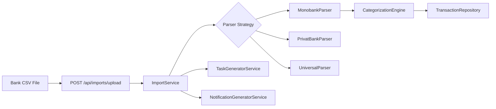

# Integration Architecture

## Current Integrations

### Bank CSV Import

**Package:** `com.flowiq.importcsv`  
**Formats:** Monobank, PrivatBank, universal fallback  
**Post-import:** Review task + completion notification

### Reports Export

| Format | Renderer | Library |
|--------|----------|---------|
| PDF | `OpenPdfReportRenderer` | OpenPDF |
| Excel | `PoiReportRenderer` | Apache POI |
| CSV | Inline in `ReportFileGenerator` | — |

### Frontend ↔ Backend

| Header | Set By | Used By |
|--------|--------|---------|
| `Authorization: Bearer` | Frontend `apiClient` | All protected endpoints |
| `X-App-Language` | `PreferencesContext` | `AppPreferencesFilter` → UK/EN content |
| `X-App-Currency` | `PreferencesContext` | `CurrencyFormatter` |

### CORS Allowed Origins

`CorsConfig`: `localhost:3000`, `localhost:3001`, `https://flowiq.vercel.app`

## Planned / Stub Integrations

| Integration | Frontend | Backend |
|-------------|----------|---------|
| Google Sheets | `IntegrationsView` | ❌ No API |
| Shopify | UI card | ❌ |
| Telegram notifications | UI card | `NotificationChannel.TELEGRAM` enum only |
| Email notifications | — | `NotificationChannel.EMAIL` enum only |
| Bank API (open banking) | — | Roadmap |
| ДПС (tax authority) | — | Roadmap |

## Notification Deep Links

`Notification.action_url` routes frontend navigation:

| URL | Module |
|-----|--------|
| `/business-guide` | FOP limit warnings |
| `/ai-accountant` | Tax deadlines |
| `/analytics` | Revenue/expense anomalies |
| `/tasks` | Task-related alerts |

## Docker Compose (Database Only)

`compose.yaml` provides PostgreSQL; Spring Boot Docker Compose integration auto-starts it in dev.

**No** application container or frontend container in repo.

## Related Documents

- [Transactions Module](../modules/transactions.md)
- [Reports Module](../modules/reports.md)
- [Docker](../deployment/docker.md)
