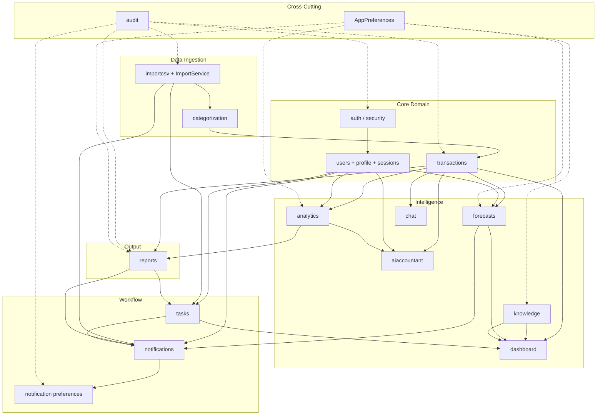

# Module Dependencies

**As-built:** 2026-06-28  
**Scope:** Domain modules across backend packages and frontend features

## Backend Module Dependency Graph

Core data flows **downstream from `transactions`**. Import and manual CRUD populate the ledger; all intelligence modules read from it.



## Dependency Matrix

| Module | Depends on | Depended on by |
|--------|------------|----------------|
| **auth / security** | `users`, JWT config | All protected controllers |
| **profile / sessions** | `users`, `fop_profiles`, `user_sessions` | Auth, Analytics, Forecasts, Tasks |
| **transactions** | `users` | Import, Dashboard, Analytics, Forecasts, AI, Chat, Reports |
| **importcsv** | `transactions`, categorization | — (entry point for bank data) |
| **categorization** | optional `CategorizationProvider` | ImportService |
| **dashboard** | transactions, forecasts, tasks, knowledge | Frontend `/` |
| **analytics** | transactions, FOP profile | AI Accountant, Reports preview |
| **forecasts** | transactions, FOP profile, `ForecastEngine` | Dashboard snapshot, Notifications |
| **aiaccountant** | transactions, analytics, `AIRecommendationEngine` | — |
| **chat** | transactions (context), chat tables | — |
| **knowledge** | `knowledge_articles` | Dashboard, Business Guide |
| **tasks** | `TaskRuleEngine`, transactions (indirect) | Dashboard snapshot, Notifications |
| **notifications** | `NotificationRuleEngine`, preferences | All lifecycle events |
| **reports** | transactions, analytics | — |
| **audit** | all `@Auditable` endpoints | — |

## Frontend Feature → Backend Module Map

```mermaid
flowchart LR
    subgraph Frontend
        F1[auth]
        F2[dashboard]
        F3[transactions]
        F4[imports]
        F5[analytics]
        F6[forecasts]
        F7[ai-accountant]
        F8[chat]
        F9[tasks]
        F10[notifications]
        F11[reports]
        F12[business-guide]
        F13[settings]
    end

    subgraph BackendAPI
        B1[/api/auth + /api/profile]
        B2[/api/dashboard]
        B3[/api/transactions]
        B4[/api/imports]
        B5[/api/analytics]
        B6[/api/forecasts]
        B7[/api/ai-accountant]
        B8[/api/chat]
        B9[/api/tasks]
        B10[/api/notifications]
        B11[/api/reports]
        B12[/api/business-guide]
        B13[/api/settings/notifications]
    end

    F1 --> B1
    F2 --> B2
    F3 --> B3
    F4 --> B4
    F5 --> B5
    F6 --> B6
    F7 --> B7
    F8 --> B8
    F9 --> B9
    F10 --> B10 & B13
    F11 --> B11
    F12 --> B12
    F13 --> B1 & B13
```

### Hybrid / mock frontend modules

| Frontend feature | Backend API | Local fallback |
|------------------|-------------|----------------|
| Tax profile card | `GET /api/profile/fop` exists | `mock-data/tax-profile.localized.ts` still used in some views |
| Business Guide groups/taxes | Articles API | Static locale data for explorer sections |
| FOP eligibility checker | — | Client-side `eligibility-engine.ts` |
| Integrations | — | `/coming-soon/integrations` |

## Automation → Feature Coverage

| Automation suite | Backend modules exercised | Frontend routes |
|------------------|---------------------------|-----------------|
| API smoke | auth, health, dashboard | — |
| API regression | transactions, imports, forecasts, tasks, notifications, reports | — |
| Contract tests | OpenAPI schemas for 15 controllers | — |
| UI smoke | auth UI | login, dashboard shell |
| E2E journeys | full stack | dashboard, transactions, imports, reports, tasks, forecasts |

See [automation-architecture.md](automation-architecture.md) and `flowiq-automation/docs/qa/TRACEABILITY_MATRIX.md`.

## Circular Dependencies

**None** at package level. Services may call each other (e.g. `ReportsService` → `AnalyticsService`) but packages form a directed acyclic graph with `transactions` as the shared read hub.

## Related

- [REQUEST_FLOW_MAP.md](REQUEST_FLOW_MAP.md) — per-controller call chains
- [SYSTEM_COMPONENT_CATALOG.md](SYSTEM_COMPONENT_CATALOG.md)
- [SRS §18](../product/SRS.md) — traceability matrix
