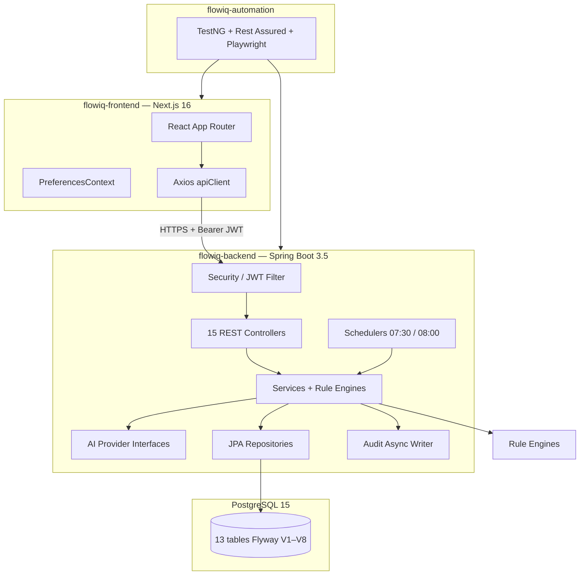
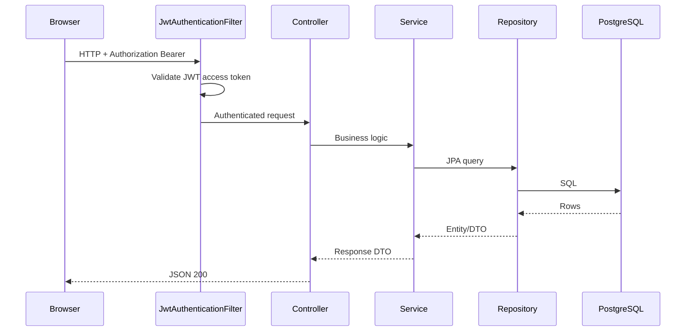
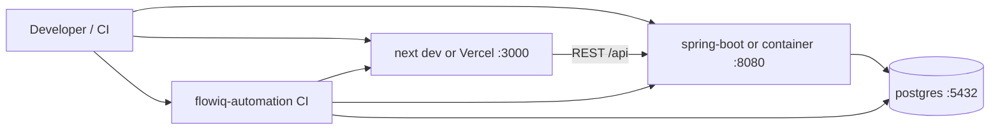

# System Overview

**As-built:** 2026-06-28  
**Index:** [README.md](README.md) — full architecture documentation map

## High-Level Architecture

Three repositories form the FlowIQ platform:

## Request Flow

## Technology Stack

| Layer | Technology |
|-------|------------|
| Frontend | Next.js 16, React 19, TypeScript, Tailwind 4, shadcn/ui, Recharts, Axios |
| Backend | Spring Boot 3.5.14, Java 17, Spring Security, Spring Data JPA |
| Database | PostgreSQL 15 (Docker Compose) |
| Migrations | Flyway V1–V8 |
| Automation | TestNG, Rest Assured, Playwright Java (`flowiq-automation`) |
| API Docs | springdoc-openapi 2.8 |
| PDF Reports | OpenPDF |
| Excel Reports | Apache POI |

## Module Map

| Domain | Backend Package | Frontend Feature |
|--------|-----------------|------------------|
| Auth | `controller`, `security` | `features/auth` |
| Transactions | `controller`, `entity` | `features/transactions` |
| Dashboard | `controller`, `service` | `features/dashboard` |
| Forecasts | `forecasts.*` | `features/forecasts` |
| Tasks | `tasks.*` | `features/tasks` |
| Notifications | `notifications.*` | `features/notifications` |
| Knowledge | `knowledge.*` | `features/business-guide` |
| Analytics | `controller`, `service` | `features/analytics` |
| Reports | `reports.*`, `controller` | `features/reports` |
| AI Accountant | `aiaccountant.*` | `features/ai-accountant` |
| Chat | `controller`, `service` | `features/chat` |
| Imports | `importcsv.*`, `service` | `features/imports` |

## Deployment Topology (Current)

See [deployment-architecture.md](deployment-architecture.md) for full diagram.

Production: frontend on Vercel (`https://flowiq.vercel.app`); backend JAR/Docker — **CD not automated**. See [cicd-architecture.md](cicd-architecture.md).

## Process Flows

| Flow | Document |
|------|----------|
| Authentication | [flows/authentication-flow.md](flows/authentication-flow.md) |
| Notifications | [flows/notification-flow.md](flows/notification-flow.md) |
| CSV import | [flows/import-flow.md](flows/import-flow.md) |
| Forecasts | [flows/forecast-flow.md](flows/forecast-flow.md) |
| AI / rules | [flows/ai-flow.md](flows/ai-flow.md) |
| Reports | [flows/reporting-flow.md](flows/reporting-flow.md) |

## Cross-References

- [C4 Context](c4/c4-context.md) · [C4 Container](c4/c4-container.md) · [C4 Component](c4/c4-component.md)
- [Module Dependencies](module-dependencies.md)
- [Backend](backend-architecture.md) · [Frontend](frontend-architecture.md) · [Automation](automation-architecture.md)
- [Database ER](database-er-diagram.md) · [Test Architecture](test-architecture.md)
- [SRS](../product/SRS.md)
