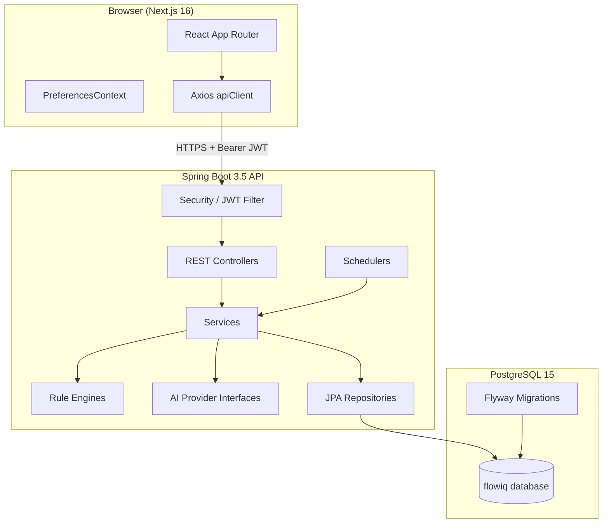
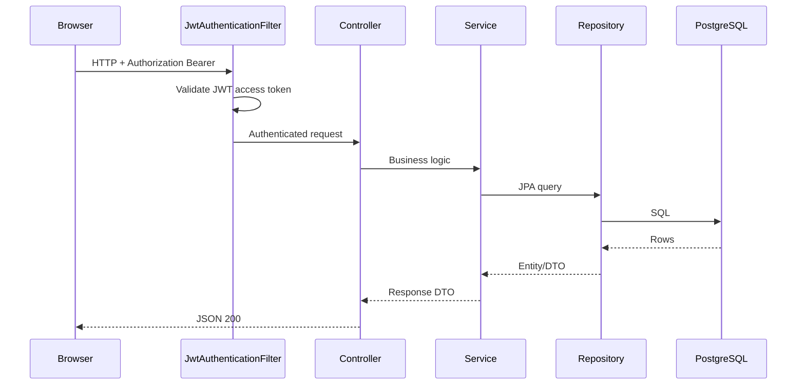
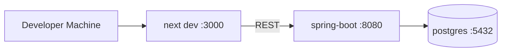

# System Overview

## High-Level Architecture

## Request Flow

## Technology Stack

| Layer | Technology |
|-------|------------|
| Frontend | Next.js 16, React 19, TypeScript, Tailwind 4, shadcn/ui, Recharts, Axios |
| Backend | Spring Boot 3.5.14, Java 17, Spring Security, Spring Data JPA |
| Database | PostgreSQL 15 (Docker Compose) |
| Migrations | Flyway V1–V5 |
| API Docs | springdoc-openapi 2.8 |
| PDF Reports | OpenPDF |
| Excel Reports | Apache POI |

## Module Map

| Domain | Backend Package | Frontend Feature |
|--------|-----------------|------------------|
| Auth | `controller`, `security` | `features/auth` |
| Transactions | `controller`, `entity` | `features/transactions` |
| Dashboard | `controller`, `service` | `features/dashboard` |
| Forecasts | `forecasts.*` | `features/forecasts` |
| Tasks | `tasks.*` | `features/tasks` |
| Notifications | `notifications.*` | `features/notifications` |
| Knowledge | `knowledge.*` | `features/business-guide` |
| Analytics | `controller`, `service` | `features/analytics` |
| Reports | `reports.*`, `controller` | `features/reports` |
| AI Accountant | `aiaccountant.*` | `features/ai-accountant` |
| Chat | `controller`, `service` | `features/chat` |
| Imports | `importcsv.*`, `service` | `features/imports` |

## Deployment Topology (Current)

Production target: frontend on Vercel (`https://flowiq.vercel.app` in CORS); backend via `Dockerfile` (manual build/deploy) or managed JVM host — **CD not automated**. See [Docker](../deployment/docker.md) and [CI/CD](../deployment/ci-cd.md).

## Cross-References

- [Backend Architecture](backend-architecture.md)
- [Frontend Architecture](frontend-architecture.md)
- [Database Architecture](database-architecture.md)
- [AI Architecture](ai-architecture.md)
- [Local Setup](../deployment/local-setup.md)
