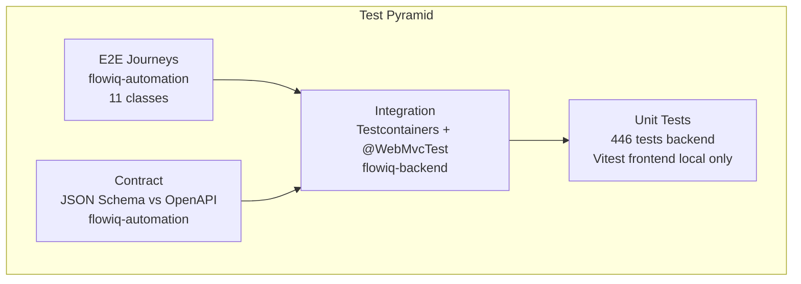
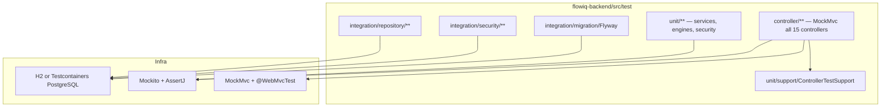
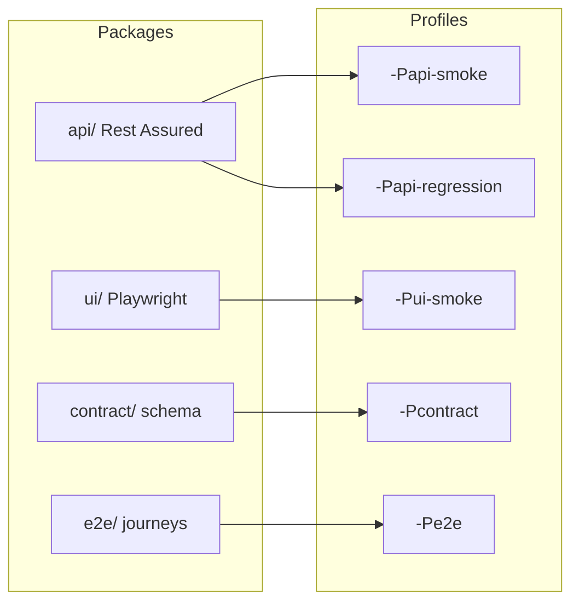
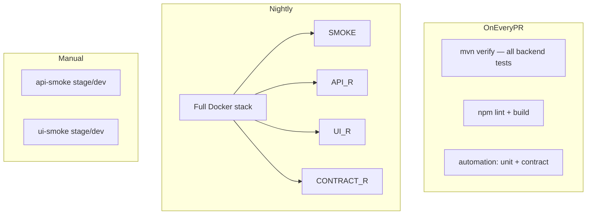

# Test Architecture

**As-built:** 2026-06-28  
**Scope:** Testing strategy across `flowiq-backend`, `flowiq-frontend`, `flowiq-automation`

## Test Pyramid (As-Built)

| Layer | Count / status | Repository |
|-------|----------------|--------------|
| **Unit** | 446 tests, 72 classes, ~81% line JaCoCo | `flowiq-backend` |
| **Controller** | 15 controller test classes (MockMvc) | `flowiq-backend` |
| **Integration** | Repository, security, Flyway tests | `flowiq-backend` |
| **Contract** | OpenAPI schema validation | `flowiq-automation` |
| **API regression** | Rest Assured suites | `flowiq-automation` |
| **UI / E2E** | Playwright Java | `flowiq-automation` |
| **Frontend unit** | Vitest (local) | `flowiq-frontend` — **not in CI** |

## Backend Test Structure

### Test configuration

| File | Purpose |
|------|---------|
| `application-test.properties` | H2/Testcontainers, disable compose, demo seed off |
| `AbstractPostgresIntegrationTest` | Shared Testcontainers base |
| `ControllerTestSupport` | JWT + MockMvc helpers |

### Surefire inclusion

`pom.xml`: `**/*Test.java`, `**/*Tests.java` — includes integration and application context tests.

## Automation Test Structure

## CI Test Execution Map

## Coverage by Domain

| Domain | Backend unit | Controller | Integration | Automation API | Automation E2E |
|--------|-------------|------------|-------------|----------------|----------------|
| Auth | ✅ | ✅ | ✅ security | ✅ | ✅ |
| Transactions | ✅ | ✅ | ✅ repo | ✅ | ✅ |
| Imports | ✅ | ✅ | — | ✅ | ✅ |
| Dashboard | ✅ | ✅ | — | ✅ | ✅ |
| Analytics | ✅ | ✅ | — | ✅ | Partial |
| Forecasts | ✅ | ✅ | — | ✅ | ✅ |
| AI Accountant | ✅ | ✅ | — | ✅ | Partial |
| Chat | ✅ | ✅ | — | Partial | — |
| Tasks | ✅ | ✅ | ✅ repo | ✅ | ✅ |
| Notifications | ✅ | ✅ | ✅ repo | ✅ | Partial |
| Reports | ✅ | ✅ | — | ✅ | ✅ |
| Business Guide | ✅ | ✅ | — | ✅ | Partial |
| Profile | ✅ | ✅ | — | Partial | — |

Detail: [BACKEND_TEST_COVERAGE_REPORT.md](../qa/BACKEND_TEST_COVERAGE_REPORT.md), `flowiq-automation/docs/qa/TRACEABILITY_MATRIX.md`.

## Test Data Strategy

| Environment | User | Data |
|-------------|------|------|
| Backend unit/integration | Mock / H2 / Testcontainers | Programmatic fixtures |
| Automation local/CI | `demo@flowiq.ai` or `TEST_USER_*` | Demo seed + Docker seed scripts |
| Nightly Docker | Seeded stack | `ci-up.sh` |

## Reporting & Artifacts

| Tool | Output | Where |
|------|--------|-------|
| JaCoCo | HTML coverage | Backend CI artifact |
| Surefire | JUnit XML | GitHub Checks |
| Allure | HTML report | Nightly/smoke automation |
| EnricoMi action | PR test comments | Backend CI |

## Gaps & Evolution

| Gap | Priority |
|-----|----------|
| Frontend Vitest in CI | Medium |
| JaCoCo minimum threshold gate | Low |
| Dependency/CVE scanning | Medium |
| Performance/load tests | Low |
| Visual regression | Low |

## Related

- [automation-architecture.md](automation-architecture.md)
- [cicd-architecture.md](cicd-architecture.md)
- [Test Strategy](../qa/test-strategy.md) — operational checklist
- [Critical User Flows](../qa/critical-user-flows.md)
