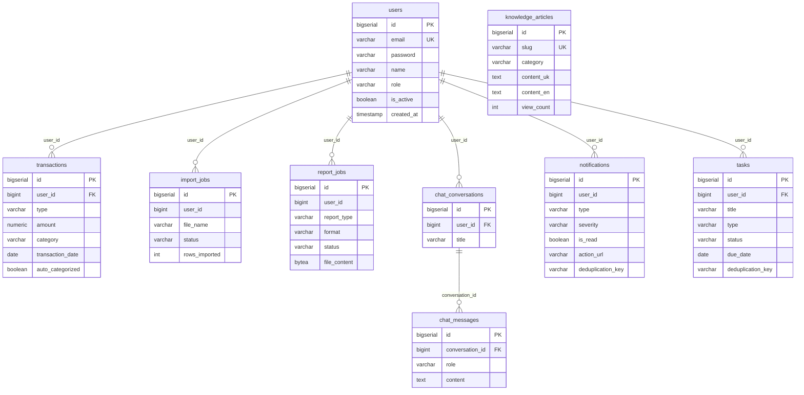

# ER Diagram

Full entity-relationship diagram for FlowIQ PostgreSQL schema.

```mermaid
erDiagram
    users {
        bigserial id PK
        varchar email UK
        varchar password
        varchar name
        varchar role
        boolean is_active
        timestamp created_at
    }

    transactions {
        bigserial id PK
        bigint user_id FK
        varchar type
        numeric amount
        varchar category
        date transaction_date
        boolean auto_categorized
    }

    import_jobs {
        bigserial id PK
        bigint user_id
        varchar file_name
        varchar status
        int rows_imported
    }

    report_jobs {
        bigserial id PK
        bigint user_id
        varchar report_type
        varchar format
        varchar status
        bytea file_content
    }

    chat_conversations {
        bigserial id PK
        bigint user_id FK
        varchar title
    }

    chat_messages {
        bigserial id PK
        bigint conversation_id FK
        varchar role
        text content
    }

    notifications {
        bigserial id PK
        bigint user_id
        varchar type
        varchar severity
        boolean is_read
        varchar action_url
        varchar deduplication_key
    }

    tasks {
        bigserial id PK
        bigint user_id FK
        varchar title
        varchar type
        varchar status
        date due_date
        varchar deduplication_key
    }

    knowledge_articles {
        bigserial id PK
        varchar slug UK
        varchar category
        text content_uk
        text content_en
        int view_count
    }

    users ||--o{ transactions : "user_id"
    users ||--o{ chat_conversations : "user_id"
    users ||--o{ import_jobs : "user_id"
    users ||--o{ report_jobs : "user_id"
    users ||--o{ notifications : "user_id"
    users ||--o{ tasks : "user_id"
    chat_conversations ||--o{ chat_messages : "conversation_id"
```

## Related

- [Entities](entities.md)
- [Relationships](relationships.md)
