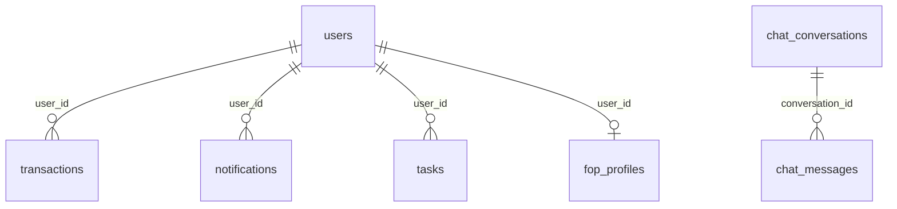

# ER Diagram

> **Canonical ER diagram:** [architecture/database-er-diagram.md](../architecture/database-er-diagram.md)

The full entity-relationship diagram with all 13 tables (Flyway V1–V8) lives in the architecture folder.

## Quick reference (core entities)

## Related

- [Database ER Diagram](../architecture/database-er-diagram.md)
- [Database Architecture](../architecture/database-architecture.md)
- [Entities](entities.md)
- [Relationships](relationships.md)
