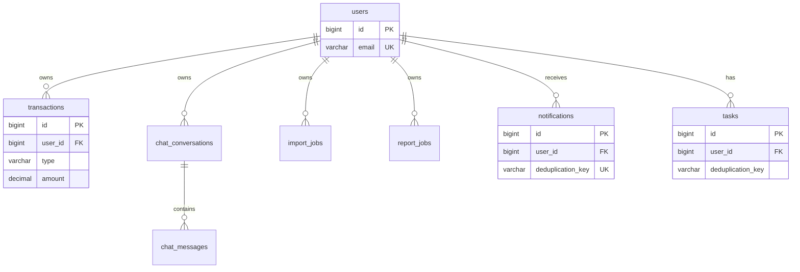

# Entity Relationships

## User-Centric Model

## Knowledge (Independent)

`knowledge_articles` has **no FK to users** — global content library.

## JPA Mapping Notes

| Entity | User Reference |
|--------|----------------|
| `Transaction` | `@ManyToOne User` |
| `Task`, `Notification` | Flat `Long userId` |
| `ImportJob`, `ReportJob` | Flat `Long userId` |

## Cascade Rules

- `ChatConversation` → `ChatMessage`: orphan removal on conversation delete
- Transactions: no cascade from user delete (FK constraint)

## Related

- [ER Diagram](er-diagram.md)
