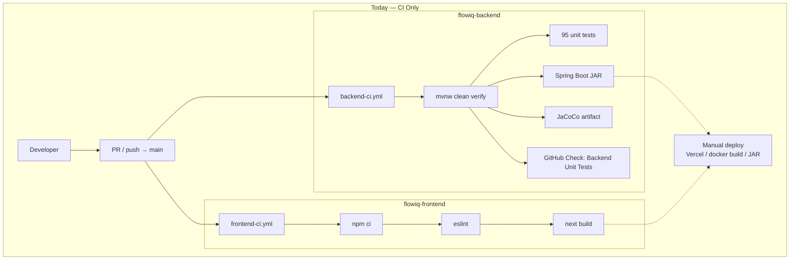
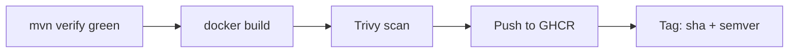
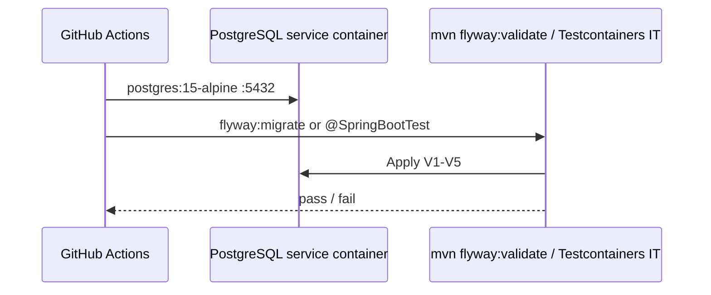
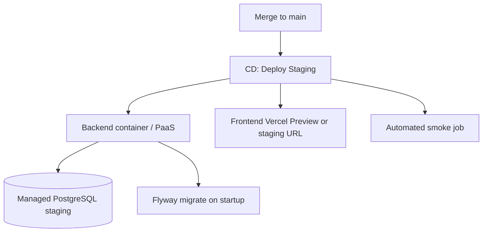
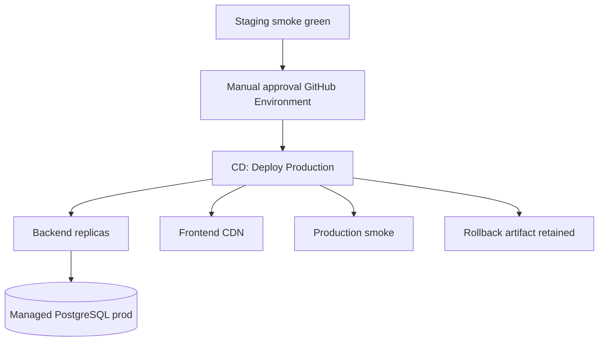
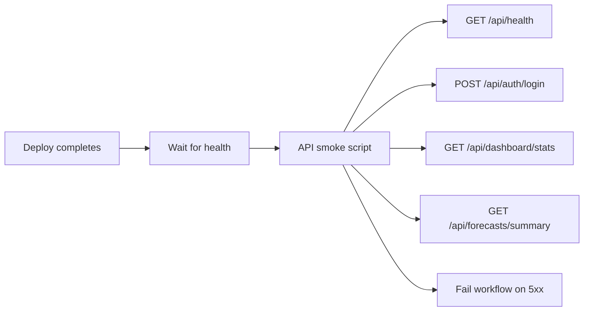
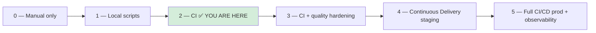
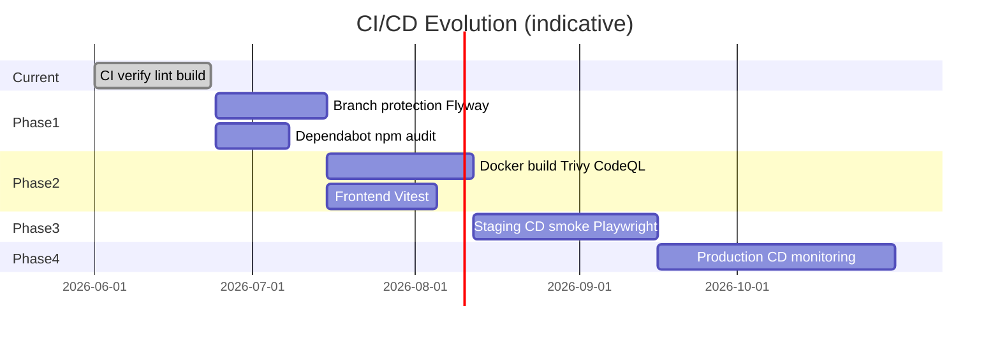

# CI/CD Evolution Plan

**Audit date:** 2026-06-23  
**Source of truth:** `.github/workflows/*.yml`, `pom.xml`, `package.json`, `Dockerfile` (both repos)  
**Related:** [CI/CD As-Built](ci-cd-as-built.md) · [Technical Debt Register](../architecture/TECHNICAL_DEBT_REGISTER.md) (TD-H05, TD-H11)

---

## Executive Summary

FlowIQ has crossed from **no automation** to **CI-only** on two independent GitHub repositories. Every push/PR to `main` runs compile, backend unit tests (95), frontend lint, and production build. **Nothing deploys automatically.** Quality gates stop at build verification — no database migrations in CI, no container publish, no security scans, no E2E.

**Maturity today:** **CI (Level 2)** — not Continuous Delivery, not Full CI/CD.

---

## Current State



| Dimension | Status |
|-----------|--------|
| **Repositories** | 2 separate repos — no monorepo orchestration |
| **Triggers** | `push` + `pull_request` → `main` only |
| **CD** | ❌ Not implemented |
| **Staging** | ❌ TBD ([environments.md](environments.md)) |
| **Production** | Manual; CORS allows `https://flowiq.vercel.app` |
| **Branch protection** | ❌ Not configured in repo (recommended below) |

---

## What Already Works

### Backend (`flowiq-backend/.github/workflows/backend-ci.yml`)

| Step | Implementation | Verified |
|------|----------------|----------|
| Trigger | `on: push/pull_request` → `main` | ✅ workflow file |
| Runner | `ubuntu-latest`, timeout 20 min | ✅ |
| Java | 17 Temurin, Maven cache | ✅ `pom.xml` `java.version=17` |
| Build | `./mvnw clean verify -B` | ✅ local run: BUILD SUCCESS |
| Compose off | `SPRING_DOCKER_COMPOSE_ENABLED=false` | ✅ avoids DB in CI |
| Tests | Surefire `**/*Test.java` → **95 tests** | ✅ `mvn test` 2026-06-23 |
| Package | Spring Boot repackaged JAR in verify phase | ✅ |
| Test reporting | `publish-unit-test-result-action@v2` | ✅ check name: **Backend Unit Tests** |
| Coverage artifact | `target/site/jacoco/` uploaded 30 days | ✅ `jacoco-maven-plugin` in `pom.xml` |
| Surefire artifact | XML reports 14 days | ✅ |

**Excluded from CI (by design in `pom.xml`):**

```xml
<!-- maven-surefire-plugin -->
<include>**/*Test.java</include>
```

`FlowiqBackendApplicationTests` (class name ends with `Tests`) — **not executed** in CI; would require PostgreSQL + Flyway on startup.

### Frontend (`flowiq-frontend/.github/workflows/frontend-ci.yml`)

| Step | Implementation | Verified |
|------|----------------|----------|
| Trigger | `on: push/pull_request` → `main` | ✅ |
| Runner | `ubuntu-latest`, timeout 15 min | ✅ |
| Node | 20, npm cache | ✅ `package.json` / Dockerfile `node:20` |
| Install | `npm ci` | ✅ requires `package-lock.json` |
| Lint | `npm run lint` → ESLint 9 | ✅ `eslint.config.mjs` |
| Build | `npm run build` | ✅ Next.js 16 + TS via build |
| API URL | `NEXT_PUBLIC_API_URL=http://localhost:8080/api` | ✅ matches Dockerfile default |

**Not in frontend CI:** `npm test` (no test script in `package.json`), Playwright, bundle size analysis.

### Cross-repo reality

| Behavior | Detail |
|----------|--------|
| Independent pipelines | Backend PR does not run frontend CI unless both repos have PRs |
| No contract tests | OpenAPI not validated against frontend clients |
| No combined smoke | [smoke-checklist.md](../qa/smoke-checklist.md) is manual (~15 min) |

---

## Quality Gates

### Present (blocks merge if job fails)

| Gate | Repo | Mechanism | Fails pipeline |
|------|------|-----------|----------------|
| Java compile | Backend | `mvn verify` compile phase | ✅ |
| Unit tests (95) | Backend | Surefire in verify | ✅ |
| JAR package | Backend | `spring-boot-maven-plugin` repackage | ✅ |
| ESLint (0 errors) | Frontend | `npm run lint` | ✅ |
| TypeScript | Frontend | `next build` | ✅ |
| Next.js production build | Frontend | `next build` (18 `app/**/page.tsx` routes) | ✅ |

### Present (informational only)

| Gate | Repo | Mechanism | Blocks merge |
|------|------|-----------|--------------|
| JaCoCo HTML report | Backend | Artifact upload | ❌ No `jacoco:check` in `pom.xml` |
| Surefire XML | Backend | Artifact upload | ❌ |
| ESLint warnings | Frontend | `no-unused-vars: warn` | ❌ warnings allowed |

### Absent

| Gate | Impact | Evidence |
|------|--------|----------|
| **Integration tests** | Flyway/SQL/repository bugs reach runtime | No Testcontainers; `FlowiqBackendApplicationTests` excluded |
| **Flyway validation** | Broken migration may pass CI | No Postgres service in `backend-ci.yml` |
| **Frontend unit tests** | UI regressions undetected | 0 `*.test.ts` files |
| **E2E / Playwright** | Auth flows untested | No E2E config in either repo |
| **Docker build** | Dockerfile drift undetected | `Dockerfile` not run in CI; backend uses `-DskipTests` |
| **Image scan (Trivy/Snyk)** | CVEs in base images | No scan workflow |
| **Dependency scan** | Vulnerable Maven/npm packages | No Dependabot, OWASP, `npm audit` |
| **SAST / secret scan** | Leaked credentials in PR | No `gitleaks`, CodeQL |
| **Coverage threshold** | Coverage regression | JaCoCo report only |
| **OpenAPI breaking change** | API contract drift | No spectral/diff |
| **Smoke automation** | Post-deploy health unverified | Manual checklist only |
| **Performance / load** | No baseline | Not configured |
| **License compliance** | — | Not configured |

---

## Branch Protection Recommendations

Configure on **both** GitHub repositories (`Settings → Branches → main`):

| Rule | Setting | Rationale |
|------|---------|-----------|
| Require pull request | ✅ Before merging | No direct pushes to `main` (optional for solo dev) |
| Require status checks | ✅ | |
| **Backend required check** | `Maven Verify` **or** `Backend Unit Tests` | Job name vs EnricoMi check — verify in first PR after enabling |
| **Frontend required check** | `Lint and Build` | Job name from `frontend-ci.yml` |
| Require branches up to date | ✅ | Re-run CI on latest `main` |
| Dismiss stale reviews | Optional | |
| Restrict pushes | Admins only | Protect `main` |
| Require signed commits | Optional | Supply chain hardening |

**Not yet available until workflows exist:**

- `Docker Build` (future)
- `Flyway Validate` (future)
- `Security Scan` (future)
- `E2E Smoke` (future)

**Cross-repo note:** Merging coordinated features may require **both** PRs green — document in team process; no GitHub-native monorepo gate today.

---

## Docker Build Pipeline (Planned)

### Current

| Item | As-built |
|------|----------|
| Backend `Dockerfile` | Multi-stage: `maven:3.9` build → `eclipse-temurin:17-jre-alpine` runtime |
| Backend build command | `mvn package -DskipTests` — **tests not run in image build** |
| Frontend `Dockerfile` | Multi-stage: `node:20-alpine`, `output: standalone` |
| CI runs Docker | ❌ |

### Recommended workflow (`backend-docker.yml` / `frontend-docker.yml`)



| Step | Backend | Frontend |
|------|---------|----------|
| Trigger | `push` to `main` after verify | Same |
| Build context | `flowiq-backend/` | `flowiq-frontend/` |
| Args | — | `NEXT_PUBLIC_API_URL` per environment |
| Registry | `ghcr.io/<org>/flowiq-backend` | `ghcr.io/<org>/flowiq-frontend` |
| Gate | Fail on CRITICAL CVE | Same |
| **Do not** use `-DskipTests` in CI image job | Build JAR from `mvn verify` artifact or run verify before docker |

**Complexity:** Medium · **Priority:** Month 2–3 of evolution roadmap

---

## Security Scan Pipeline (Planned)

| Tool | Scope | Suggested trigger | Gate |
|------|-------|-------------------|------|
| **GitHub CodeQL** | Java + TypeScript SAST | `pull_request` | Block on high (tune) |
| **Trivy** | Docker images + filesystem | After docker build | Block CRITICAL |
| **Gitleaks** | Secrets in diff | Every PR | Block on find |
| **OWASP Dependency-Check** | Maven `pom.xml` | Weekly + PR | Block high CVE |

**Current:** None configured in `.github/workflows/`.

**Permissions note:** Backend workflow has `checks: write` for test publisher; security workflows may need `security-events: write` for CodeQL.

---

## Dependency Scan Pipeline (Planned)

| Ecosystem | Tool | Current | Recommended |
|-----------|------|---------|-------------|
| Maven | Dependabot + OWASP DC | ❌ | `.github/dependabot.yml` for `maven`, weekly |
| npm | Dependabot + `npm audit` | ❌ | `npm audit --audit-level=high` in `frontend-ci.yml` |
| Actions | Dependabot | ❌ | Version bumps for `actions/checkout@v4`, etc. |

**Example addition to `frontend-ci.yml` (non-blocking → later blocking):**

```yaml
- name: npm audit
  run: npm audit --audit-level=high
  continue-on-error: true  # remove when baseline clean
```

**Backend:** `dependency-check-maven-plugin` in profile `security`, run nightly.

---

## Flyway Validation (Planned)

### Current

| Item | Status |
|------|--------|
| Migrations | `src/main/resources/db/migration/V1`–`V5` |
| CI validation | ❌ — `SPRING_DOCKER_COMPOSE_ENABLED=false`, no Postgres service |
| Runtime validation | App startup runs Flyway when developer has local Postgres |
| Hibernate | `ddl-auto=validate` after Flyway |

### Recommended: `backend-flyway.yml` or job in `backend-ci.yml`



**Option A — Service container (lighter):**

```yaml
services:
  postgres:
    image: postgres:15-alpine
    env:
      POSTGRES_DB: flowiq
      POSTGRES_USER: flowiq
      POSTGRES_PASSWORD: flowiq123
    ports:
      - 5432:5432
```

Run: `./mvnw flyway:migrate` with test JDBC URL **or** enable `FlowiqBackendApplicationTests` + Testcontainers.

**Option B — Testcontainers (recommended with integration tests):**

- Add `org.testcontainers:postgresql` test scope
- `@Testcontainers` class: migrate + one repository query

**Gate:** Fail PR if migration SQL invalid or checksum mismatch.

**Complexity:** Medium · **Priority:** Month 1–2

---

## Staging Deployment (Planned)

### Current

| Item | Status |
|------|--------|
| Staging environment | **TBD** in [environments.md](environments.md) |
| Deploy workflow | ❌ |
| Staging secrets | ❌ |
| Anonymized data policy | ❌ |

### Target architecture



| Component | Suggestion |
|-----------|------------|
| Backend | Railway / Render / ECS / K8s — image from GHCR |
| Frontend | Vercel **Preview** for PR; fixed `staging.flowiq.*` for `main` |
| Database | Managed PostgreSQL (separate from prod) |
| Config | `application-staging.properties`, GitHub Environment `staging` |
| Seed policy | `demo-seed-enabled=true` OK on staging; label UI as demo |
| URL | Document in `environments.md` |

**Gate:** Smoke job must pass before promoting to production.

**Complexity:** High · **Priority:** Month 2–3

---

## Production Deployment (Planned)

### Current

Manual per [production-deployment.md](production-deployment.md):

- Frontend → Vercel or Docker
- Backend → JAR or Docker
- Flyway on application startup
- No blue/green, no canary, no automated rollback

### Target



| Practice | Recommendation |
|----------|----------------|
| Trigger | `workflow_dispatch` or tag `v*` only — **not** every `main` push |
| Approval | GitHub Environment `production` — required reviewers |
| Secrets | `JWT_SECRET`, `DATABASE_URL` in Environment secrets |
| Migrations | Backup before deploy; Flyway forward-only ([ADR-005](../architecture/adr/005-flyway-selection.md)) |
| Images | Immutable tags (`sha-abc123`, `v1.2.3`) |
| Rollback | Redeploy previous image; DB rollback via compensating migration |

**Complexity:** High · **Priority:** Month 3+

---

## Smoke Automation (Planned)

### Current

Manual [smoke-checklist.md](../qa/smoke-checklist.md) (~15 min):

- `GET /api/health`, `/api/health/ping`
- Login → token → `/api/auth/me`
- Core GETs: dashboard, transactions, forecasts, tasks, notifications, business-guide
- UI: login redirect, sidebar, logout

### Recommended: `smoke.yml` post-deploy job



| Layer | Tool | Scope |
|-------|------|-------|
| API smoke | `curl` / `httpx` / small Node script in repo | Health + auth + 5 core endpoints |
| UI smoke | Playwright (3 tests) | Login → dashboard → logout |
| Trigger | After staging/prod deploy workflow | Required gate |

**Store:** `scripts/smoke/api-smoke.sh` in `flowiq-backend` or shared `flowiq-ops` repo.

**Credentials:** GitHub Environment secrets `SMOKE_USER`, `SMOKE_PASSWORD` (not `demo@flowiq.ai` in prod).

**Complexity:** Medium · **Priority:** Month 2 (staging), Month 3 (prod)

---

## Evolution Roadmap

### Maturity model



| Level | Name | FlowIQ status |
|-------|------|---------------|
| 0 | Manual | Pre-2026-06 |
| **2** | **CI** | **✅ Current** — verify + lint + build |
| 3 | CI+ | Flyway, Docker, scans, tests |
| 4 | CD (staging) | Auto-deploy + smoke |
| 5 | Full CI/CD | Prod approval + monitoring + E2E |

---

### Phase 1 — CI hardening (Weeks 1–4)

**Goal:** Close gaps that CI should catch before any deploy automation.

| # | Deliverable | Workflow change |
|---|-------------|-----------------|
| 1.1 | Branch protection on `main` | GitHub settings |
| 1.2 | Dependabot (`maven`, `npm`, `github-actions`) | `.github/dependabot.yml` |
| 1.3 | `npm audit` in frontend-ci | `frontend-ci.yml` |
| 1.4 | PostgreSQL service + Flyway migrate OR Testcontainers | `backend-ci.yml` job `flyway-validate` |
| 1.5 | Include `FlowiqBackendApplicationTests` or dedicated IT | Surefire / Failsafe |
| 1.6 | JaCoCo `check` with minimum threshold (e.g. 50% → 60%) | `pom.xml` |

**Exit:** PR cannot merge with broken migrations; dependency visibility.

---

### Phase 2 — CI+ artifacts & security (Weeks 5–8)

**Goal:** Reproducible artifacts and supply chain baseline.

| # | Deliverable | Workflow |
|---|-------------|----------|
| 2.1 | `backend-docker.yml` — build & push GHCR on `main` | After `verify` passes |
| 2.2 | `frontend-docker.yml` — optional parallel to Vercel | Same |
| 2.3 | Trivy scan on images | Fail CRITICAL |
| 2.4 | CodeQL | `pull_request` + `schedule` |
| 2.5 | Gitleaks | Every PR |
| 2.6 | OWASP dependency-check | Weekly workflow |
| 2.7 | Vitest + 10 frontend tests | `frontend-ci.yml` `npm test` |

**Exit:** Images in registry; security findings visible; frontend has minimal tests.

---

### Phase 3 — Continuous Delivery to staging (Weeks 9–12)

**Goal:** Every green `main` → staging environment with automated smoke.

| # | Deliverable | Detail |
|---|-------------|--------|
| 3.1 | Define staging in `environments.md` | URLs, DB, secrets |
| 3.2 | GitHub Environment `staging` | Secrets, variables |
| 3.3 | `deploy-staging.yml` | Deploy backend image + Vercel staging |
| 3.4 | `smoke-staging.yml` | API + 3 Playwright tests |
| 3.5 | Playwright E2E in CI on PR | Against docker-compose stack |
| 3.6 | ADR-019 CI/CD | Document decisions |

**Exit:** One-click path from merge to verified staging.

---

### Phase 4 — Full CI/CD production (Month 4+)

**Goal:** Controlled production releases with observability.

| # | Deliverable |
|---|-------------|
| 4.1 | GitHub Environment `production` + manual approval |
| 4.2 | `deploy-production.yml` on tag or `workflow_dispatch` |
| 4.3 | Production smoke + rollback runbook |
| 4.4 | Actuator `/actuator/health` + uptime monitor |
| 4.5 | Log aggregation (CloudWatch / Grafana Loki) |
| 4.6 | Cross-repo release notes / version alignment |

**Exit:** Repeatable, auditable production releases.

---

### Timeline summary



---

## Workflow Inventory (As-Built)

| Repository | File | Jobs | Purpose |
|------------|------|------|---------|
| flowiq-backend | `.github/workflows/backend-ci.yml` | `verify` (Maven Verify) | CI |
| flowiq-frontend | `.github/workflows/frontend-ci.yml` | `build` (Lint and Build) | CI |

**Missing workflows (planned):** `backend-docker.yml`, `frontend-docker.yml`, `security.yml`, `dependabot.yml`, `deploy-staging.yml`, `deploy-production.yml`, `smoke.yml`, `e2e.yml`.

---

## Audit Findings vs Existing Docs

| Claim in docs | Code audit 2026-06-23 |
|---------------|----------------------|
| 95 backend unit tests in CI | ✅ Confirmed (`mvn test` total 95) |
| `FlowiqBackendApplicationTests` excluded | ✅ Surefire `*Test.java` only |
| No CD | ✅ Only 2 CI workflow files |
| JaCoCo artifact only | ✅ No `jacoco:check` execution in `pom.xml` |
| Docker `-DskipTests` | ✅ `Dockerfile` line 10 |
| Frontend no tests | ✅ No test script / test files |
| CI readiness “production-ready CI” | ⚠️ Accurate for **CI**; not production **deployment** |

---

## Related Documents

| Document | Link |
|----------|------|
| CI/CD as-built | [ci-cd-as-built.md](ci-cd-as-built.md) |
| CI overview | [ci-cd.md](ci-cd.md) |
| CI readiness report | [CI_READINESS_REPORT.md](CI_READINESS_REPORT.md) |
| Technical debt (CD, E2E) | [TECHNICAL_DEBT_REGISTER.md](../architecture/TECHNICAL_DEBT_REGISTER.md) |
| Smoke checklist | [smoke-checklist.md](../qa/smoke-checklist.md) |
| Environments | [environments.md](environments.md) |

**Prepared:** 2026-06-23  
**Next review:** After Phase 1 (Flyway in CI) or first staging deploy
