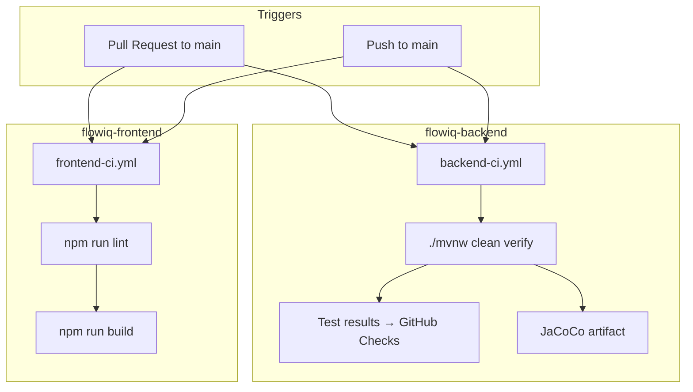
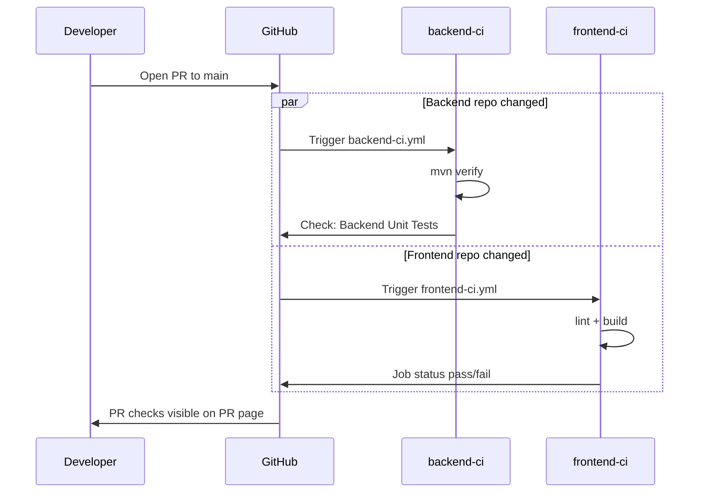

# CI/CD — As-Built

**Updated:** 2026-06-22  
**Scope:** GitHub Actions CI in `flowiq-backend` and `flowiq-frontend` (separate repositories)

## Overview

FlowIQ uses **CI-only** GitHub Actions pipelines. There is **no automated CD** (no deploy on merge).

## Repository Layout

| Repository | Workflow file | Trigger |
|------------|---------------|---------|
| `flowiq-backend` | `.github/workflows/backend-ci.yml` | `pull_request`, `push` → `main` |
| `flowiq-frontend` | `.github/workflows/frontend-ci.yml` | `pull_request`, `push` → `main` |

Each repo runs its own pipeline independently — no monorepo orchestration.

---

## Backend Workflow (`backend-ci.yml`)

### Steps

| Step | Action |
|------|--------|
| Checkout | `actions/checkout@v4` |
| Java 17 | `actions/setup-java@v4` (Temurin, Maven cache) |
| Verify | `./mvnw clean verify -B` |
| Test results | `EnricoMi/publish-unit-test-result-action@v2` |
| Coverage | Upload `target/site/jacoco/` as artifact |
| Surefire | Upload `target/surefire-reports/` as artifact |

### Environment

| Variable | Value | Purpose |
|----------|-------|---------|
| `SPRING_DOCKER_COMPOSE_ENABLED` | `false` | Prevent Docker Compose startup in CI |

### What `mvn verify` runs

1. **Compile** — 176 main sources
2. **Unit tests** — 95 tests (`**/*Test.java` pattern in Surefire)
3. **JaCoCo report** — `target/site/jacoco/index.html`
4. **Package** — Spring Boot repackaged JAR

### What is NOT run in CI

| Check | Reason |
|-------|--------|
| `@SpringBootTest` context load | `FlowiqBackendApplicationTests` excluded by Surefire pattern `*Test.java` (class ends with `Tests`) |
| Flyway against live PostgreSQL | No integration tests; migrations validated on app startup in dev/staging |
| Docker image build | Dockerfile uses `-DskipTests`; JAR build in verify is sufficient |
| Security / dependency scan | Not configured yet |

### Dockerfile compatibility

Production `Dockerfile` runs `mvn package -DskipTests`. CI runs stricter `mvn verify` (tests + package). A green CI build guarantees the same compile/test path before Docker image creation.

---

## Frontend Workflow (`frontend-ci.yml`)

### Steps

| Step | Action |
|------|--------|
| Checkout | `actions/checkout@v4` |
| Node 20 | `actions/setup-node@v4` (npm cache) |
| Install | `npm ci` |
| Lint | `npm run lint` (ESLint 9 + `eslint-config-next`) |
| Build | `npm run build` (Next.js 16 + TypeScript check) |

### Build environment

| Variable | Value |
|----------|-------|
| `NEXT_PUBLIC_API_URL` | `http://localhost:8080/api` |

Matches `Dockerfile` build-arg default for standalone output.

### What passes in CI

- ESLint — no errors (warnings allowed for unused vars)
- TypeScript — strict check via `next build`
- Production bundle — all 19 routes compile

---

## PR Validation Flow

**Branch protection (recommended):** Require `Maven Verify` and `Lint and Build` checks before merge.

---

## Quality Gates

| Gate | Backend | Frontend | Blocks merge |
|------|---------|----------|--------------|
| Compile | ✅ `mvn verify` | ✅ `next build` | Yes |
| Unit tests | ✅ 95 tests | — | Yes |
| Linter | — | ✅ ESLint | Yes |
| TypeScript | — | ✅ via `next build` | Yes |
| JaCoCo coverage | 📊 artifact only | — | No (informational) |
| Integration tests | ❌ | ❌ | — |
| E2E (Playwright) | ❌ | ❌ | — |
| Smoke checklist | ❌ manual | ❌ manual | — |
| CVE scan | ❌ | ❌ | — |

---

## CD Status

**Not implemented.** Deployment remains manual:

| Target | Method |
|--------|--------|
| Frontend | Vercel or `docker build` |
| Backend | JAR or `docker build` |
| Database | Flyway on application startup |

See [Production Deployment](production-deployment.md) for target architecture.

---

## Related

- [CI/CD Overview](ci-cd.md)
- [CI/CD Evolution Plan](CI_CD_EVOLUTION_PLAN.md)
- [CI Readiness Report](CI_READINESS_REPORT.md)
- [Docker](docker.md)
- [Test Strategy](../qa/test-strategy.md)
