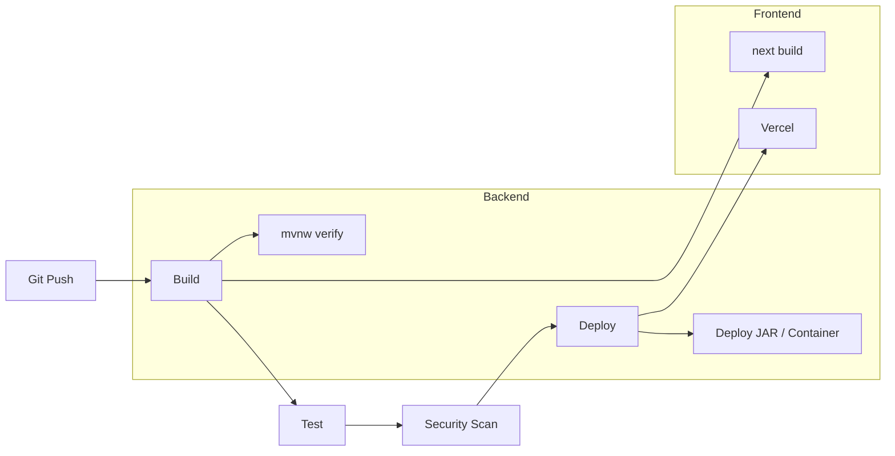

# CI/CD

## Current State

**No CI/CD pipeline** configured in either repository (no `.github/workflows`, `.gitlab-ci.yml`).

## Recommended Pipeline

## Backend Stages

1. `./mvnw verify` (when tests added)
2. Flyway migration check against test DB
3. Build JAR artifact
4. Deploy to cloud runtime

## Frontend Stages

1. `npm ci`
2. `npm run lint`
3. `npm run build`
4. Deploy to Vercel (or static host)

## Quality Gates

- Smoke checklist pass
- No critical CVEs in dependencies
- OpenAPI spec diff review

## TODO

- [ ] GitHub Actions workflow for both repos
- [ ] Dependabot configuration
- [ ] Automated Playwright on PR
