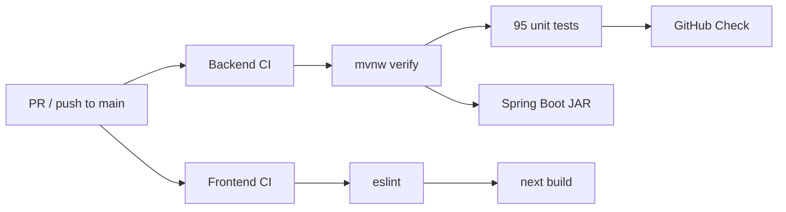

# CI/CD

**Updated:** 2026-06-22

## Current State

**CI is implemented** via GitHub Actions in both repositories:

| Repository | Workflow | File |
|------------|----------|------|
| `flowiq-backend` | Backend CI | `.github/workflows/backend-ci.yml` |
| `flowiq-frontend` | Frontend CI | `.github/workflows/frontend-ci.yml` |

**CD is not implemented** — no automated deploy on merge.

Full as-built documentation: [CI/CD As-Built](ci-cd-as-built.md)  
Evolution roadmap: [CI/CD Evolution Plan](CI_CD_EVOLUTION_PLAN.md)  
Readiness report: [CI Readiness Report](CI_READINESS_REPORT.md)

## Pipeline Diagram

## Backend CI

1. `./mvnw clean verify` — compile, test, package
2. Publish Surefire results to GitHub Checks
3. Upload JaCoCo coverage artifact

## Frontend CI

1. `npm ci`
2. `npm run lint`
3. `npm run build` (includes TypeScript validation)

## Quality Gates (Automated)

| Gate | Backend | Frontend |
|------|---------|----------|
| Compile / build | ✅ | ✅ |
| Unit tests | ✅ | — |
| Linter | — | ✅ |
| TypeScript | — | ✅ |
| JaCoCo report | ✅ artifact | — |

## Manual / Planned

- [ ] Branch protection rules on GitHub
- [ ] Dependabot
- [ ] Integration tests (Testcontainers + PostgreSQL)
- [ ] Playwright E2E on PR
- [ ] Docker image build in CI
- [ ] Automated deploy (CD) to staging/production
- [ ] CVE dependency scanning
- [ ] Smoke checklist automation

## Related

- [CI/CD As-Built](ci-cd-as-built.md)
- [CI Readiness Report](CI_READINESS_REPORT.md)
- [Docker](docker.md)
- [Production Deployment](production-deployment.md)
