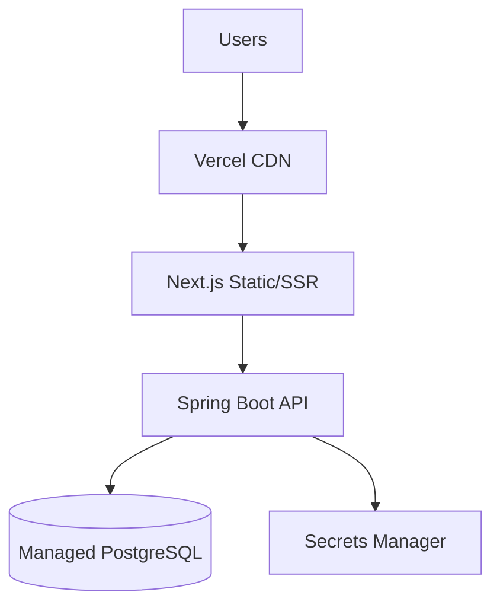

# Production Deployment

## Architecture Target

## Backend Checklist

- [ ] Build production JAR or container image
- [ ] Set `jwt.secret` from secure source (256+ bits)
- [ ] Configure managed PostgreSQL with SSL
- [ ] Set `spring.jpa.show-sql=false`
- [ ] Disable demo user seed (or restrict to staging)
- [ ] Configure log aggregation
- [ ] Enable HTTPS only
- [ ] Set CORS to production frontend origin only
- [ ] File upload limit review (10MB)
- [ ] Plan migration from BYTEA report storage to object storage

## Frontend Checklist

- [ ] Set `NEXT_PUBLIC_API_URL` to production API
- [ ] Deploy via `next build` + Vercel
- [ ] Verify all routes SSR/CSR correctly
- [ ] Enable security headers (CSP)

## Database

- Run Flyway migrations on deploy
- Enable automated backups (see [Backup & Recovery](../operations/backup-recovery.md))

## Rollback

- Keep previous JAR/container version
- Flyway: avoid destructive migrations; use expand-contract pattern

## Related

- [Environments](environments.md)
- [Smoke Checklist](../qa/smoke-checklist.md)
