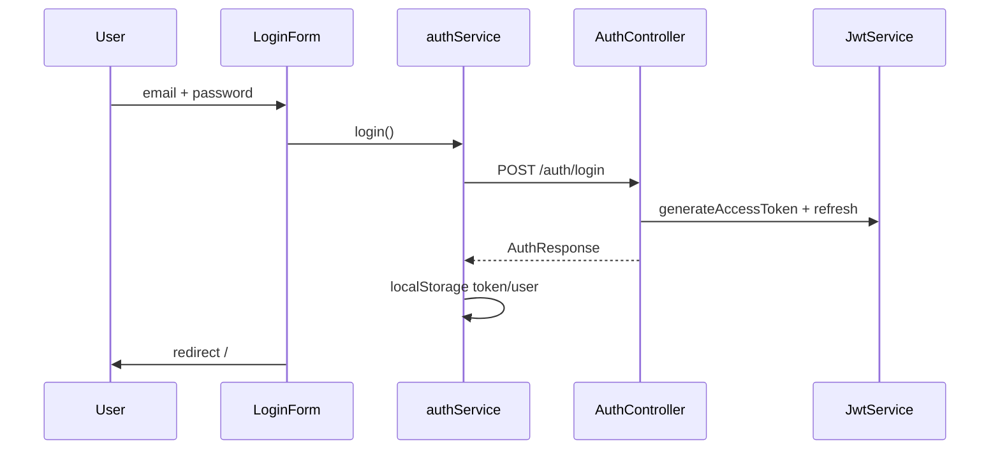

# Authentication Module

**Backend:** `AuthController`, `AuthService`, `security.*`  
**Frontend:** `features/auth/`

## Flow

## Password Storage

BCrypt via `BCryptPasswordEncoder` in `SecurityConfig`.

## Demo Account

`DemoUserSeedService` creates `demo@flowiq.ai` / `demo123` on startup.

## Protected Routes

All `/api/**` except health and login/register require valid access JWT.

Frontend: `MainLayout` client-side guard.

## Related

- [Authentication API](../api/authentication-api.md)
- [JWT Flow](../security/jwt-flow.md)
